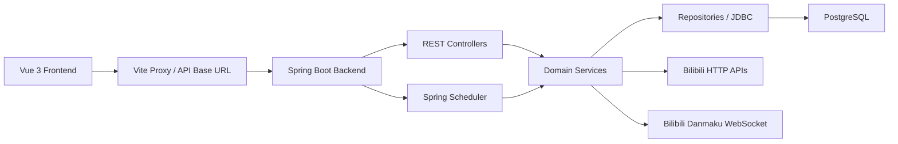

# GitHub 上传指南

本文档用于将本项目上传到 GitHub 前后的说明、交接和部署。内容以当前代码和 Flyway 迁移文件为准，覆盖项目现状、系统架构、环境搭建、配置方式、数据库表结构和隐私安全注意事项。

## 项目现状

`BiliMonitor` 是一个以 Bilibili 数据监控为当前 MVP 的多社交平台数据监控系统。项目采用 Java Spring Boot + Vue 3 的模块化单体结构，已实现 Bilibili 用户粉丝趋势、直播间状态、直播弹幕、直播榜单和指定用户聚合工作台。

当前可运行应用位于：

```text
social-data-monitor/
```

根目录中还包含方案文档、设计资料和外部研究资料。上传 GitHub 时，外部研究 dump、本地运行数据、浏览器临时 profile、依赖缓存和真实本地配置已通过 `.gitignore` 排除。

### 已实现功能

- Bilibili 用户粉丝监控：添加用户、定时采集、手动刷新、趋势查询、采集状态维护。
- Bilibili 直播间监控：添加直播间、直播状态采集、热度/关注变化、开播关播事件。
- Bilibili Web 扫码登录：通过扫码获取登录态，后端加密存储 Cookie/refresh token。
- Bilibili 直播弹幕监控：启动/停止弹幕连接，记录会话状态、最近弹幕和分钟桶指标。
- Bilibili 直播榜单监控：采集直播间榜单快照和榜单条目。
- 指定用户聚合工作台：将 Bilibili 用户监控、直播间监控、弹幕能力绑定到一个监控对象。
- 平台适配器预留：`SocialPlatformAdapter`、Normalizer、Collector、Identity、AI Port 等模块已经预留。
- 前端管理界面：Vue 3 + Vite + Element Plus + Pinia + Vue Router + ECharts。

### 当前页面入口

启动前后端后访问：

```text
http://127.0.0.1:5173/dashboard
http://127.0.0.1:5173/bilibili
http://127.0.0.1:5173/bilibili/live
http://127.0.0.1:5173/subjects
http://127.0.0.1:5173/subjects/{subjectId}
http://127.0.0.1:5173/platform
http://127.0.0.1:5173/tasks
http://127.0.0.1:5173/data
http://127.0.0.1:5173/analytics
http://127.0.0.1:5173/ai
http://127.0.0.1:5173/identity
http://127.0.0.1:5173/settings
```

### 当前后端 API 边界

主要 API 分组：

```text
GET  /actuator/health
GET  /v3/api-docs
GET  /swagger-ui.html

GET  /api/dev/health
GET  /api/dev/overview

GET  /api/platforms/adapters
POST /api/collect/tasks/run-once
POST /api/ai/mock-summary
GET  /api/analytics/summary

GET    /api/bilibili/follower-monitor/users
POST   /api/bilibili/follower-monitor/users
PATCH  /api/bilibili/follower-monitor/users/{userId}/status
PUT    /api/bilibili/follower-monitor/users/{userId}/settings
PATCH  /api/bilibili/follower-monitor/users/{userId}/settings
POST   /api/bilibili/follower-monitor/users/{userId}/refresh
DELETE /api/bilibili/follower-monitor/users/{userId}
GET    /api/bilibili/follower-monitor/users/{userId}/history
GET    /api/bilibili/follower-monitor/trends

GET    /api/bilibili/live-monitor/rooms
POST   /api/bilibili/live-monitor/rooms
PATCH  /api/bilibili/live-monitor/rooms/{roomMonitorId}
DELETE /api/bilibili/live-monitor/rooms/{roomMonitorId}
POST   /api/bilibili/live-monitor/rooms/{roomMonitorId}/refresh
GET    /api/bilibili/live-monitor/summary
GET    /api/bilibili/live-monitor/rooms/{roomMonitorId}/trends
GET    /api/bilibili/live-monitor/trends
GET    /api/bilibili/live-monitor/events

POST   /api/bilibili/auth/qr/start
GET    /api/bilibili/auth/qr/{loginId}/status
GET    /api/bilibili/auth/status
POST   /api/bilibili/auth/refresh
GET    /api/bilibili/auth/credential
DELETE /api/bilibili/auth

POST /api/bilibili/live-monitor/rooms/{roomMonitorId}/danmaku/start
POST /api/bilibili/live-monitor/rooms/{roomMonitorId}/danmaku/stop
GET  /api/bilibili/live-monitor/rooms/{roomMonitorId}/danmaku/status
GET  /api/bilibili/live-monitor/rooms/{roomMonitorId}/danmaku/recent
GET  /api/bilibili/live-monitor/rooms/{roomMonitorId}/danmaku/metrics

GET  /api/bilibili/live-monitor/rooms/{roomMonitorId}/ranks/summary
GET  /api/bilibili/live-monitor/rooms/{roomMonitorId}/ranks/latest
POST /api/bilibili/live-monitor/rooms/{roomMonitorId}/ranks/refresh

GET    /api/subjects
POST   /api/subjects
GET    /api/subjects/{subjectId}
PATCH  /api/subjects/{subjectId}
DELETE /api/subjects/{subjectId}
POST   /api/subjects/{subjectId}/bilibili-binding
PATCH  /api/subjects/{subjectId}/bilibili-binding
GET    /api/subjects/{subjectId}/workbench
GET    /api/subjects/{subjectId}/trends
PUT    /api/subjects/{subjectId}/layout
```

## 技术栈

后端：

- Java 17+，推荐 Java 21。
- Spring Boot 3.3.6。
- Spring Web、Spring Security、Spring Validation、Spring Scheduling、Actuator。
- MyBatis-Plus 3.5.9。
- Flyway + PostgreSQL。
- springdoc-openapi。
- Maven Wrapper。

前端：

- Node.js 20+。
- npm 10+。
- Vue 3。
- Vite 6。
- TypeScript。
- Pinia。
- Vue Router。
- Element Plus。
- ECharts。
- Axios。

数据库：

- PostgreSQL 14+。
- 本地开发可使用项目脚本管理的便携 PostgreSQL，也可使用本机或远程 PostgreSQL。

## 目录结构

```text
BiliMonitor/
  .gitignore
  GITHUB_UPLOAD_GUIDE.md
  docs/
  multi-social-platform-monitoring/
  design-mockups/
  social-data-monitor/
    .env.example
    .gitignore
    README.md
    backend/
      pom.xml
      mvnw.cmd
      src/main/java/com/socialmonitor/
      src/main/resources/application.yml
      src/main/resources/application-dev.yml
      src/main/resources/db/migration/
    frontend/
      package.json
      vite.config.ts
      src/
    scripts/
      dev-start.cmd
      dev-start.ps1
      dev-stop.cmd
      dev-stop.ps1
      dev-backend.ps1
      dev-frontend.ps1
      load-env.ps1
```

以下目录或文件不应提交：

```text
social-data-monitor/.env.local
social-data-monitor/.dev-data/
social-data-monitor/.dev-tools/
social-data-monitor/backend/target/
social-data-monitor/frontend/node_modules/
social-data-monitor/frontend/dist/
external-research/
bilibili-api-collect-new-research/
design-mockups/png/edge-profile*/
```

## 配置方式

项目配置分为两类：

- 可提交模板：`social-data-monitor/.env.example`。
- 本地真实配置和密钥：`social-data-monitor/.env.local`，该文件位于项目目录内，但必须被 Git 忽略。

首次部署时复制模板：

```powershell
cd social-data-monitor
Copy-Item .env.example .env.local
```

Linux/macOS：

```bash
cd social-data-monitor
cp .env.example .env.local
```

然后在 `.env.local` 中填写真实值。不要把配置和密钥放到项目目录外；启动脚本会校验配置文件路径必须位于 `social-data-monitor/` 内。

### 必填配置

```properties
SOCIAL_MONITOR_DB_URL=jdbc:postgresql://localhost:5432/social_data_monitor
SOCIAL_MONITOR_DB_USERNAME=<your_db_user>
SOCIAL_MONITOR_DB_PASSWORD=<your_db_password>
SOCIAL_MONITOR_SECURITY_DEV_USERNAME=<your_dev_username>
SOCIAL_MONITOR_SECURITY_DEV_PASSWORD=<your_dev_password>
SOCIAL_MONITOR_CORS_ALLOWED_ORIGINS=http://localhost:5173,http://127.0.0.1:5173
SOCIAL_MONITOR_CREDENTIAL_ENCRYPTION_KEY=<base64-encoded-32-byte-key>
VITE_API_BASE_URL=http://localhost:8080
```

`SOCIAL_MONITOR_CREDENTIAL_ENCRYPTION_KEY` 必须是 base64 编码的 32 字节随机密钥，用于 AES-256-GCM 加密 Bilibili 登录凭据。

PowerShell 生成方式：

```powershell
$bytes = New-Object byte[] 32
$rng = [Security.Cryptography.RandomNumberGenerator]::Create()
try {
  $rng.GetBytes($bytes)
  [Convert]::ToBase64String($bytes)
} finally {
  $rng.Dispose()
}
```

Linux/macOS 生成方式：

```bash
openssl rand -base64 32
```

### Bilibili 授权相关配置

```properties
SOCIAL_MONITOR_BILIBILI_AUTH_ENABLED=true
SOCIAL_MONITOR_BILIBILI_AUTH_QR_EXPIRE_SECONDS=180
SOCIAL_MONITOR_BILIBILI_AUTH_POLL_INTERVAL_MS=1500
SOCIAL_MONITOR_BILIBILI_AUTH_SESSION_CLEANUP_DELAY_MS=60000
SOCIAL_MONITOR_BILIBILI_AUTH_CONNECT_TIMEOUT_MS=5000
SOCIAL_MONITOR_BILIBILI_AUTH_REQUEST_TIMEOUT_MS=10000
SOCIAL_MONITOR_BILIBILI_AUTH_REFRESH_CHECK_INTERVAL_HOURS=24
SOCIAL_MONITOR_BILIBILI_AUTH_USER_AGENT=<browser user agent>
SOCIAL_MONITOR_BILIBILI_AUTH_REFERER=https://www.bilibili.com/
```

### Bilibili 粉丝监控配置

```properties
SOCIAL_MONITOR_BILIBILI_FOLLOWER_MONITOR_ENABLED=true
SOCIAL_MONITOR_BILIBILI_FOLLOWER_STORAGE_ENABLED=true
SOCIAL_MONITOR_BILIBILI_FOLLOWER_SCHEDULER_DELAY_MS=1000
SOCIAL_MONITOR_BILIBILI_FOLLOWER_DUE_BATCH_SIZE=10
SOCIAL_MONITOR_BILIBILI_FOLLOWER_INTERVAL_SECONDS=3600
SOCIAL_MONITOR_BILIBILI_FOLLOWER_MIN_INTERVAL_SECONDS=1
SOCIAL_MONITOR_BILIBILI_FOLLOWER_MAX_INTERVAL_SECONDS=2592000
SOCIAL_MONITOR_BILIBILI_FOLLOWER_SHORT_INTERVAL_WARNING_SECONDS=60
SOCIAL_MONITOR_BILIBILI_FOLLOWER_FAILURE_BACKOFF_SECONDS=900
SOCIAL_MONITOR_BILIBILI_REQUEST_MIN_INTERVAL_MS=1500
```

### Bilibili 直播监控配置

```properties
SOCIAL_MONITOR_BILIBILI_LIVE_MONITOR_ENABLED=true
SOCIAL_MONITOR_BILIBILI_LIVE_STORAGE_ENABLED=true
SOCIAL_MONITOR_BILIBILI_LIVE_SCHEDULER_DELAY_MS=1000
SOCIAL_MONITOR_BILIBILI_LIVE_DUE_BATCH_SIZE=20
SOCIAL_MONITOR_BILIBILI_LIVE_STATUS_BATCH_SIZE=30
SOCIAL_MONITOR_BILIBILI_LIVE_INTERVAL_SECONDS=300
SOCIAL_MONITOR_BILIBILI_LIVE_MIN_INTERVAL_SECONDS=1
SOCIAL_MONITOR_BILIBILI_LIVE_MAX_INTERVAL_SECONDS=2592000
SOCIAL_MONITOR_BILIBILI_LIVE_SHORT_INTERVAL_WARNING_SECONDS=120
SOCIAL_MONITOR_BILIBILI_LIVE_FAILURE_BACKOFF_SECONDS=900
SOCIAL_MONITOR_BILIBILI_LIVE_REQUEST_MIN_INTERVAL_MS=1500
SOCIAL_MONITOR_BILIBILI_LIVE_CONNECT_TIMEOUT_MS=5000
SOCIAL_MONITOR_BILIBILI_LIVE_READ_TIMEOUT_MS=10000
SOCIAL_MONITOR_BILIBILI_LIVE_MAX_ATTEMPTS=3
SOCIAL_MONITOR_BILIBILI_LIVE_RETRY_BACKOFF_MS=1500
SOCIAL_MONITOR_BILIBILI_LIVE_USER_AGENT=<user agent>
SOCIAL_MONITOR_BILIBILI_LIVE_REFERER=https://live.bilibili.com/
```

### 弹幕和榜单配置

```properties
SOCIAL_MONITOR_BILIBILI_LIVE_DANMAKU_ENABLED=true
SOCIAL_MONITOR_BILIBILI_LIVE_DANMAKU_AUTO_START_ENABLED=true
SOCIAL_MONITOR_BILIBILI_LIVE_DANMAKU_SCHEDULER_DELAY_MS=5000
SOCIAL_MONITOR_BILIBILI_LIVE_DANMAKU_MAX_CONNECTIONS=10
SOCIAL_MONITOR_BILIBILI_LIVE_DANMAKU_HEARTBEAT_SECONDS=30
SOCIAL_MONITOR_BILIBILI_LIVE_DANMAKU_CONNECT_TIMEOUT_MS=8000
SOCIAL_MONITOR_BILIBILI_LIVE_DANMAKU_BUCKET_SECONDS=60
SOCIAL_MONITOR_BILIBILI_LIVE_DANMAKU_RECENT_LIMIT=200
SOCIAL_MONITOR_BILIBILI_LIVE_DANMAKU_PROBE_SECONDS=20
SOCIAL_MONITOR_BILIBILI_LIVE_DANMAKU_PROTOCOL_VERSION=3
SOCIAL_MONITOR_BILIBILI_LIVE_DANMAKU_WBI_CACHE_SECONDS=43200
SOCIAL_MONITOR_BILIBILI_LIVE_DANMAKU_BUVID_CACHE_SECONDS=43200
SOCIAL_MONITOR_BILIBILI_LIVE_DANMAKU_USE_LOGIN_CREDENTIAL=true
SOCIAL_MONITOR_BILIBILI_LIVE_DANMAKU_WEB_LOCATION=444.8
SOCIAL_MONITOR_BILIBILI_LIVE_DANMAKU_CLIENT_VERSION=1.14.3

SOCIAL_MONITOR_BILIBILI_LIVE_RANK_ENABLED=true
SOCIAL_MONITOR_BILIBILI_LIVE_RANK_PAGE_SIZE=50
SOCIAL_MONITOR_BILIBILI_LIVE_RANK_GUARD_PAGE_SIZE=30
SOCIAL_MONITOR_BILIBILI_LIVE_RANK_MAX_PAGES=1
SOCIAL_MONITOR_BILIBILI_LIVE_RANK_REQUEST_MIN_INTERVAL_MS=1500
SOCIAL_MONITOR_BILIBILI_LIVE_RANK_WEB_LOCATION=444.8
```

## 环境搭建

### 1. 准备运行环境

安装：

- JDK 17+。
- Node.js 20+。
- npm 10+。
- PostgreSQL 14+。

确认版本：

```powershell
java -version
node -v
npm -v
psql --version
```

### 2. 创建数据库

如果使用本机 PostgreSQL：

```sql
CREATE USER social_monitor WITH PASSWORD '<your_db_password>';
CREATE DATABASE social_data_monitor OWNER social_monitor;
GRANT ALL PRIVILEGES ON DATABASE social_data_monitor TO social_monitor;
```

然后将 `.env.local` 中的数据库配置设置为：

```properties
SOCIAL_MONITOR_DB_URL=jdbc:postgresql://localhost:5432/social_data_monitor
SOCIAL_MONITOR_DB_USERNAME=social_monitor
SOCIAL_MONITOR_DB_PASSWORD=<your_db_password>
```

数据库表结构由 Flyway 自动迁移，迁移文件位于：

```text
social-data-monitor/backend/src/main/resources/db/migration/
```

### 3. 一键启动本地开发环境

Windows PowerShell：

```powershell
cd social-data-monitor
.\scripts\dev-start.cmd
```

脚本会：

- 加载 `social-data-monitor/.env.local`。
- 检查并启动 PostgreSQL（如果配置了便携 PostgreSQL）。
- 启动 Spring Boot 后端。
- 启动 Vite 前端。
- 等待后端健康检查和前端页面可访问。

停止：

```powershell
cd social-data-monitor
.\scripts\dev-stop.cmd
```

### 4. 单独启动后端

```powershell
cd social-data-monitor
Set-ExecutionPolicy -Scope Process -ExecutionPolicy Bypass
& .\scripts\load-env.ps1
cd backend
.\mvnw.cmd spring-boot:run
```

后端默认端口：`8080`。

检查：

```text
http://localhost:8080/actuator/health
http://localhost:8080/swagger-ui.html
```

### 5. 单独启动前端

```powershell
cd social-data-monitor/frontend
npm install
npm run dev
```

前端默认端口：`5173`。

`vite.config.ts` 已配置 `envDir` 指向项目根目录，因此前端会读取 `social-data-monitor/.env.local` 中的 `VITE_API_BASE_URL`。

### 6. 验证命令

后端：

```powershell
cd social-data-monitor/backend
.\mvnw.cmd -DskipTests compile
.\mvnw.cmd test
```

前端：

```powershell
cd social-data-monitor/frontend
npm run typecheck
npm run build
```

## 系统架构

系统采用模块化单体架构，后端按业务域划分包，前端按页面和 API client 划分模块。当前只落地 Bilibili 适配，但架构上预留了多平台扩展点。



### 后端模块

```text
com.socialmonitor.admin        开发健康、系统概览
com.socialmonitor.ai           AI 分析 Port、Mock Provider、AI 任务结果预留
com.socialmonitor.analytics    分析看板接口
com.socialmonitor.bilibili     Bilibili 粉丝、直播、登录、弹幕、榜单模块
com.socialmonitor.collector    通用采集任务、执行、重试、checkpoint、API 调用日志预留
com.socialmonitor.common       通用响应、异常、错误码、审计字段
com.socialmonitor.config       Web/CORS、采集调度配置
com.socialmonitor.identity     跨平台身份聚合预留
com.socialmonitor.ingestion    原始数据归一化预留
com.socialmonitor.notification 通知模块预留
com.socialmonitor.platform     平台、能力、凭据、适配器注册
com.socialmonitor.security     Spring Security、RBAC、JWT 占位
com.socialmonitor.socialdata   通用社交账号/内容 DTO
com.socialmonitor.subject      指定用户聚合工作台
```

### 关键后端流转

粉丝监控：

```text
Controller -> BilibiliFollowerMonitorService -> BilibiliApiClient -> Repository -> PostgreSQL
```

直播监控：

```text
Controller -> BilibiliLiveMonitorService -> BilibiliLiveApiClient -> Repository -> PostgreSQL
```

扫码登录：

```text
Frontend QR Dialog -> BilibiliAuthController -> BilibiliAuthService
  -> BilibiliPassportClient
  -> BilibiliCredentialCipher
  -> BilibiliCredentialRepository
  -> platform_credential / platform_account
```

弹幕监控：

```text
Controller/Scheduler -> BilibiliLiveDanmakuService
  -> BilibiliLiveDanmuInfoClient
  -> WebSocket connection
  -> Packet codec / event parser
  -> Danmaku repository
  -> session / metric bucket / recent tables
```

直播榜单：

```text
Controller -> BilibiliLiveRankService -> BilibiliLiveRankApiClient
  -> BilibiliLiveRankRepository
  -> rank snapshot / rank entry tables
```

指定用户工作台：

```text
SubjectController -> SubjectService / SubjectWorkbenchService
  -> subject tables
  -> Bilibili follower/live/danmaku/rank repositories
  -> workbench DTO
```

### 前端模块

```text
frontend/src/router/index.ts              路由入口
frontend/src/layouts/MainLayout.vue       主布局
frontend/src/api/                         Axios API clients
frontend/src/views/dashboard/             Dashboard
frontend/src/views/bilibili/              Bilibili 粉丝监控和扫码登录
frontend/src/views/bilibili-live/         Bilibili 直播监控
frontend/src/views/subjects/              指定用户列表和工作台
frontend/src/views/platform/              平台适配器展示
frontend/src/views/tasks/                 采集任务占位
frontend/src/views/data/                  数据中心占位
frontend/src/views/analytics/             分析占位
frontend/src/views/ai/                    AI 分析占位
frontend/src/views/identity/              身份聚合占位
frontend/src/views/settings/              设置占位
```

前端请求统一通过 `frontend/src/api/http.ts` 创建的 Axios 实例发出。开发环境下 Vite 将 `/api` 和 `/actuator` 代理到 `VITE_API_BASE_URL`。

## 数据库表结构

数据库迁移由 Flyway 管理。当前迁移：

```text
V1__init_schema.sql
V2__bilibili_follower_monitor.sql
V3__bilibili_interval_range.sql
V4__bilibili_live_monitor.sql
V5__subject_monitor.sql
V6__bilibili_live_danmaku_monitor.sql
V7__bilibili_auth_credential.sql
V8__bilibili_live_rank_monitor.sql
```

### 账号、权限、审计

#### `sys_user`

系统用户表。当前权限体系仍处于预留阶段。

| 字段 | 说明 |
| --- | --- |
| `id` | 主键 |
| `username` | 用户名，唯一 |
| `password_hash` | 密码哈希 |
| `display_name` | 展示名 |
| `status` | 用户状态，默认 `ACTIVE` |
| `created_at` / `updated_at` | 创建和更新时间 |

#### `sys_role`

系统角色表。

| 字段 | 说明 |
| --- | --- |
| `id` | 主键 |
| `code` | 角色编码，唯一 |
| `name` | 角色名称 |
| `created_at` / `updated_at` | 创建和更新时间 |

#### `sys_permission`

系统权限表。

| 字段 | 说明 |
| --- | --- |
| `id` | 主键 |
| `code` | 权限编码，唯一 |
| `name` | 权限名称 |
| `resource_type` | 资源类型 |
| `created_at` / `updated_at` | 创建和更新时间 |

#### `sys_user_role`

用户和角色多对多关系表。

| 字段 | 说明 |
| --- | --- |
| `user_id` | 外键到 `sys_user.id`，级联删除 |
| `role_id` | 外键到 `sys_role.id`，级联删除 |
| `created_at` | 创建时间 |

主键：`(user_id, role_id)`。

#### `audit_log`

审计日志表。

| 字段 | 说明 |
| --- | --- |
| `id` | 主键 |
| `user_id` | 操作用户，可为空 |
| `action` | 操作动作 |
| `target_type` | 目标类型 |
| `target_id` | 目标 ID |
| `ip` | 操作 IP |
| `detail_json` | 审计详情 JSON |
| `created_at` | 创建时间 |

### 平台、凭据和采集任务

#### `platform`

平台字典表。初始化时写入 `bilibili`。

| 字段 | 说明 |
| --- | --- |
| `id` | 主键 |
| `code` | 平台编码，唯一 |
| `name` | 平台名称 |
| `status` | 平台状态 |
| `config_json` | 平台配置 |
| `created_at` / `updated_at` | 创建和更新时间 |

#### `platform_capability`

平台能力表。

| 字段 | 说明 |
| --- | --- |
| `id` | 主键 |
| `platform_id` | 外键到 `platform.id` |
| `capability_code` | 能力编码 |
| `data_type` | 数据类型 |
| `enabled` | 是否启用 |
| `config_json` | 能力配置 |
| `created_at` / `updated_at` | 创建和更新时间 |

唯一约束：`(platform_id, capability_code, data_type)`。

#### `platform_credential`

平台凭据表。Bilibili 扫码登录后的 Cookie/refresh token 会加密写入 `encrypted_payload`。

| 字段 | 说明 |
| --- | --- |
| `id` | 主键 |
| `platform_id` | 外键到 `platform.id` |
| `auth_type` | 认证类型，例如 `BILIBILI_WEB_COOKIE` |
| `encrypted_payload` | 加密后的凭据 JSON |
| `expires_at` | 过期时间 |
| `risk_level` | 风险等级 |
| `status` | 凭据状态 |
| `created_at` / `updated_at` | 创建和更新时间 |

索引：

- `ux_platform_credential_bilibili_web_active`：同一平台同一 `BILIBILI_WEB_COOKIE` 只允许一个 ACTIVE 凭据。
- `idx_platform_credential_platform_auth_status`：按平台、认证类型和状态查询。

#### `platform_account`

平台账号表。

| 字段 | 说明 |
| --- | --- |
| `id` | 主键 |
| `platform_id` | 外键到 `platform.id` |
| `credential_id` | 关联凭据 |
| `external_account_id` | 平台侧账号 ID |
| `display_name` | 展示名 |
| `profile_url` | 主页 URL |
| `status` | 状态 |
| `last_sync_at` | 最近同步时间 |
| `extension_json` | 扩展信息 |
| `created_at` / `updated_at` | 创建和更新时间 |

唯一约束：`(platform_id, external_account_id)`。

#### `platform_rate_limit_state`

平台限流状态表，预留给多实例或持久化限流策略。

| 字段 | 说明 |
| --- | --- |
| `id` | 主键 |
| `platform_id` | 平台 |
| `account_id` | 平台账号，可为空 |
| `endpoint_key` | API 端点标识 |
| `next_allowed_at` | 下次允许请求时间 |
| `state_json` | 限流状态 |
| `updated_at` | 更新时间 |

唯一约束：`(platform_id, account_id, endpoint_key)`。

#### `collect_task`

通用采集任务表。

| 字段 | 说明 |
| --- | --- |
| `id` | 主键 |
| `name` | 任务名称 |
| `platform_id` | 平台 |
| `account_id` | 平台账号，可为空 |
| `data_type` | 数据类型 |
| `schedule_type` | 调度类型 |
| `cron` | Cron 表达式 |
| `interval_seconds` | 间隔秒数 |
| `status` | 状态 |
| `priority` | 优先级 |
| `next_run_at` | 下次执行时间 |
| `config_json` | 任务配置 |
| `created_at` / `updated_at` | 创建和更新时间 |

索引：`idx_collect_task_status_next_run(status, next_run_at)`。

#### `collect_task_instance`

采集任务执行实例表。

| 字段 | 说明 |
| --- | --- |
| `id` | 主键 |
| `task_id` | 外键到 `collect_task.id` |
| `status` | 执行状态 |
| `trigger_type` | 触发方式 |
| `attempt` | 尝试次数 |
| `started_at` / `finished_at` | 开始和结束时间 |
| `error_code` / `error_message` | 错误信息 |
| `metrics_json` | 执行指标 |
| `created_at` | 创建时间 |

索引：`idx_collect_task_instance_task_status(task_id, status, started_at)`。

#### `task_checkpoint`

采集 checkpoint 表。

| 字段 | 说明 |
| --- | --- |
| `id` | 主键 |
| `task_id` | 采集任务 |
| `checkpoint_key` | checkpoint 标识 |
| `cursor_value` | 游标值 |
| `last_success_at` | 最近成功时间 |
| `state_json` | checkpoint 状态 |
| `updated_at` | 更新时间 |

唯一约束：`(task_id, checkpoint_key)`。

#### `api_call_log`

API 调用日志表。

| 字段 | 说明 |
| --- | --- |
| `id` | 主键 |
| `task_instance_id` | 任务实例 |
| `platform_id` | 平台 |
| `endpoint_key` | 端点标识 |
| `status_code` | HTTP 状态码 |
| `duration_ms` | 请求耗时 |
| `error_type` | 错误类型 |
| `retryable` | 是否可重试 |
| `request_meta_json` | 请求元信息 |
| `response_meta_json` | 响应元信息 |
| `created_at` | 创建时间 |

索引：`idx_api_call_log_platform_created(platform_id, created_at)`。

#### `raw_payload`

原始响应保存表。

| 字段 | 说明 |
| --- | --- |
| `id` | 主键 |
| `platform_id` | 平台 |
| `account_id` | 平台账号，可为空 |
| `data_type` | 数据类型 |
| `external_id` | 平台侧对象 ID |
| `payload_json` | 原始 JSON |
| `payload_hash` | 内容哈希 |
| `fetched_at` | 抓取时间 |
| `task_instance_id` | 任务实例 |

唯一索引：`ux_raw_payload_dedup(platform_id, data_type, coalesce(external_id,''), payload_hash)`。

### 通用社交数据模型

#### `social_account`

通用社交账号表。

| 字段 | 说明 |
| --- | --- |
| `id` | 主键 |
| `platform_id` | 平台 |
| `external_id` | 平台账号 ID |
| `name` | 昵称 |
| `avatar_url` | 头像 |
| `profile_url` | 主页 |
| `verified` | 是否认证 |
| `follower_count` / `following_count` | 粉丝数/关注数 |
| `raw_payload_id` | 原始响应 |
| `extension_json` | 扩展信息 |
| `created_at` / `updated_at` | 创建和更新时间 |

唯一约束：`(platform_id, external_id)`。

#### `social_content`

通用内容表。

| 字段 | 说明 |
| --- | --- |
| `id` | 主键 |
| `platform_id` | 平台 |
| `external_id` | 平台内容 ID |
| `author_account_id` | 作者账号 |
| `content_type` | 内容类型 |
| `title` | 标题 |
| `content_text` | 文本 |
| `url` | URL |
| `published_at` | 发布时间 |
| `metrics_json` | 指标 |
| `raw_payload_id` | 原始响应 |
| `extension_json` | 扩展信息 |
| `created_at` / `updated_at` | 创建和更新时间 |

唯一约束：`(platform_id, external_id)`。

索引：`idx_social_content_published(platform_id, published_at)`。

#### `social_comment`

通用评论表。

| 字段 | 说明 |
| --- | --- |
| `id` | 主键 |
| `platform_id` | 平台 |
| `external_id` | 平台评论 ID |
| `content_id` | 内容 |
| `author_external_id` | 评论作者平台 ID |
| `parent_external_id` | 父评论平台 ID |
| `comment_text` | 评论内容 |
| `published_at` | 发布时间 |
| `metrics_json` | 指标 |
| `raw_payload_id` | 原始响应 |
| `created_at` / `updated_at` | 创建和更新时间 |

唯一约束：`(platform_id, external_id)`。

#### `social_danmaku`

通用弹幕表。

| 字段 | 说明 |
| --- | --- |
| `id` | 主键 |
| `platform_id` | 平台 |
| `content_id` | 内容 |
| `external_id` | 弹幕外部 ID |
| `danmaku_text` | 弹幕内容 |
| `video_time_ms` | 视频时间点 |
| `mode` | 弹幕模式 |
| `color` | 颜色 |
| `sent_at` | 发送时间 |
| `raw_payload_id` | 原始响应 |
| `created_at` | 创建时间 |

索引：`idx_social_danmaku_content_time(content_id, video_time_ms)`。

#### `social_interaction`

互动计数表。

| 字段 | 说明 |
| --- | --- |
| `id` | 主键 |
| `platform_id` | 平台 |
| `entity_type` | 实体类型 |
| `entity_id` | 实体 ID |
| `interaction_type` | 互动类型 |
| `count_value` | 计数 |
| `captured_at` | 采集时间 |
| `extension_json` | 扩展信息 |

索引：`idx_social_interaction_entity(entity_type, entity_id, interaction_type, captured_at)`。

#### `social_metric_snapshot`

通用指标快照表。

| 字段 | 说明 |
| --- | --- |
| `id` | 主键 |
| `entity_type` | 实体类型 |
| `entity_id` | 实体 ID |
| `metric_key` | 指标名 |
| `metric_value` | 指标值 |
| `captured_at` | 采集时间 |

索引：`idx_metric_snapshot_lookup(entity_type, entity_id, metric_key, captured_at)`。

#### `metric_hourly_summary` / `metric_daily_summary`

小时和日级指标汇总表。

| 字段 | 说明 |
| --- | --- |
| `id` | 主键 |
| `entity_type` | 实体类型 |
| `entity_id` | 实体 ID |
| `metric_key` | 指标名 |
| `summary_hour` / `summary_date` | 汇总时间 |
| `value` | 汇总值 |
| `created_at` | 创建时间 |

唯一约束分别为：

- `(entity_type, entity_id, metric_key, summary_hour)`
- `(entity_type, entity_id, metric_key, summary_date)`

#### `trend_topic`

趋势话题表。

| 字段 | 说明 |
| --- | --- |
| `id` | 主键 |
| `platform_id` | 平台 |
| `keyword` | 关键词 |
| `rank_value` | 排名 |
| `score` | 分数 |
| `region` | 地区 |
| `captured_at` | 采集时间 |
| `extension_json` | 扩展信息 |

索引：`idx_trend_topic_platform_time(platform_id, captured_at, rank_value)`。

### AI 与身份聚合

#### `prompt_template`

Prompt 模板表。

| 字段 | 说明 |
| --- | --- |
| `id` | 主键 |
| `code` | 模板编码 |
| `version` | 版本 |
| `template_text` | 模板内容 |
| `status` | 状态 |
| `created_at` / `updated_at` | 创建和更新时间 |

唯一约束：`(code, version)`。

#### `ai_job`

AI 任务表。

| 字段 | 说明 |
| --- | --- |
| `id` | 主键 |
| `target_type` | 目标类型 |
| `target_id` | 目标 ID |
| `capability` | AI 能力 |
| `provider` | Provider |
| `model` | 模型 |
| `status` | 状态 |
| `prompt_template_id` | Prompt 模板 |
| `input_hash` | 输入哈希 |
| `created_at` / `updated_at` | 创建和更新时间 |

索引：`idx_ai_job_status_created(status, created_at)`。

#### `ai_result`

AI 结果表。

| 字段 | 说明 |
| --- | --- |
| `id` | 主键 |
| `job_id` | AI 任务 |
| `summary` | 摘要 |
| `sentiment` | 情绪 |
| `labels_json` | 标签 |
| `score_json` | 分数 |
| `result_json` | 完整结果 |
| `model_version` | 模型版本 |
| `created_at` | 创建时间 |

#### `person_profile`

人/主体档案表。

| 字段 | 说明 |
| --- | --- |
| `id` | 主键 |
| `display_name` | 展示名 |
| `remark` | 备注 |
| `status` | 状态 |
| `created_at` / `updated_at` | 创建和更新时间 |

#### `platform_identity`

平台身份表。

| 字段 | 说明 |
| --- | --- |
| `id` | 主键 |
| `person_id` | 人/主体档案 |
| `platform_id` | 平台 |
| `platform_account_id` | 平台账号 |
| `external_id` | 平台身份 ID |
| `confidence` | 置信度 |
| `source` | 来源 |
| `created_at` / `updated_at` | 创建和更新时间 |

唯一约束：`(platform_id, external_id)`。

#### `identity_link_candidate`

身份链接候选表。

| 字段 | 说明 |
| --- | --- |
| `id` | 主键 |
| `left_identity_id` / `right_identity_id` | 两侧身份 |
| `score` | 匹配分数 |
| `reason_json` | 匹配原因 |
| `status` | 状态 |
| `created_at` / `updated_at` | 创建和更新时间 |

唯一约束：`(left_identity_id, right_identity_id)`。

#### `identity_merge_audit`

身份合并审计表。

| 字段 | 说明 |
| --- | --- |
| `id` | 主键 |
| `operator_id` | 操作用户 |
| `action` | 动作 |
| `before_json` | 合并前 |
| `after_json` | 合并后 |
| `created_at` | 创建时间 |

### Bilibili 粉丝监控

#### `bilibili_monitored_user`

Bilibili 用户监控对象表。

| 字段 | 说明 |
| --- | --- |
| `id` | 主键 |
| `mid` | Bilibili 用户 MID，唯一 |
| `nickname` | 昵称 |
| `avatar_url` | 头像 |
| `profile_url` | 主页 |
| `current_follower_count` | 当前粉丝数 |
| `following_count` | 当前关注数 |
| `monitor_status` | 监控状态 |
| `interval_seconds` | 采集间隔，范围 1 到 2592000 秒 |
| `next_collect_at` | 下次采集时间 |
| `last_snapshot_at` | 最近快照时间 |
| `last_success_at` | 最近成功时间 |
| `last_error_at` | 最近错误时间 |
| `last_error_type` / `last_error_message` | 错误信息 |
| `source_endpoint` | 数据来源端点 |
| `extension_json` | 扩展信息 |
| `created_at` / `updated_at` | 创建和更新时间 |

索引：`idx_bilibili_monitored_user_due(monitor_status, next_collect_at)`。

#### `bilibili_follower_snapshot`

粉丝数快照表。

| 字段 | 说明 |
| --- | --- |
| `id` | 主键 |
| `monitored_user_id` | 监控用户 |
| `mid` | Bilibili MID |
| `follower_count` | 粉丝数 |
| `following_count` | 关注数 |
| `captured_at` | 采集时间 |
| `captured_bucket` | 时间桶 |
| `source_endpoint` | 数据来源端点 |
| `raw_payload_json` | 原始响应 |
| `created_at` | 创建时间 |

唯一约束：`(monitored_user_id, captured_bucket)`。

索引：

- `idx_bilibili_follower_snapshot_lookup(monitored_user_id, captured_at)`
- `idx_bilibili_follower_snapshot_mid_time(mid, captured_at)`

### Bilibili 直播监控

#### `bilibili_live_room_monitor`

直播间监控对象表。

| 字段 | 说明 |
| --- | --- |
| `id` | 主键 |
| `uid` | 主播 UID，唯一 |
| `room_id` | 直播间 ID，唯一 |
| `short_id` | 短号 |
| `uname` | 主播名 |
| `face_url` | 头像 |
| `title` | 标题 |
| `cover_url` / `keyframe_url` | 封面/关键帧 |
| `area_id` / `area_name` | 分区 |
| `parent_area_id` / `parent_area_name` | 父分区 |
| `live_status` | 直播状态 |
| `live_time` | 开播时间 |
| `online_count` | 在线人数/热度 |
| `attention_count` | 关注数 |
| `monitor_status` | 监控状态 |
| `interval_seconds` | 采集间隔 |
| `next_collect_at` | 下次采集时间 |
| `last_snapshot_at` / `last_success_at` | 最近快照/成功时间 |
| `last_error_at` / `last_error_type` / `last_error_message` | 错误信息 |
| `backoff_until` | 退避截止时间 |
| `source_endpoint` | 数据来源端点 |
| `extension_json` | 扩展信息 |
| `created_at` / `updated_at` | 创建和更新时间 |

索引：

- `idx_bilibili_live_room_monitor_due(monitor_status, next_collect_at)`
- `idx_bilibili_live_room_monitor_status(live_status)`

#### `bilibili_live_room_snapshot`

直播间快照表。

| 字段 | 说明 |
| --- | --- |
| `id` | 主键 |
| `monitor_id` | 直播间监控对象 |
| `uid` / `room_id` | 主播和房间 |
| `live_status` | 直播状态 |
| `title` | 标题 |
| `area_id` / `area_name` | 分区 |
| `parent_area_id` / `parent_area_name` | 父分区 |
| `online_count` | 在线人数/热度 |
| `attention_count` | 关注数 |
| `live_time` | 开播时间 |
| `source_endpoint` | 来源端点 |
| `raw_payload_json` | 原始响应 |
| `captured_at` / `captured_bucket` | 采集时间和桶 |
| `created_at` | 创建时间 |

唯一约束：`(monitor_id, captured_bucket)`。

索引：

- `idx_bilibili_live_room_snapshot_room_time(room_id, captured_at desc)`
- `idx_bilibili_live_room_snapshot_monitor_time(monitor_id, captured_at desc)`

#### `bilibili_live_status_event`

直播状态事件表。

| 字段 | 说明 |
| --- | --- |
| `id` | 主键 |
| `monitor_id` | 直播间监控对象 |
| `uid` / `room_id` | 主播和房间 |
| `event_type` | 事件类型 |
| `from_live_status` / `to_live_status` | 状态变化 |
| `title_before` / `title_after` | 标题变化 |
| `online_count` | 事件发生时在线人数/热度 |
| `occurred_at` | 事件时间 |
| `extension_json` | 扩展信息 |

索引：

- `idx_bilibili_live_status_event_time(occurred_at desc)`
- `idx_bilibili_live_status_event_room_time(room_id, occurred_at desc)`

### 指定用户聚合工作台

#### `monitored_subject`

监控主体表，用于把用户粉丝、直播间、弹幕等能力聚合到一个工作台。

| 字段 | 说明 |
| --- | --- |
| `id` | 主键 |
| `display_name` | 主体名称 |
| `avatar_url` | 头像 |
| `remark` | 备注 |
| `tags_json` | 标签 |
| `monitor_status` | 状态，只允许 `ACTIVE` / `PAUSED` |
| `health_score` | 健康分 |
| `last_success_at` | 最近成功时间 |
| `last_event_at` | 最近事件时间 |
| `created_at` / `updated_at` | 创建和更新时间 |

索引：`idx_monitored_subject_status(monitor_status)`。

#### `subject_bilibili_binding`

主体与 Bilibili 监控对象绑定表。

| 字段 | 说明 |
| --- | --- |
| `id` | 主键 |
| `subject_id` | 监控主体，唯一 |
| `bilibili_user_monitor_id` | 粉丝监控对象 |
| `bilibili_live_room_monitor_id` | 直播间监控对象 |
| `mid` | Bilibili MID |
| `room_id` | 直播间 ID |
| `enabled_capabilities_json` | 启用能力列表 |
| `danmu_enabled` | 是否启用弹幕 |
| `created_at` / `updated_at` | 创建和更新时间 |

索引：

- `idx_subject_bilibili_binding_user(bilibili_user_monitor_id)`
- `idx_subject_bilibili_binding_live(bilibili_live_room_monitor_id)`

#### `subject_widget_layout`

主体工作台组件布局表。

| 字段 | 说明 |
| --- | --- |
| `id` | 主键 |
| `subject_id` | 监控主体 |
| `widget_key` | 组件 key |
| `enabled` | 是否启用 |
| `position_json` | 位置布局 |
| `settings_json` | 组件设置 |
| `created_at` / `updated_at` | 创建和更新时间 |

唯一约束：`(subject_id, widget_key)`。

索引：`idx_subject_widget_layout_subject(subject_id)`。

### Bilibili 直播弹幕

#### `bilibili_live_danmaku_session`

弹幕连接会话表。

| 字段 | 说明 |
| --- | --- |
| `id` | 主键 |
| `live_room_monitor_id` | 直播间监控对象 |
| `room_id` | 直播间 ID |
| `started_at` / `ended_at` | 开始和结束时间 |
| `status` | 会话状态 |
| `connect_host` | 连接主机 |
| `reconnect_count` | 重连次数 |
| `last_heartbeat_at` | 最近心跳时间 |
| `last_error_at` / `last_error_type` / `last_error_message` | 错误信息 |
| `created_at` | 创建时间 |

索引：

- `idx_bilibili_danmaku_session_room_time(live_room_monitor_id, started_at desc)`
- `idx_bilibili_danmaku_session_status(status)`

#### `bilibili_live_danmaku_metric_bucket`

弹幕指标时间桶表。

| 字段 | 说明 |
| --- | --- |
| `id` | 主键 |
| `live_room_monitor_id` | 直播间监控对象 |
| `session_id` | 弹幕会话 |
| `room_id` | 直播间 ID |
| `bucket_start` | 时间桶开始 |
| `bucket_seconds` | 桶大小，默认 60 秒 |
| `danmu_count` | 弹幕数 |
| `like_count` | 点赞总数 |
| `like_increment` | 点赞增量 |
| `watched_count` | 看过人数 |
| `heartbeat_popularity` | 心跳人气值 |
| `gift_count` | 礼物数 |
| `super_chat_count` | SC 数 |
| `raw_event_count` | 原始事件数 |
| `updated_at` / `created_at` | 更新时间和创建时间 |

唯一约束：`(live_room_monitor_id, bucket_start, bucket_seconds)`。

索引：`idx_bilibili_danmaku_bucket_room_time(live_room_monitor_id, bucket_start desc)`。

#### `bilibili_live_danmaku_recent`

最近弹幕表。

| 字段 | 说明 |
| --- | --- |
| `id` | 主键 |
| `live_room_monitor_id` | 直播间监控对象 |
| `room_id` | 直播间 ID |
| `message_text` | 弹幕文本 |
| `display_name` | 发送者昵称 |
| `medal_name` | 粉丝牌名称 |
| `sent_at` | 发送时间 |
| `created_at` | 创建时间 |

索引：`idx_bilibili_danmaku_recent_room_time(live_room_monitor_id, sent_at desc)`。

### Bilibili 直播榜单

#### `bilibili_live_rank_snapshot`

直播榜单快照表。

| 字段 | 说明 |
| --- | --- |
| `id` | 主键 |
| `monitor_id` | 直播间监控对象 |
| `room_id` | 直播间 ID |
| `ruid` | 主播 UID |
| `rank_family` | 榜单族群 |
| `rank_type` | 榜单类型 |
| `rank_switch` | 榜单开关/子类型 |
| `period_scope` | 时间范围 |
| `page_no` / `page_size` | 页码和页大小 |
| `total_count` | 总数 |
| `count_text` / `value_text` | 展示文本 |
| `remind_msg` | 提示信息 |
| `source_endpoint` | 来源端点 |
| `signed_required` | 是否需要签名 |
| `captured_at` / `captured_bucket` | 采集时间和桶 |
| `raw_payload_json` | 原始响应 |
| `extension_json` | 扩展信息 |
| `created_at` | 创建时间 |

唯一索引：`uk_bilibili_live_rank_snapshot_bucket`，按监控对象、榜单类型、时间桶和页码去重。

索引：`idx_bilibili_live_rank_snapshot_room_latest(monitor_id, rank_family, rank_type, captured_at desc)`。

#### `bilibili_live_rank_entry`

直播榜单条目表。

| 字段 | 说明 |
| --- | --- |
| `id` | 主键 |
| `snapshot_id` | 榜单快照 |
| `monitor_id` | 直播间监控对象 |
| `room_id` | 直播间 ID |
| `ruid` | 主播 UID |
| `user_uid` | 榜单用户 UID |
| `rank_no` | 排名 |
| `entry_kind` | 条目类型 |
| `display_name` | 用户名 |
| `face_url` | 头像 |
| `score` | 分数 |
| `guard_level` | 大航海等级 |
| `wealth_level` | 财富等级 |
| `medal_name` / `medal_level` | 粉丝牌名称和等级 |
| `medal_ruid` | 粉丝牌归属主播 |
| `medal_is_light` | 粉丝牌是否点亮 |
| `guard_expired_text` | 大航海过期文本 |
| `accompany_days` | 陪伴天数 |
| `raw_entry_json` | 原始条目 |
| `created_at` | 创建时间 |

索引：

- `idx_bilibili_live_rank_entry_snapshot(snapshot_id, rank_no nulls last)`
- `idx_bilibili_live_rank_entry_user(user_uid, room_id, created_at desc)`

## 隐私和安全说明

### 不应提交的内容

以下内容必须保持在本地，不能提交到 GitHub：

- `social-data-monitor/.env.local`
- PostgreSQL 数据目录和日志：`social-data-monitor/.dev-data/`
- 便携 PostgreSQL 工具：`social-data-monitor/.dev-tools/`
- Maven/Node 构建产物：`target/`、`node_modules/`、`dist/`
- 浏览器临时 profile：`design-mockups/png/edge-profile*/`
- 外部研究 dump：`external-research/`、`bilibili-api-collect-new-research/`
- 真实 Bilibili Cookie、`SESSDATA`、`bili_jct`、`refresh_token`
- 真实数据库密码、开发账号密码、API token、私钥

### 当前代码内的风险点

- 当前 `SecurityConfig` 对 `/api/**` 开发接口仍为 `permitAll`，适合本地开发，不适合公网部署。
- `/api/bilibili/auth/credential` 会返回完整 Bilibili 登录态，生产部署前必须加管理员鉴权。
- `platform_credential.encrypted_payload` 是加密存储，但加密 key 必须由项目内的 `social-data-monitor/.env.local` 提供，并保持 Git 忽略。
- 文档和模板只应保留空值或占位符，不应写入真实 Cookie、token 或个人账号信息。

### 上传前复扫建议

初始化 Git 后，使用 Git 将提交的文件范围做检查：

```powershell
git status --short
git ls-files --others --cached --exclude-standard
```

敏感词扫描：

```powershell
rg -n --hidden --glob '!**/.git/**' --glob '!**/node_modules/**' --glob '!**/target/**' --glob '!**/dist/**' --glob '!**/.dev-data/**' --glob '!**/.dev-tools/**' --glob '!**/.env.local' "(SESSDATA=|bili_jct=|refresh_token=|AKIA|PRIVATE KEY|SOCIAL_MONITOR_DB_PASSWORD=.+|SOCIAL_MONITOR_CREDENTIAL_ENCRYPTION_KEY=.+)"
```

如果扫描命中真实值，应先删除或替换为占位符，再提交。

## GitHub 上传建议

本项目当前适合以一次干净初始提交上传。推荐流程：

```powershell
git init
git add .
git commit -m "Initial public project snapshot"
git branch -M main
git remote add origin <your-github-repo-url>
git push -u origin main
```

如果本地已有旧 `.git` 历史并且确认要清除历史，可删除旧 `.git` 后重新 `git init`。删除前请确认没有需要保留的旧分支、tag 或远程配置。

## 后续改进建议

- 为生产环境补管理员认证和权限控制。
- 将 `/api/bilibili/auth/**` 归入受保护管理接口。
- 为配置项补充 profile 分层，例如 `dev`、`prod`。
- 为 PostgreSQL 增加 Docker Compose 或部署脚本，降低新环境搭建成本。
- 为采集任务引入更完整的限流、重试和断路策略。
- 为 Bilibili API 风控失败增加可观测性和告警。
- 为数据保留周期增加清理任务，避免弹幕和原始 payload 无限增长。
