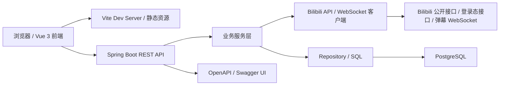

# BiliMonitor

## 目录

- [项目现状](#项目现状)
- [目录结构](#目录结构)
- [技术栈](#技术栈)
- [环境搭建](#环境搭建)
  - [前置依赖](#1-前置依赖)
  - [创建项目内私有配置](#2-创建项目内私有配置)
  - [建库建表指南](#3-建库建表指南)
    - [库表结构总览](#33-库表结构总览)
    - [核心业务建表 SQL](#34-核心业务建表-sql)
  - [一键启动开发环境](#4-一键启动开发环境)
  - [分别启动后端和前端](#5-分别启动后端和前端)
  - [构建与验证](#6-构建与验证)
- [系统架构](#系统架构)
- [数据库结构](#数据库结构)
- [API 概览](#api-概览)
- [安全与隐私](#安全与隐私)
- [文档入口](#文档入口)
- [许可证](#许可证)

BiliMonitor 是一个面向 Bilibili 数据监控的模块化社交数据监控系统。当前可运行应用位于 [`social-data-monitor/`](social-data-monitor/)，采用 Spring Boot 后端、Vue 3 前端、PostgreSQL 存储、Flyway 数据库迁移，并使用项目内私有配置文件管理本地配置和密钥。

当前仓库已经整理为适合公开 GitHub 托管的形态：真实配置和密钥放在项目内但被 Git 忽略的 `social-data-monitor/.env.local`；提交到仓库的是结构相同、空值的 `social-data-monitor/.env.example`。

## 项目现状

当前 MVP 聚焦 Bilibili 监控闭环，已经具备以下能力：

- Bilibili 用户粉丝趋势监控：支持添加 UID、设置采集间隔、手动刷新、定时采集、趋势查询、错误状态记录和暂停/恢复。
- Bilibili 直播间监控：支持按房间号或主播 UID 添加监控，采集直播状态、标题、分区、热度/在线数、关注量、开播/下播/标题变化事件。
- Bilibili Web 扫码登录：支持二维码生成、前端轮询、Cookie 提取、`nav` 校验、登录态刷新、删除登录态和加密保存。
- Bilibili 直播弹幕监控：支持 WebSocket 连接、心跳、协议版本 `0/1/2/3`、最近弹幕、分钟级弹幕指标桶、登录态优先和游客态回退。
- Bilibili 直播榜单监控：支持房间观众榜和大航海榜单快照，榜单数据优先读数据库，手动刷新时才请求外部接口。
- 指定用户聚合工作台：通过 Subject 聚合 Bilibili 粉丝、直播、弹幕、榜单和健康事件，形成单个用户的监控视图。
- 前端管理界面：包含仪表盘、B站粉丝监控、B站直播监控、指定用户工作台、平台、任务、数据、分析、AI、身份和设置等页面。
- 扩展点：保留 `SocialPlatformAdapter`、采集任务、归一化器、身份映射、AI 分析端口等模块，后续可扩展到更多平台。

当前主要页面：

```text
http://127.0.0.1:5173/dashboard
http://127.0.0.1:5173/bilibili
http://127.0.0.1:5173/bilibili/live
http://127.0.0.1:5173/subjects
http://127.0.0.1:5173/subjects/{subjectId}
http://127.0.0.1:5173/platform
http://127.0.0.1:5173/tasks
http://127.0.0.1:5173/data
http://127.0.0.1:5173/analytics
http://127.0.0.1:5173/ai
http://127.0.0.1:5173/identity
http://127.0.0.1:5173/settings
```

## 目录结构

```text
BiliMonitor/
  .github/                         GitHub Actions、Issue 模板、PR 模板
  docs/                            根级项目文档、架构、数据模型、运行手册、研究记录
  multi-social-platform-monitoring/ 早期多平台方案文档
  design-mockups/                  设计稿和截图资产
  social-data-monitor/             当前可运行应用
    .env.example                   项目内私有配置空模板，可提交
    .env.local                     项目内真实配置和密钥，本地存在，Git 忽略
    backend/                       Spring Boot 后端
    frontend/                      Vue 3 前端
    scripts/                       本地开发启动/停止/加载配置脚本
    docs/                          应用内专项文档
```

## 技术栈

后端：

- Java 17+，推荐 JDK 21。
- Spring Boot 3.3.6。
- Spring Web、Spring Security、Spring Validation、Spring Scheduling、Actuator。
- MyBatis-Plus 3.5.9；当前 Bilibili 监控主要使用 `NamedParameterJdbcTemplate`。
- Flyway + PostgreSQL。
- springdoc-openapi / Swagger UI。
- Maven Wrapper。

前端：

- Node.js 20+。
- Vue 3。
- Vite 6。
- TypeScript。
- Pinia。
- Vue Router。
- Element Plus。
- ECharts。
- Axios。

数据库：

- PostgreSQL 14+。
- 本地开发可使用项目脚本管理的便携 PostgreSQL，也可以使用本机或远程 PostgreSQL。

## 环境搭建

### 1. 前置依赖

推荐安装：

- JDK 17+，推荐 JDK 21。
- Node.js 20+。
- npm 10+。
- PostgreSQL 14+，如果使用项目内便携 PostgreSQL，则由 `scripts/dev-start.cmd` 启动。

后端使用 Maven Wrapper，不要求全局安装 Maven。前端依赖通过 `social-data-monitor/frontend/package-lock.json` 锁定。

### 2. 创建项目内私有配置

真实配置和密钥必须放在项目目录内的 `social-data-monitor/.env.local`，不能放到项目外目录。该文件已被 `.gitignore` 忽略，不会上传 GitHub。

```powershell
cd social-data-monitor
Copy-Item .env.example .env.local
```

在 `social-data-monitor/.env.local` 中填写：

```properties
SOCIAL_MONITOR_DB_URL=jdbc:postgresql://localhost:5432/social_data_monitor
SOCIAL_MONITOR_DB_USERNAME=social_monitor
SOCIAL_MONITOR_DB_PASSWORD=<your_db_password>

SOCIAL_MONITOR_SECURITY_DEV_USERNAME=<your_dev_username>
SOCIAL_MONITOR_SECURITY_DEV_PASSWORD=<your_dev_password>

SOCIAL_MONITOR_CORS_ALLOWED_ORIGINS=http://localhost:5173,http://127.0.0.1:5173
SOCIAL_MONITOR_COLLECTOR_SCHEDULER_ENABLED=false
SOCIAL_MONITOR_CREDENTIAL_ENCRYPTION_KEY=<base64-encoded-32-byte-key>

VITE_API_BASE_URL=http://localhost:8080
```

`SOCIAL_MONITOR_CREDENTIAL_ENCRYPTION_KEY` 用于加密 Bilibili 登录态，必须是 base64 编码的 32 字节随机 key。开发环境未配置时，后端会使用运行期临时 key；正式部署必须显式配置。

### 3. 建库建表指南

数据库使用 PostgreSQL，表结构由 Flyway 迁移脚本维护。推荐做法是先创建空数据库和账号，再启动后端，由 Flyway 自动建表并记录迁移历史。

#### 3.1 创建数据库账号

使用 PostgreSQL 超级用户或有建库权限的账号连接数据库，例如本机默认 `postgres` 用户：

```powershell
psql -U postgres -h localhost -p 5432
```

在 `psql` 中执行：

```sql
CREATE USER social_monitor WITH PASSWORD '<your_db_password>';
CREATE DATABASE social_data_monitor OWNER social_monitor;
GRANT ALL PRIVILEGES ON DATABASE social_data_monitor TO social_monitor;
```

如果数据库已经存在，可以只确认属主和权限：

```sql
ALTER DATABASE social_data_monitor OWNER TO social_monitor;
GRANT ALL PRIVILEGES ON DATABASE social_data_monitor TO social_monitor;
```

#### 3.2 配置项目内数据库连接

真实数据库密码只写入项目内 `social-data-monitor/.env.local`，不要写入 README、issue、提交记录或项目外目录。

```properties
SOCIAL_MONITOR_DB_URL=jdbc:postgresql://localhost:5432/social_data_monitor
SOCIAL_MONITOR_DB_USERNAME=social_monitor
SOCIAL_MONITOR_DB_PASSWORD=<your_db_password>
```

后端 `application-dev.yml` 会读取这三个配置：

```yaml
spring:
  datasource:
    url: ${SOCIAL_MONITOR_DB_URL}
    username: ${SOCIAL_MONITOR_DB_USERNAME}
    password: ${SOCIAL_MONITOR_DB_PASSWORD}
```

#### 3.3 库表结构总览

当前数据库按“通用平台能力 + Bilibili 业务监控 + Subject 聚合工作台”组织。建表 SQL 由 `V1` 到 `V8` 的 Flyway migration 管理，核心表如下。

| 表组 | 表 | 来源迁移 | 用途 |
| --- | --- | --- | --- |
| 系统权限 | `sys_user`、`sys_role`、`sys_permission`、`sys_user_role`、`audit_log` | `V1__init_schema.sql` | 系统用户、角色、权限和审计日志。当前主要作为后续鉴权/RBAC 基础。 |
| 平台基础 | `platform`、`platform_capability`、`platform_credential`、`platform_account`、`platform_rate_limit_state` | `V1__init_schema.sql`、`V7__bilibili_auth_credential.sql` | 平台登记、平台能力、登录凭据、账号信息和限频状态。Bilibili 扫码登录态存放在 `platform_credential`。 |
| 采集任务 | `collect_task`、`collect_task_instance`、`task_checkpoint`、`api_call_log`、`raw_payload` | `V1__init_schema.sql` | 通用采集任务、任务实例、游标、API 调用日志和原始响应载荷。 |
| 通用社交数据 | `social_account`、`social_content`、`social_comment`、`social_danmaku`、`social_interaction`、`social_metric_snapshot`、`metric_hourly_summary`、`metric_daily_summary`、`trend_topic` | `V1__init_schema.sql` | 多平台归一化账号、内容、评论、弹幕、互动和指标模型。当前 Bilibili MVP 主要使用业务专表。 |
| AI 与身份 | `prompt_template`、`ai_job`、`ai_result`、`person_profile`、`platform_identity`、`identity_link_candidate`、`identity_merge_audit` | `V1__init_schema.sql` | AI 分析和跨平台身份映射的预留结构。 |
| Bilibili 粉丝 | `bilibili_monitored_user`、`bilibili_follower_snapshot` | `V2__bilibili_follower_monitor.sql`、`V3__bilibili_interval_range.sql` | 被监控 UID 的当前状态、采集调度和粉丝趋势快照。 |
| Bilibili 直播 | `bilibili_live_room_monitor`、`bilibili_live_room_snapshot`、`bilibili_live_status_event` | `V4__bilibili_live_monitor.sql` | 直播间当前状态、历史快照和开播/下播/标题变化事件。 |
| Subject 工作台 | `monitored_subject`、`subject_bilibili_binding`、`subject_widget_layout` | `V5__subject_monitor.sql` | 指定用户聚合对象、Bilibili 监控绑定和工作台卡片布局。 |
| Bilibili 弹幕 | `bilibili_live_danmaku_session`、`bilibili_live_danmaku_metric_bucket`、`bilibili_live_danmaku_recent` | `V6__bilibili_live_danmaku_monitor.sql` | 弹幕 WebSocket 会话、分钟级指标桶和最近弹幕。 |
| Bilibili 榜单 | `bilibili_live_rank_snapshot`、`bilibili_live_rank_entry` | `V8__bilibili_live_rank_monitor.sql` | 房间观众榜和大航海榜单快照、榜单明细。 |

关系摘要：

- `bilibili_follower_snapshot.monitored_user_id` 关联 `bilibili_monitored_user.id`，删除监控用户时级联删除粉丝快照。
- `bilibili_live_room_snapshot.monitor_id` 和 `bilibili_live_status_event.monitor_id` 关联 `bilibili_live_room_monitor.id`，删除直播间监控时级联删除直播历史。
- `bilibili_live_danmaku_*` 表关联 `bilibili_live_room_monitor.id`，删除直播间监控时级联删除弹幕会话、指标和最近弹幕。
- `bilibili_live_rank_snapshot.monitor_id` 和 `bilibili_live_rank_entry.monitor_id` 关联 `bilibili_live_room_monitor.id`，删除直播间监控时级联删除榜单。
- `subject_bilibili_binding.subject_id` 关联 `monitored_subject.id`；删除 Subject 只删除聚合层绑定和布局，不删除底层 Bilibili 监控数据。
- `subject_bilibili_binding.bilibili_user_monitor_id` 和 `subject_bilibili_binding.bilibili_live_room_monitor_id` 分别关联粉丝监控和直播间监控；底层监控删除时绑定字段置空。

#### 3.4 核心业务建表 SQL

完整建表 SQL 以项目内 Flyway 文件为准。本节直接给出当前 Bilibili MVP 最核心的业务表 SQL，便于快速理解和手动建表排查；通用系统表、采集表、AI 表和身份表的完整 SQL 见 `V1__init_schema.sql`。

<details>
<summary>Bilibili 粉丝监控建表 SQL</summary>

```sql
CREATE TABLE IF NOT EXISTS bilibili_monitored_user (
    id BIGSERIAL PRIMARY KEY,
    mid BIGINT NOT NULL UNIQUE,
    nickname VARCHAR(160) NOT NULL,
    avatar_url TEXT,
    profile_url TEXT NOT NULL,
    current_follower_count BIGINT,
    following_count BIGINT,
    monitor_status VARCHAR(32) NOT NULL DEFAULT 'ACTIVE',
    interval_seconds INTEGER NOT NULL DEFAULT 3600,
    next_collect_at TIMESTAMPTZ,
    last_snapshot_at TIMESTAMPTZ,
    last_success_at TIMESTAMPTZ,
    last_error_at TIMESTAMPTZ,
    last_error_type VARCHAR(80),
    last_error_message TEXT,
    source_endpoint VARCHAR(160),
    extension_json JSONB NOT NULL DEFAULT '{}'::jsonb,
    created_at TIMESTAMPTZ NOT NULL DEFAULT now(),
    updated_at TIMESTAMPTZ NOT NULL DEFAULT now(),
    CHECK (mid > 0),
    CHECK (interval_seconds >= 300)
);

CREATE INDEX IF NOT EXISTS idx_bilibili_monitored_user_due
    ON bilibili_monitored_user (monitor_status, next_collect_at);

CREATE TABLE IF NOT EXISTS bilibili_follower_snapshot (
    id BIGSERIAL PRIMARY KEY,
    monitored_user_id BIGINT NOT NULL REFERENCES bilibili_monitored_user(id) ON DELETE CASCADE,
    mid BIGINT NOT NULL,
    follower_count BIGINT NOT NULL,
    following_count BIGINT,
    captured_at TIMESTAMPTZ NOT NULL DEFAULT now(),
    captured_bucket TIMESTAMPTZ NOT NULL,
    source_endpoint VARCHAR(160) NOT NULL,
    raw_payload_json JSONB NOT NULL DEFAULT '{}'::jsonb,
    created_at TIMESTAMPTZ NOT NULL DEFAULT now(),
    UNIQUE (monitored_user_id, captured_bucket)
);

CREATE INDEX IF NOT EXISTS idx_bilibili_follower_snapshot_lookup
    ON bilibili_follower_snapshot (monitored_user_id, captured_at);

CREATE INDEX IF NOT EXISTS idx_bilibili_follower_snapshot_mid_time
    ON bilibili_follower_snapshot (mid, captured_at);

ALTER TABLE bilibili_monitored_user
    DROP CONSTRAINT IF EXISTS bilibili_monitored_user_interval_seconds_check;

ALTER TABLE bilibili_monitored_user
    ADD CONSTRAINT bilibili_monitored_user_interval_seconds_check
    CHECK (interval_seconds BETWEEN 1 AND 2592000);
```

</details>

<details>
<summary>Bilibili 直播监控建表 SQL</summary>

```sql
CREATE TABLE IF NOT EXISTS bilibili_live_room_monitor (
    id BIGSERIAL PRIMARY KEY,
    uid BIGINT NOT NULL,
    room_id BIGINT NOT NULL,
    short_id BIGINT,
    uname VARCHAR(160) NOT NULL,
    face_url TEXT,
    title TEXT,
    cover_url TEXT,
    keyframe_url TEXT,
    area_id BIGINT,
    area_name VARCHAR(120),
    parent_area_id BIGINT,
    parent_area_name VARCHAR(120),
    live_status SMALLINT NOT NULL DEFAULT 0,
    live_time TIMESTAMPTZ,
    online_count BIGINT,
    attention_count BIGINT,
    monitor_status VARCHAR(32) NOT NULL DEFAULT 'ACTIVE',
    interval_seconds INTEGER NOT NULL DEFAULT 300,
    next_collect_at TIMESTAMPTZ,
    last_snapshot_at TIMESTAMPTZ,
    last_success_at TIMESTAMPTZ,
    last_error_at TIMESTAMPTZ,
    last_error_type VARCHAR(80),
    last_error_message TEXT,
    backoff_until TIMESTAMPTZ,
    source_endpoint VARCHAR(160),
    extension_json JSONB NOT NULL DEFAULT '{}'::jsonb,
    created_at TIMESTAMPTZ NOT NULL DEFAULT now(),
    updated_at TIMESTAMPTZ NOT NULL DEFAULT now(),
    UNIQUE (uid),
    UNIQUE (room_id),
    CHECK (uid > 0),
    CHECK (room_id > 0),
    CHECK (interval_seconds BETWEEN 1 AND 2592000)
);

CREATE INDEX IF NOT EXISTS idx_bilibili_live_room_monitor_due
    ON bilibili_live_room_monitor (monitor_status, next_collect_at);

CREATE INDEX IF NOT EXISTS idx_bilibili_live_room_monitor_status
    ON bilibili_live_room_monitor (live_status);

CREATE TABLE IF NOT EXISTS bilibili_live_room_snapshot (
    id BIGSERIAL PRIMARY KEY,
    monitor_id BIGINT NOT NULL REFERENCES bilibili_live_room_monitor(id) ON DELETE CASCADE,
    uid BIGINT NOT NULL,
    room_id BIGINT NOT NULL,
    live_status SMALLINT NOT NULL,
    title TEXT,
    area_id BIGINT,
    area_name VARCHAR(120),
    parent_area_id BIGINT,
    parent_area_name VARCHAR(120),
    online_count BIGINT,
    attention_count BIGINT,
    live_time TIMESTAMPTZ,
    source_endpoint VARCHAR(160) NOT NULL,
    raw_payload_json JSONB NOT NULL DEFAULT '{}'::jsonb,
    captured_at TIMESTAMPTZ NOT NULL DEFAULT now(),
    captured_bucket TIMESTAMPTZ NOT NULL,
    created_at TIMESTAMPTZ NOT NULL DEFAULT now(),
    UNIQUE (monitor_id, captured_bucket)
);

CREATE INDEX IF NOT EXISTS idx_bilibili_live_room_snapshot_room_time
    ON bilibili_live_room_snapshot (room_id, captured_at DESC);

CREATE INDEX IF NOT EXISTS idx_bilibili_live_room_snapshot_monitor_time
    ON bilibili_live_room_snapshot (monitor_id, captured_at DESC);

CREATE TABLE IF NOT EXISTS bilibili_live_status_event (
    id BIGSERIAL PRIMARY KEY,
    monitor_id BIGINT NOT NULL REFERENCES bilibili_live_room_monitor(id) ON DELETE CASCADE,
    uid BIGINT NOT NULL,
    room_id BIGINT NOT NULL,
    event_type VARCHAR(40) NOT NULL,
    from_live_status SMALLINT,
    to_live_status SMALLINT,
    title_before TEXT,
    title_after TEXT,
    online_count BIGINT,
    occurred_at TIMESTAMPTZ NOT NULL DEFAULT now(),
    extension_json JSONB NOT NULL DEFAULT '{}'::jsonb
);

CREATE INDEX IF NOT EXISTS idx_bilibili_live_status_event_time
    ON bilibili_live_status_event (occurred_at DESC);

CREATE INDEX IF NOT EXISTS idx_bilibili_live_status_event_room_time
    ON bilibili_live_status_event (room_id, occurred_at DESC);
```

</details>

<details>
<summary>Subject 工作台建表 SQL</summary>

```sql
CREATE TABLE IF NOT EXISTS monitored_subject (
    id BIGSERIAL PRIMARY KEY,
    display_name VARCHAR(160) NOT NULL,
    avatar_url TEXT,
    remark TEXT,
    tags_json JSONB NOT NULL DEFAULT '[]'::jsonb,
    monitor_status VARCHAR(32) NOT NULL DEFAULT 'ACTIVE',
    health_score NUMERIC(6, 2),
    last_success_at TIMESTAMPTZ,
    last_event_at TIMESTAMPTZ,
    created_at TIMESTAMPTZ NOT NULL DEFAULT now(),
    updated_at TIMESTAMPTZ NOT NULL DEFAULT now(),
    CHECK (monitor_status IN ('ACTIVE', 'PAUSED'))
);

CREATE INDEX IF NOT EXISTS idx_monitored_subject_status
    ON monitored_subject (monitor_status);

CREATE TABLE IF NOT EXISTS subject_bilibili_binding (
    id BIGSERIAL PRIMARY KEY,
    subject_id BIGINT NOT NULL REFERENCES monitored_subject(id) ON DELETE CASCADE,
    bilibili_user_monitor_id BIGINT REFERENCES bilibili_monitored_user(id) ON DELETE SET NULL,
    bilibili_live_room_monitor_id BIGINT REFERENCES bilibili_live_room_monitor(id) ON DELETE SET NULL,
    mid BIGINT,
    room_id BIGINT,
    enabled_capabilities_json JSONB NOT NULL DEFAULT '["follower", "live_heat"]'::jsonb,
    danmu_enabled BOOLEAN NOT NULL DEFAULT false,
    created_at TIMESTAMPTZ NOT NULL DEFAULT now(),
    updated_at TIMESTAMPTZ NOT NULL DEFAULT now(),
    UNIQUE (subject_id),
    CHECK (mid IS NULL OR mid > 0),
    CHECK (room_id IS NULL OR room_id > 0)
);

CREATE INDEX IF NOT EXISTS idx_subject_bilibili_binding_user
    ON subject_bilibili_binding (bilibili_user_monitor_id);

CREATE INDEX IF NOT EXISTS idx_subject_bilibili_binding_live
    ON subject_bilibili_binding (bilibili_live_room_monitor_id);

CREATE TABLE IF NOT EXISTS subject_widget_layout (
    id BIGSERIAL PRIMARY KEY,
    subject_id BIGINT NOT NULL REFERENCES monitored_subject(id) ON DELETE CASCADE,
    widget_key VARCHAR(80) NOT NULL,
    enabled BOOLEAN NOT NULL DEFAULT true,
    position_json JSONB NOT NULL DEFAULT '{}'::jsonb,
    settings_json JSONB NOT NULL DEFAULT '{}'::jsonb,
    created_at TIMESTAMPTZ NOT NULL DEFAULT now(),
    updated_at TIMESTAMPTZ NOT NULL DEFAULT now(),
    UNIQUE (subject_id, widget_key)
);

CREATE INDEX IF NOT EXISTS idx_subject_widget_layout_subject
    ON subject_widget_layout (subject_id);
```

</details>

<details>
<summary>Bilibili 弹幕建表 SQL</summary>

```sql
CREATE TABLE IF NOT EXISTS bilibili_live_danmaku_session (
    id BIGSERIAL PRIMARY KEY,
    live_room_monitor_id BIGINT NOT NULL REFERENCES bilibili_live_room_monitor(id) ON DELETE CASCADE,
    room_id BIGINT NOT NULL,
    started_at TIMESTAMPTZ NOT NULL DEFAULT now(),
    ended_at TIMESTAMPTZ,
    status VARCHAR(32) NOT NULL,
    connect_host VARCHAR(200),
    reconnect_count INTEGER NOT NULL DEFAULT 0,
    last_heartbeat_at TIMESTAMPTZ,
    last_error_at TIMESTAMPTZ,
    last_error_type VARCHAR(80),
    last_error_message TEXT,
    created_at TIMESTAMPTZ NOT NULL DEFAULT now()
);

CREATE INDEX IF NOT EXISTS idx_bilibili_danmaku_session_room_time
    ON bilibili_live_danmaku_session (live_room_monitor_id, started_at DESC);

CREATE INDEX IF NOT EXISTS idx_bilibili_danmaku_session_status
    ON bilibili_live_danmaku_session (status);

CREATE TABLE IF NOT EXISTS bilibili_live_danmaku_metric_bucket (
    id BIGSERIAL PRIMARY KEY,
    live_room_monitor_id BIGINT NOT NULL REFERENCES bilibili_live_room_monitor(id) ON DELETE CASCADE,
    session_id BIGINT REFERENCES bilibili_live_danmaku_session(id) ON DELETE SET NULL,
    room_id BIGINT NOT NULL,
    bucket_start TIMESTAMPTZ NOT NULL,
    bucket_seconds INTEGER NOT NULL DEFAULT 60,
    danmu_count INTEGER NOT NULL DEFAULT 0,
    like_count BIGINT,
    like_increment BIGINT NOT NULL DEFAULT 0,
    watched_count BIGINT,
    heartbeat_popularity BIGINT,
    gift_count INTEGER NOT NULL DEFAULT 0,
    super_chat_count INTEGER NOT NULL DEFAULT 0,
    raw_event_count INTEGER NOT NULL DEFAULT 0,
    updated_at TIMESTAMPTZ NOT NULL DEFAULT now(),
    created_at TIMESTAMPTZ NOT NULL DEFAULT now(),
    UNIQUE (live_room_monitor_id, bucket_start, bucket_seconds)
);

CREATE INDEX IF NOT EXISTS idx_bilibili_danmaku_bucket_room_time
    ON bilibili_live_danmaku_metric_bucket (live_room_monitor_id, bucket_start DESC);

CREATE TABLE IF NOT EXISTS bilibili_live_danmaku_recent (
    id BIGSERIAL PRIMARY KEY,
    live_room_monitor_id BIGINT NOT NULL REFERENCES bilibili_live_room_monitor(id) ON DELETE CASCADE,
    room_id BIGINT NOT NULL,
    message_text TEXT NOT NULL,
    display_name VARCHAR(160),
    medal_name VARCHAR(80),
    sent_at TIMESTAMPTZ NOT NULL,
    created_at TIMESTAMPTZ NOT NULL DEFAULT now()
);

CREATE INDEX IF NOT EXISTS idx_bilibili_danmaku_recent_room_time
    ON bilibili_live_danmaku_recent (live_room_monitor_id, sent_at DESC);
```

</details>

<details>
<summary>Bilibili 榜单建表 SQL</summary>

```sql
CREATE TABLE IF NOT EXISTS bilibili_live_rank_snapshot (
    id BIGSERIAL PRIMARY KEY,
    monitor_id BIGINT NOT NULL REFERENCES bilibili_live_room_monitor(id) ON DELETE CASCADE,
    room_id BIGINT NOT NULL,
    ruid BIGINT NOT NULL,
    rank_family VARCHAR(32) NOT NULL,
    rank_type VARCHAR(64) NOT NULL,
    rank_switch VARCHAR(64),
    period_scope VARCHAR(32),
    page_no INTEGER NOT NULL,
    page_size INTEGER NOT NULL,
    total_count BIGINT,
    count_text VARCHAR(64),
    value_text VARCHAR(64),
    remind_msg VARCHAR(512),
    source_endpoint VARCHAR(256) NOT NULL,
    signed_required BOOLEAN NOT NULL DEFAULT FALSE,
    captured_at TIMESTAMPTZ NOT NULL,
    captured_bucket TIMESTAMPTZ NOT NULL,
    raw_payload_json JSONB NOT NULL DEFAULT '{}'::jsonb,
    extension_json JSONB NOT NULL DEFAULT '{}'::jsonb,
    created_at TIMESTAMPTZ NOT NULL DEFAULT now()
);

CREATE UNIQUE INDEX IF NOT EXISTS uk_bilibili_live_rank_snapshot_bucket
    ON bilibili_live_rank_snapshot (
        monitor_id,
        rank_family,
        rank_type,
        (COALESCE(rank_switch, '')),
        (COALESCE(period_scope, '')),
        captured_bucket,
        page_no
    );

CREATE INDEX IF NOT EXISTS idx_bilibili_live_rank_snapshot_room_latest
    ON bilibili_live_rank_snapshot (monitor_id, rank_family, rank_type, captured_at DESC);

CREATE TABLE IF NOT EXISTS bilibili_live_rank_entry (
    id BIGSERIAL PRIMARY KEY,
    snapshot_id BIGINT NOT NULL REFERENCES bilibili_live_rank_snapshot(id) ON DELETE CASCADE,
    monitor_id BIGINT NOT NULL REFERENCES bilibili_live_room_monitor(id) ON DELETE CASCADE,
    room_id BIGINT NOT NULL,
    ruid BIGINT NOT NULL,
    user_uid BIGINT,
    rank_no INTEGER,
    entry_kind VARCHAR(32) NOT NULL,
    display_name VARCHAR(512),
    face_url TEXT,
    score BIGINT,
    guard_level INTEGER,
    wealth_level INTEGER,
    medal_name VARCHAR(128),
    medal_level INTEGER,
    medal_ruid BIGINT,
    medal_is_light INTEGER,
    guard_expired_text VARCHAR(128),
    accompany_days INTEGER,
    raw_entry_json JSONB NOT NULL DEFAULT '{}'::jsonb,
    created_at TIMESTAMPTZ NOT NULL DEFAULT now()
);

CREATE INDEX IF NOT EXISTS idx_bilibili_live_rank_entry_snapshot
    ON bilibili_live_rank_entry (snapshot_id, rank_no NULLS LAST);

CREATE INDEX IF NOT EXISTS idx_bilibili_live_rank_entry_user
    ON bilibili_live_rank_entry (user_uid, room_id, created_at DESC);
```

</details>

<details>
<summary>Bilibili 登录态索引 SQL</summary>

```sql
CREATE UNIQUE INDEX IF NOT EXISTS ux_platform_credential_bilibili_web_active
    ON platform_credential (platform_id, auth_type)
    WHERE auth_type = 'BILIBILI_WEB_COOKIE' AND status = 'ACTIVE';

CREATE INDEX IF NOT EXISTS idx_platform_credential_platform_auth_status
    ON platform_credential (platform_id, auth_type, status, updated_at DESC);
```

</details>

#### 3.5 推荐建表方式：启动后端自动执行 Flyway

确认数据库已创建、`.env.local` 已配置后，启动后端：

```powershell
cd social-data-monitor
.\scripts\dev-backend.ps1
```

或直接一键启动完整环境：

```powershell
cd social-data-monitor
.\scripts\dev-start.cmd
```

后端启动时会自动扫描并执行：

```text
social-data-monitor/backend/src/main/resources/db/migration/
```

执行顺序由文件名前缀决定：

```text
V1__init_schema.sql
V2__bilibili_follower_monitor.sql
V3__bilibili_interval_range.sql
V4__bilibili_live_monitor.sql
V5__subject_monitor.sql
V6__bilibili_live_danmaku_monitor.sql
V7__bilibili_auth_credential.sql
V8__bilibili_live_rank_monitor.sql
```

Flyway 会在数据库中创建 `flyway_schema_history` 表，用来记录每个迁移文件是否已执行。后续新增表结构时，应新增 `V9__xxx.sql` 这类迁移文件，不要直接修改已经共享的历史迁移。

#### 3.6 手动建表方式：按顺序执行迁移脚本

如果只想先建表、不启动后端，可以手动按顺序执行迁移文件。先进入仓库根目录：

```powershell
cd BiliMonitor
```

再执行：

```powershell
psql `
  -U social_monitor `
  -h localhost `
  -p 5432 `
  -d social_data_monitor `
  -v ON_ERROR_STOP=1 `
  -f social-data-monitor/backend/src/main/resources/db/migration/V1__init_schema.sql

psql -U social_monitor -h localhost -p 5432 -d social_data_monitor -v ON_ERROR_STOP=1 -f social-data-monitor/backend/src/main/resources/db/migration/V2__bilibili_follower_monitor.sql
psql -U social_monitor -h localhost -p 5432 -d social_data_monitor -v ON_ERROR_STOP=1 -f social-data-monitor/backend/src/main/resources/db/migration/V3__bilibili_interval_range.sql
psql -U social_monitor -h localhost -p 5432 -d social_data_monitor -v ON_ERROR_STOP=1 -f social-data-monitor/backend/src/main/resources/db/migration/V4__bilibili_live_monitor.sql
psql -U social_monitor -h localhost -p 5432 -d social_data_monitor -v ON_ERROR_STOP=1 -f social-data-monitor/backend/src/main/resources/db/migration/V5__subject_monitor.sql
psql -U social_monitor -h localhost -p 5432 -d social_data_monitor -v ON_ERROR_STOP=1 -f social-data-monitor/backend/src/main/resources/db/migration/V6__bilibili_live_danmaku_monitor.sql
psql -U social_monitor -h localhost -p 5432 -d social_data_monitor -v ON_ERROR_STOP=1 -f social-data-monitor/backend/src/main/resources/db/migration/V7__bilibili_auth_credential.sql
psql -U social_monitor -h localhost -p 5432 -d social_data_monitor -v ON_ERROR_STOP=1 -f social-data-monitor/backend/src/main/resources/db/migration/V8__bilibili_live_rank_monitor.sql
```

手动方式适合排障或数据库初始化演练。日常开发仍建议使用 Flyway 自动迁移，因为它会记录版本历史，能避免重复执行或漏执行。

#### 3.7 验证建表结果

连接业务库：

```powershell
psql -U social_monitor -h localhost -p 5432 -d social_data_monitor
```

查看 Flyway 历史：

```sql
SELECT installed_rank, version, description, success
FROM flyway_schema_history
ORDER BY installed_rank;
```

查看核心业务表：

```sql
SELECT table_name
FROM information_schema.tables
WHERE table_schema = 'public'
  AND table_name IN (
    'platform',
    'platform_credential',
    'bilibili_monitored_user',
    'bilibili_follower_snapshot',
    'bilibili_live_room_monitor',
    'bilibili_live_room_snapshot',
    'bilibili_live_status_event',
    'bilibili_live_danmaku_session',
    'bilibili_live_danmaku_metric_bucket',
    'bilibili_live_danmaku_recent',
    'bilibili_live_rank_snapshot',
    'bilibili_live_rank_entry',
    'monitored_subject',
    'subject_bilibili_binding',
    'subject_widget_layout'
  )
ORDER BY table_name;
```

确认 Bilibili 平台初始化记录：

```sql
SELECT id, code, name, status
FROM platform
WHERE code = 'bilibili';
```

常见问题：

- 如果提示 `password authentication failed`，检查 `.env.local` 和 PostgreSQL 用户密码是否一致。
- 如果提示 `database "social_data_monitor" does not exist`，先执行 `CREATE DATABASE`。
- 如果 Flyway 提示历史版本校验失败，说明已执行过的迁移文件被改动过；应先备份数据库，再用新的迁移文件修正结构。

### 4. 一键启动开发环境

推荐日常开发使用：

```powershell
cd social-data-monitor
.\scripts\dev-start.cmd
```

脚本会自动处理：

- 检查并启动 PostgreSQL，默认端口 `5432`。
- 加载项目内 `social-data-monitor/.env.local`。
- 启动 Spring Boot 后端，默认端口 `8080`。
- 启动 Vite 前端，默认端口 `5173`。
- 等待后端健康检查和前端页面可用。

常用地址：

```text
前端入口: http://127.0.0.1:5173/bilibili
直播监控: http://127.0.0.1:5173/bilibili/live
用户工作台: http://127.0.0.1:5173/subjects
后端健康检查: http://127.0.0.1:8080/actuator/health
Swagger UI: http://127.0.0.1:8080/swagger-ui.html
OpenAPI JSON: http://127.0.0.1:8080/v3/api-docs
```

停止开发环境：

```powershell
cd social-data-monitor
.\scripts\dev-stop.cmd
```

### 5. 分别启动后端和前端

只启动后端：

```powershell
cd social-data-monitor
.\scripts\dev-backend.ps1
```

等价手动方式：

```powershell
cd social-data-monitor
Set-ExecutionPolicy -Scope Process -ExecutionPolicy Bypass
& .\scripts\load-env.ps1
cd backend
.\mvnw.cmd spring-boot:run
```

只启动前端：

```powershell
cd social-data-monitor
.\scripts\dev-frontend.ps1
```

等价手动方式：

```powershell
cd social-data-monitor
Set-ExecutionPolicy -Scope Process -ExecutionPolicy Bypass
& .\scripts\load-env.ps1
cd frontend
npm install
npm run dev
```

`load-env.ps1` 会校验配置文件必须位于 `social-data-monitor/` 内，传入 `..\outside.env` 这类项目外路径会直接报错。

### 6. 构建与验证

后端测试：

```powershell
cd social-data-monitor\backend
.\mvnw.cmd test
```

前端构建：

```powershell
cd social-data-monitor\frontend
npm install
npm run build
```

GitHub Actions 也会在 `main` 分支 push 和 Pull Request 时运行：

- 后端测试：`.\mvnw.cmd test`
- 前端构建：`npm ci && npm run build`

## 系统架构

### 总体架构



### 后端模块

后端入口是 `com.socialmonitor.SocialDataMonitorApplication`，核心包结构如下：

| 包 | 职责 |
| --- | --- |
| `common` | 统一响应、错误码、业务异常、全局异常处理。 |
| `config` | CORS、OpenAPI、采集调度配置。 |
| `security` | 开发期安全配置、JWT/RBAC 占位；当前 `/api/**` 面向本地开发默认放行。 |
| `platform` | 平台适配器抽象、平台能力、风险等级、抓取结果模型。 |
| `collector` | 采集任务、任务实例、限频、重试、API 调用日志、原始载荷。 |
| `ingestion` | 归一化接口和注册表。 |
| `bilibili` | Bilibili 粉丝监控、登录态、直播、弹幕、榜单等核心业务。 |
| `subject` | 指定用户聚合工作台、Bilibili 绑定、Widget 布局。 |
| `analytics` | 分析摘要接口。 |
| `ai` | AI 分析端口和 Mock provider。 |
| `identity` | 跨平台身份映射预留能力。 |
| `notification` | 通知服务预留能力。 |
| `admin` | 开发期健康和概览接口。 |

### 前端模块

前端入口是 `social-data-monitor/frontend/src/main.ts`，路由定义在 `src/router/index.ts`。

| 路径 | 页面 | 说明 |
| --- | --- | --- |
| `/dashboard` | `DashboardView.vue` | 总览页。 |
| `/bilibili` | `BilibiliView.vue` | Bilibili 用户粉丝趋势监控和扫码登录面板。 |
| `/bilibili/live` | `BilibiliLiveView.vue` | Bilibili 直播间监控、直播状态、趋势和榜单。 |
| `/subjects` | `SubjectListView.vue` | 指定用户监控列表。 |
| `/subjects/:subjectId` | `SubjectWorkbenchView.vue` | 指定用户聚合工作台。 |
| `/platform` | `PlatformView.vue` | 平台能力展示。 |
| `/tasks` | `TasksView.vue` | 采集任务页面骨架。 |
| `/data` | `DataCenterView.vue` | 数据中心页面骨架。 |
| `/analytics` | `AnalyticsView.vue` | 分析页面。 |
| `/ai` | `AiAnalysisView.vue` | AI 分析页面。 |
| `/identity` | `IdentityView.vue` | 身份映射页面骨架。 |
| `/settings` | `SettingsView.vue` | 设置页面。 |

前端 API 封装位于 `src/api/`：

- `http.ts`：Axios 实例和基础响应处理。
- `bilibili.ts`：粉丝监控 API。
- `bilibiliAuth.ts`：扫码登录和登录态 API。
- `bilibiliLive.ts`：直播间、弹幕、榜单 API。
- `subjects.ts`：指定用户工作台 API。
- `dashboard.ts`、`platform.ts`：概览和平台接口。

### 核心业务链路

粉丝监控链路：

```text
BilibiliView.vue
  -> frontend/src/api/bilibili.ts
  -> /api/bilibili/follower-monitor/*
  -> BilibiliFollowerMonitorController
  -> BilibiliFollowerMonitorService
  -> BilibiliApiClient
  -> BilibiliFollowerMonitorRepository
  -> PostgreSQL
```

直播监控链路：

```text
BilibiliLiveView.vue
  -> frontend/src/api/bilibiliLive.ts
  -> /api/bilibili/live-monitor/*
  -> BilibiliLiveMonitorController
  -> BilibiliLiveMonitorService
  -> BilibiliLiveApiClient
  -> BilibiliLiveMonitorRepository
  -> PostgreSQL
```

弹幕链路：

```text
BilibiliLiveDanmuWidget.vue
  -> /api/bilibili/live-monitor/rooms/{roomMonitorId}/danmaku/*
  -> BilibiliLiveDanmakuController
  -> BilibiliLiveDanmakuService
  -> Java WebSocket Client
  -> Bilibili Live WebSocket
  -> bilibili_live_danmaku_session / metric_bucket / recent
```

Subject 聚合链路：

```text
SubjectListView.vue / SubjectWorkbenchView.vue
  -> frontend/src/api/subjects.ts
  -> /api/subjects/*
  -> SubjectController
  -> SubjectService / SubjectWorkbenchService
  -> 复用粉丝、直播、弹幕、榜单 repository
  -> monitored_subject / subject_bilibili_binding / subject_widget_layout
```

### 设计边界

- API Client 只负责外部接口调用、响应解析和外部错误归类，不承载业务策略。
- Service 负责业务策略，例如间隔校验、失败退避、快照写入、事件生成、聚合视图。
- Repository 负责 SQL 和数据映射，不放业务策略。
- Subject 层只聚合已有 Bilibili 监控数据，不复制底层历史快照。
- 登录态只来自用户主动扫码保存的正常 Web Cookie，不实现验证码绕过、复杂风控绕过或登录态破解。

## 数据库结构

数据库使用 PostgreSQL，迁移使用 Flyway。迁移文件位于 `social-data-monitor/backend/src/main/resources/db/migration/`。

### 迁移文件

| 文件 | 说明 |
| --- | --- |
| `V1__init_schema.sql` | 初始化系统用户、平台、凭据、采集任务、原始载荷、通用社交数据、指标、AI、身份映射等基础表。 |
| `V2__bilibili_follower_monitor.sql` | 新增 Bilibili 监控用户表和粉丝快照表。 |
| `V3__bilibili_interval_range.sql` | 调整 Bilibili 粉丝采集间隔约束为 `1` 到 `2592000` 秒。 |
| `V4__bilibili_live_monitor.sql` | 新增 Bilibili 直播间监控、直播快照和直播状态事件表。 |
| `V5__subject_monitor.sql` | 新增指定用户 Subject、Bilibili 绑定和 Widget 布局表。 |
| `V6__bilibili_live_danmaku_monitor.sql` | 新增直播弹幕 session、分钟级指标桶和最近弹幕表。 |
| `V7__bilibili_auth_credential.sql` | 为 Bilibili Web Cookie 登录态增加唯一索引和查询索引。 |
| `V8__bilibili_live_rank_monitor.sql` | 新增直播房间观众、大航海榜单快照和榜单明细表。 |

### 基础系统与平台表

| 表 | 用途 | 关键字段 |
| --- | --- | --- |
| `sys_user` | 系统用户。当前主要是权限体系预留。 | `username`、`password_hash`、`display_name`、`status`。 |
| `sys_role` | 角色。 | `code`、`name`。 |
| `sys_permission` | 权限点。 | `code`、`name`、`resource_type`。 |
| `sys_user_role` | 用户和角色多对多关系。 | `user_id`、`role_id`。 |
| `audit_log` | 审计日志。 | `user_id`、`action`、`target_type`、`target_id`、`ip`、`detail_json`。 |
| `platform` | 平台基础信息，初始化插入 `bilibili`。 | `code`、`name`、`status`、`config_json`。 |
| `platform_capability` | 平台能力声明。 | `platform_id`、`capability_code`、`data_type`、`enabled`、`config_json`。 |
| `platform_credential` | 平台凭据，Bilibili 登录态复用此表。 | `platform_id`、`auth_type`、`encrypted_payload`、`expires_at`、`risk_level`、`status`。 |
| `platform_account` | 平台账号信息。 | `platform_id`、`credential_id`、`external_account_id`、`display_name`、`profile_url`、`status`。 |
| `platform_rate_limit_state` | 平台接口限频状态。 | `platform_id`、`account_id`、`endpoint_key`、`next_allowed_at`、`state_json`。 |

重要约束：

- `platform.code` 唯一。
- `platform_capability` 对 `(platform_id, capability_code, data_type)` 唯一。
- `platform_account` 对 `(platform_id, external_account_id)` 唯一。
- `platform_rate_limit_state` 对 `(platform_id, account_id, endpoint_key)` 唯一。
- `V7` 增加 `ux_platform_credential_bilibili_web_active`，限制同一 Bilibili Web Cookie 登录态只有一条 ACTIVE 凭据。

### 通用采集与归一化表

| 表 | 用途 | 关键字段 |
| --- | --- | --- |
| `collect_task` | 采集任务定义。 | `name`、`platform_id`、`account_id`、`data_type`、`schedule_type`、`cron`、`interval_seconds`、`status`、`priority`、`next_run_at`、`config_json`。 |
| `collect_task_instance` | 采集任务执行实例。 | `task_id`、`status`、`trigger_type`、`attempt`、`started_at`、`finished_at`、`error_code`、`error_message`、`metrics_json`。 |
| `task_checkpoint` | 任务游标和检查点。 | `task_id`、`checkpoint_key`、`cursor_value`、`last_success_at`、`state_json`。 |
| `api_call_log` | API 调用日志。 | `task_instance_id`、`platform_id`、`endpoint_key`、`status_code`、`duration_ms`、`error_type`、`retryable`、`request_meta_json`、`response_meta_json`。 |
| `raw_payload` | 原始响应载荷。 | `platform_id`、`account_id`、`data_type`、`external_id`、`payload_json`、`payload_hash`、`fetched_at`、`task_instance_id`。 |
| `social_account` | 归一化后的社交账号。 | `platform_id`、`external_id`、`name`、`avatar_url`、`profile_url`、`verified`、`follower_count`、`following_count`、`raw_payload_id`。 |
| `social_content` | 归一化后的内容。 | `platform_id`、`external_id`、`author_account_id`、`content_type`、`title`、`content_text`、`url`、`published_at`、`metrics_json`。 |
| `social_comment` | 评论。 | `platform_id`、`external_id`、`content_id`、`author_external_id`、`parent_external_id`、`comment_text`、`published_at`。 |
| `social_danmaku` | 通用弹幕模型预留。 | `platform_id`、`content_id`、`external_id`、`danmaku_text`、`video_time_ms`、`mode`、`color`、`sent_at`。 |
| `social_interaction` | 互动计数。 | `platform_id`、`entity_type`、`entity_id`、`interaction_type`、`count_value`、`captured_at`。 |
| `social_metric_snapshot` | 通用指标快照。 | `entity_type`、`entity_id`、`metric_key`、`metric_value`、`captured_at`。 |
| `metric_hourly_summary` | 小时聚合指标。 | `entity_type`、`entity_id`、`metric_key`、`summary_hour`、`value`。 |
| `metric_daily_summary` | 日聚合指标。 | `entity_type`、`entity_id`、`metric_key`、`summary_date`、`value`。 |
| `trend_topic` | 平台趋势主题。 | `platform_id`、`keyword`、`rank_value`、`score`、`region`、`captured_at`。 |

重要索引：

- `collect_task(status, next_run_at)` 用于扫描待执行任务。
- `collect_task_instance(task_id, status, started_at)` 用于查询任务执行历史。
- `api_call_log(platform_id, created_at)` 用于排查平台调用。
- `raw_payload(platform_id, data_type, external_id, payload_hash)` 唯一去重。
- `social_content(platform_id, published_at)` 用于按发布时间查询内容。
- `social_metric_snapshot(entity_type, entity_id, metric_key, captured_at)` 用于趋势查询。

### AI 与身份映射表

| 表 | 用途 | 关键字段 |
| --- | --- | --- |
| `prompt_template` | AI 提示词模板。 | `code`、`version`、`template_text`、`status`。 |
| `ai_job` | AI 分析任务。 | `target_type`、`target_id`、`capability`、`provider`、`model`、`status`、`prompt_template_id`、`input_hash`。 |
| `ai_result` | AI 分析结果。 | `job_id`、`summary`、`sentiment`、`labels_json`、`score_json`、`result_json`、`model_version`。 |
| `person_profile` | 跨平台人物档案。 | `display_name`、`remark`、`status`。 |
| `platform_identity` | 平台身份映射。 | `person_id`、`platform_id`、`platform_account_id`、`external_id`、`confidence`、`source`。 |
| `identity_link_candidate` | 身份合并候选。 | `left_identity_id`、`right_identity_id`、`score`、`reason_json`、`status`。 |
| `identity_merge_audit` | 身份合并审计。 | `operator_id`、`action`、`before_json`、`after_json`。 |

### Bilibili 粉丝监控表

#### `bilibili_monitored_user`

保存被监控 Bilibili 用户的当前状态和采集调度信息。

| 字段 | 说明 |
| --- | --- |
| `id` | 内部主键。 |
| `mid` | Bilibili UID，唯一。 |
| `nickname` | 昵称，来自 Bilibili 用户卡片接口。 |
| `avatar_url` | 头像 URL。 |
| `profile_url` | 个人空间链接。 |
| `current_follower_count` | 当前粉丝数。 |
| `current_following_count` | 当前关注数。 |
| `monitor_status` | `ACTIVE` 或 `PAUSED`。 |
| `interval_seconds` | 单用户采集间隔，约束为 `1` 到 `2592000` 秒。 |
| `next_collect_at` | 下一次采集时间。 |
| `last_snapshot_at` | 最近快照时间。 |
| `last_success_at` | 最近成功采集时间。 |
| `last_error_at`、`last_error_type`、`last_error_message` | 最近错误信息。 |
| `source_endpoint` | 最近一次成功采集的来源接口。 |
| `raw_payload` | 最近一次成功采集的原始响应。 |
| `created_at`、`updated_at` | 创建和更新时间。 |

索引和约束：

- `mid` 唯一。
- `(monitor_status, next_collect_at)` 用于调度器扫描到期用户。

#### `bilibili_follower_snapshot`

保存粉丝趋势历史点。

| 字段 | 说明 |
| --- | --- |
| `id` | 内部主键。 |
| `monitored_user_id` | 关联 `bilibili_monitored_user.id`，删除用户时级联删除快照。 |
| `mid` | Bilibili UID。 |
| `follower_count` | 快照粉丝数。 |
| `following_count` | 快照关注数。 |
| `captured_at` | 采集时间。 |
| `source_endpoint` | 来源接口。 |
| `raw_payload` | 原始响应。 |
| `created_at` | 入库时间。 |

索引：

- `(monitored_user_id, captured_at)`。
- `(mid, captured_at)`。

### Bilibili 直播监控表

#### `bilibili_live_room_monitor`

保存被监控直播间的当前状态、房间资料和调度信息。

| 字段 | 说明 |
| --- | --- |
| `id` | 内部主键。 |
| `uid` | 主播 UID，唯一。 |
| `room_id` | 真实直播房间号，唯一。 |
| `short_id` | 直播间短号。 |
| `uname` | 主播昵称。 |
| `face_url` | 主播头像。 |
| `title` | 当前直播间标题。 |
| `cover_url`、`keyframe_url` | 封面和关键帧。 |
| `area_id`、`area_name` | 当前分区。 |
| `parent_area_id`、`parent_area_name` | 父分区。 |
| `live_status` | 直播状态，常见值为 `0` 未开播、`1` 直播中、`2` 轮播。 |
| `live_time` | 开播时间。 |
| `online_count` | 在线/热度数。 |
| `attention_count` | 关注数或房间关注量。 |
| `monitor_status` | `ACTIVE` 或 `PAUSED`。 |
| `interval_seconds` | 单直播间采集间隔，约束为 `1` 到 `2592000` 秒。 |
| `next_collect_at` | 下一次采集时间。 |
| `last_snapshot_at`、`last_success_at` | 最近快照和成功时间。 |
| `last_error_at`、`last_error_type`、`last_error_message` | 最近错误信息。 |
| `backoff_until` | 失败退避到期时间。 |
| `source_endpoint` | 最近一次成功采集来源接口。 |
| `extension_json` | 预留扩展字段。 |

索引：

- `uid` 唯一。
- `room_id` 唯一。
- `(monitor_status, next_collect_at)` 用于调度。
- `live_status` 用于按直播状态统计。

#### `bilibili_live_room_snapshot`

保存直播状态、热度和房间资料历史快照。

| 字段 | 说明 |
| --- | --- |
| `id` | 内部主键。 |
| `monitor_id` | 关联 `bilibili_live_room_monitor.id`，删除直播间监控时级联删除快照。 |
| `uid`、`room_id` | 主播 UID 和房间号。 |
| `live_status` | 采集时直播状态。 |
| `title` | 采集时标题。 |
| `area_id`、`area_name` | 采集时分区。 |
| `online_count` | 采集时在线/热度数。 |
| `attention_count` | 采集时关注数或房间关注量。 |
| `live_time` | 开播时间。 |
| `source_endpoint` | 来源接口。 |
| `raw_payload_json` | 原始响应片段。 |
| `captured_at` | 采集时间。 |
| `captured_bucket` | 去重时间桶。 |

约束和索引：

- `UNIQUE (monitor_id, captured_bucket)` 避免同一直播间同一时间桶重复写入。
- `(room_id, captured_at)`、`(monitor_id, captured_at)` 用于趋势查询。

#### `bilibili_live_status_event`

从直播快照差异派生开播、下播、标题变化等事件。

| 字段 | 说明 |
| --- | --- |
| `monitor_id` | 关联直播间监控。 |
| `uid`、`room_id` | 主播 UID 和房间号。 |
| `event_type` | 事件类型。 |
| `from_live_status`、`to_live_status` | 状态变化前后值。 |
| `title_before`、`title_after` | 标题变化前后值。 |
| `online_count` | 事件发生时在线/热度数。 |
| `occurred_at` | 事件时间。 |
| `extension_json` | 扩展字段。 |

索引：

- `occurred_at DESC`。
- `(room_id, occurred_at DESC)`。

### Bilibili 直播弹幕表

#### `bilibili_live_danmaku_session`

记录每次弹幕 WebSocket 连接。

| 字段 | 说明 |
| --- | --- |
| `id` | 内部主键。 |
| `live_room_monitor_id` | 关联直播间监控。 |
| `room_id` | 直播间房间号。 |
| `started_at`、`ended_at` | 连接开始和结束时间。 |
| `status` | `CONNECTING`、`AUTHENTICATING`、`CONNECTED`、`STOPPED`、`CLOSED`、`ERROR` 等。 |
| `connect_host` | 实际连接的 WebSocket host。 |
| `last_heartbeat_at` | 最近心跳时间。 |
| `last_error_type`、`last_error_message` | 最近错误信息。 |

索引：

- `(room_id, started_at)`。
- `status`。

#### `bilibili_live_danmaku_metric_bucket`

按时间桶保存弹幕和互动指标。

| 字段 | 说明 |
| --- | --- |
| `live_room_monitor_id` | 关联直播间监控。 |
| `session_id` | 关联弹幕连接 session，可为空。 |
| `bucket_start` | 指标桶开始时间。 |
| `bucket_seconds` | 指标桶粒度，默认 `60` 秒。 |
| `danmu_count` | 该桶内弹幕数量。 |
| `like_count`、`like_increment` | 点赞总量和增量。 |
| `watched_count` | 看过人数。 |
| `heartbeat_popularity` | 心跳包热度。 |
| `gift_count`、`super_chat_count` | 礼物和 SC 计数。 |
| `raw_event_count` | 原始事件计数。 |

约束：

- `UNIQUE (live_room_monitor_id, bucket_start, bucket_seconds)`，同一直播间同一时间桶累加指标。

#### `bilibili_live_danmaku_recent`

保存每个直播间最近弹幕。

| 字段 | 说明 |
| --- | --- |
| `live_room_monitor_id` | 关联直播间监控。 |
| `room_id` | 直播间房间号。 |
| `message_text` | 弹幕文本。 |
| `display_name` | 发送者昵称。 |
| `medal_name` | 粉丝牌名称。 |
| `sent_at` | 弹幕发送时间。 |

保留策略：

- 后端按 `SOCIAL_MONITOR_BILIBILI_LIVE_DANMAKU_RECENT_LIMIT` 保留最近 N 条，默认 `200`。

### Bilibili 直播榜单表

#### `bilibili_live_rank_snapshot`

保存房间观众榜和大航海榜单的一次采集快照。

| 字段 | 说明 |
| --- | --- |
| `monitor_id` | 关联直播间监控，删除直播间监控时级联删除榜单快照。 |
| `room_id`、`ruid` | 直播房间号和主播 UID。 |
| `rank_family` | 榜单族，当前主要为 `audience` 和 `guard`。 |
| `rank_type` | 榜单类型，例如在线榜、进房榜、日榜、周榜、月榜、陪伴榜。 |
| `rank_switch`、`period_scope` | Bilibili 接口中的榜单切换参数和周期范围。 |
| `page_no`、`page_size` | 榜单分页。 |
| `total_count`、`count_text`、`value_text` | 榜单总数或接口展示文本。 |
| `source_endpoint` | 来源接口。 |
| `signed_required` | 是否涉及签名请求策略。 |
| `captured_at`、`captured_bucket` | 采集时间和去重时间桶。 |
| `raw_payload_json`、`extension_json` | 原始响应和扩展数据。 |

约束和索引：

- `(monitor_id, rank_family, rank_type, rank_switch, period_scope, captured_bucket, page_no)` 唯一。
- `(room_id, captured_at DESC)` 用于读取房间最新榜单。

#### `bilibili_live_rank_entry`

保存某个榜单快照下的用户条目。

| 字段 | 说明 |
| --- | --- |
| `snapshot_id` | 关联 `bilibili_live_rank_snapshot.id`，删除快照时级联删除明细。 |
| `monitor_id`、`room_id`、`ruid` | 冗余直播间监控、房间号和主播 UID，便于查询。 |
| `user_uid` | 榜单用户 UID。 |
| `rank_no` | 排名。 |
| `entry_kind` | 条目类型，例如贡献、进房、守护、陪伴。 |
| `display_name`、`face_url` | 榜单用户昵称和头像。 |
| `score` | 贡献值或榜单分数。 |
| `guard_level`、`guard_expired_text`、`accompany_days` | 大航海等级、到期文本和陪伴天数。 |
| `wealth_level`、`medal_name`、`medal_level` | 财富等级、粉丝牌名称和等级。 |
| `raw_entry_json` | 原始条目 JSON。 |

索引：

- `(snapshot_id, rank_no)` 用于读取单个快照下排序后的榜单。
- `(user_uid, room_id, created_at DESC)` 用于按用户追踪榜单出现情况。

### 指定用户 Subject 表

#### `monitored_subject`

保存“指定用户监控工作台”的聚合对象。

| 字段 | 说明 |
| --- | --- |
| `id` | Subject 主键。 |
| `display_name` | 工作台显示名。 |
| `avatar_url` | 工作台头像。 |
| `remark` | 备注。 |
| `tags_json` | 标签数组。 |
| `monitor_status` | `ACTIVE` 或 `PAUSED`。 |
| `health_score` | 聚合健康分。 |
| `last_success_at` | 最近一次底层模块成功采集时间。 |
| `last_event_at` | 最近事件时间。 |
| `created_at`、`updated_at` | 创建和更新时间。 |

#### `subject_bilibili_binding`

连接 Subject 和已有 Bilibili 粉丝监控、直播间监控。

| 字段 | 说明 |
| --- | --- |
| `subject_id` | 关联 `monitored_subject.id`，删除 Subject 时级联删除绑定。 |
| `bilibili_user_monitor_id` | 关联 `bilibili_monitored_user.id`，底层粉丝监控删除时置空。 |
| `bilibili_live_room_monitor_id` | 关联 `bilibili_live_room_monitor.id`，底层直播间监控删除时置空。 |
| `mid` | Bilibili UID。 |
| `room_id` | 直播间真实房间号。 |
| `enabled_capabilities_json` | 默认包含 `follower`、`live_heat`。 |
| `danmu_enabled` | 是否启用弹幕模块。 |

#### `subject_widget_layout`

保存用户工作台卡片布局和设置。

| 字段 | 说明 |
| --- | --- |
| `subject_id` | 关联 Subject。 |
| `widget_key` | Widget 标识，例如 `bilibili-follower-live-heat`、`bilibili-live-danmu`。 |
| `enabled` | 是否显示。 |
| `position_json` | 位置和尺寸配置。 |
| `settings_json` | Widget 私有设置。 |

### Bilibili 登录态存储

Bilibili 扫码登录态复用通用表 `platform_credential` 和 `platform_account`。

| 表/字段 | 说明 |
| --- | --- |
| `platform_credential.auth_type='BILIBILI_WEB_COOKIE'` | 标识 Bilibili Web Cookie 登录态。 |
| `platform_credential.encrypted_payload` | 使用 AES-GCM 保存 Cookie、CSRF、refreshToken 等字段。 |
| `platform_credential.status='ACTIVE'` | 当前有效凭据。 |
| `platform_account.external_account_id` | Bilibili UID。 |
| `platform_account.display_name` | Bilibili 昵称。 |
| `ux_platform_credential_bilibili_web_active` | `V7` 增加的唯一索引，限制同一平台同一登录态类型只有一条 ACTIVE 凭据。 |
| `idx_platform_credential_platform_auth_status` | 按平台、类型、状态快速查询凭据。 |

## API 概览

| 方法 | 路径 | 说明 |
| --- | --- | --- |
| `GET` | `/actuator/health` | 后端健康检查。 |
| `GET` | `/v3/api-docs` | OpenAPI JSON。 |
| `GET` | `/swagger-ui.html` | Swagger UI。 |
| `GET` | `/api/dev/health` | 开发期健康接口。 |
| `GET` | `/api/dev/overview` | 开发期系统概览。 |
| `GET` | `/api/platforms/adapters` | 平台适配器列表。 |
| `POST` | `/api/collect/tasks/run-once` | 手动触发采集任务。 |
| `POST` | `/api/ai/mock-summary` | Mock AI 摘要。 |
| `GET` | `/api/analytics/summary` | 分析摘要。 |

Bilibili 粉丝监控：

| 方法 | 路径 | 说明 |
| --- | --- | --- |
| `GET` | `/api/bilibili/follower-monitor/users` | 获取监控用户列表。 |
| `POST` | `/api/bilibili/follower-monitor/users` | 添加监控用户。 |
| `PATCH` | `/api/bilibili/follower-monitor/users/{userId}/status` | 启用或暂停监控。 |
| `PATCH` | `/api/bilibili/follower-monitor/users/{userId}/settings` | 更新采集间隔。 |
| `POST` | `/api/bilibili/follower-monitor/users/{userId}/refresh` | 立即采集。 |
| `DELETE` | `/api/bilibili/follower-monitor/users/{userId}` | 删除监控用户及快照。 |
| `GET` | `/api/bilibili/follower-monitor/users/{userId}/history` | 单用户历史趋势。 |
| `GET` | `/api/bilibili/follower-monitor/trends` | 多用户趋势。 |

Bilibili 直播、弹幕、榜单：

| 方法 | 路径 | 说明 |
| --- | --- | --- |
| `GET` | `/api/bilibili/live-monitor/rooms` | 获取直播间监控列表。 |
| `POST` | `/api/bilibili/live-monitor/rooms` | 添加直播间监控。 |
| `PATCH` | `/api/bilibili/live-monitor/rooms/{roomMonitorId}` | 更新直播间监控配置。 |
| `DELETE` | `/api/bilibili/live-monitor/rooms/{roomMonitorId}` | 删除直播间监控。 |
| `POST` | `/api/bilibili/live-monitor/rooms/{roomMonitorId}/refresh` | 立即采集直播间。 |
| `GET` | `/api/bilibili/live-monitor/summary` | 直播监控摘要。 |
| `GET` | `/api/bilibili/live-monitor/events` | 直播状态事件。 |
| `POST` | `/api/bilibili/live-monitor/rooms/{roomMonitorId}/danmaku/start` | 启动弹幕连接。 |
| `POST` | `/api/bilibili/live-monitor/rooms/{roomMonitorId}/danmaku/stop` | 停止弹幕连接。 |
| `GET` | `/api/bilibili/live-monitor/rooms/{roomMonitorId}/danmaku/status` | 弹幕连接状态。 |
| `GET` | `/api/bilibili/live-monitor/rooms/{roomMonitorId}/danmaku/recent` | 最近弹幕。 |
| `GET` | `/api/bilibili/live-monitor/rooms/{roomMonitorId}/danmaku/metrics` | 弹幕指标桶。 |
| `GET` | `/api/bilibili/live-monitor/rooms/{roomMonitorId}/ranks/summary` | 榜单摘要。 |
| `GET` | `/api/bilibili/live-monitor/rooms/{roomMonitorId}/ranks/latest` | 最新榜单快照。 |
| `POST` | `/api/bilibili/live-monitor/rooms/{roomMonitorId}/ranks/refresh` | 手动刷新榜单。 |

Bilibili 登录态：

| 方法 | 路径 | 说明 |
| --- | --- | --- |
| `POST` | `/api/bilibili/auth/qr/start` | 创建扫码登录二维码。 |
| `GET` | `/api/bilibili/auth/qr/{loginId}/status` | 轮询扫码状态。 |
| `GET` | `/api/bilibili/auth/status` | 查询登录态状态。 |
| `POST` | `/api/bilibili/auth/refresh` | 刷新校验登录态。 |
| `GET` | `/api/bilibili/auth/credential` | 获取完整登录态。开发期接口，公开部署前必须加鉴权。 |
| `DELETE` | `/api/bilibili/auth` | 删除登录态。 |

Subject 工作台：

| 方法 | 路径 | 说明 |
| --- | --- | --- |
| `GET` | `/api/subjects` | 获取 Subject 列表。 |
| `POST` | `/api/subjects` | 创建 Subject。 |
| `GET` | `/api/subjects/{subjectId}` | 获取 Subject 详情。 |
| `PATCH` | `/api/subjects/{subjectId}` | 更新 Subject。 |
| `DELETE` | `/api/subjects/{subjectId}` | 删除 Subject。 |
| `POST` | `/api/subjects/{subjectId}/bilibili-binding` | 创建 Bilibili 绑定。 |
| `PATCH` | `/api/subjects/{subjectId}/bilibili-binding` | 更新 Bilibili 绑定。 |
| `GET` | `/api/subjects/{subjectId}/workbench` | 获取工作台聚合数据。 |
| `GET` | `/api/subjects/{subjectId}/trends` | 获取趋势数据。 |
| `PUT` | `/api/subjects/{subjectId}/layout` | 保存 Widget 布局。 |

## 安全与隐私

- 真实配置和密钥只放在项目内 `social-data-monitor/.env.local`，该文件被 Git 忽略。
- `social-data-monitor/.env.example` 只保留空值结构，不包含真实配置。
- Bilibili Cookie、`SESSDATA`、`bili_jct`、`refresh_token`、数据库密码和加密 key 不应写入提交、文档、issue、截图或日志样例。
- 当前后端仍偏本地开发，`/api/**` 默认放行；公开部署前必须增加认证和 RBAC。
- `/api/bilibili/auth/credential` 可返回完整登录态，公开部署前必须加管理员鉴权。
- `platform_credential.encrypted_payload` 是加密存储，但加密 key 必须来自项目内 `.env.local`。
- GitHub 仓库已启用 Secret Scanning 和 Push Protection。

## 文档入口

- GitHub 上传和部署说明：[GITHUB_UPLOAD_GUIDE.md](GITHUB_UPLOAD_GUIDE.md)
- 应用工程说明：[social-data-monitor/README.md](social-data-monitor/README.md)
- 架构说明：[docs/architecture.md](docs/architecture.md)
- 运行手册：[docs/runbook.md](docs/runbook.md)
- 数据模型说明：[docs/data-model.md](docs/data-model.md)
- 项目约定：[social-data-monitor/docs/project-conventions.md](social-data-monitor/docs/project-conventions.md)

## 许可证

ISC。详见 [LICENSE](LICENSE)。
