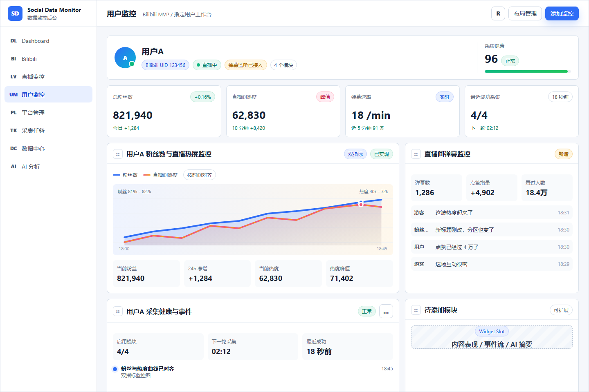

# B站指定用户监控工作台技术方案

最后更新：2026-06-13  
关联工程：`social-data-monitor`  
样式稿：[`mockups/bilibili-user-monitor-workbench-styles.html`](mockups/bilibili-user-monitor-workbench-styles.html)

## 1. 结论

建议把“用户监控”做成当前 B站粉丝监控和 B站直播监控之上的一层聚合工作台，而不是重写已有模块。

首版落地路径：

1. 新增 `Subject` 监控对象，把一个用户的 B站账号、直播间、启用模块和页面布局绑定在一起。
2. 复用已实现的 B站粉丝监控与直播间热度监控，用户监控页只做聚合展示和操作跳转。
3. 按调研报告新增直播弹幕 WebSocket 增强链路，只在直播中且用户启用弹幕模块时连接。
4. 弹幕数据默认先做分钟级聚合和最近窗口，不默认永久保存完整用户明细。

样式上首版确定采用“方案 A：总览工作台”的合并图版本：把粉丝数监控和直播间热度监控合并到一个双指标趋势图里，顶部保留各自核心数值，右侧保留直播间弹幕监控，底部留出采集健康/事件和待添加模块。它最接近当前项目的 Vue 3 + Element Plus 中后台风格，也最适合从现有页面迁移组件。方案 C 的可编排看板适合作为第二阶段，把用户草图里的“监控展示位置可移动”做完整。

最终样式图：



## 2. 当前基础

项目已有两条可运行闭环：

| 能力 | 当前页面 | API 封装 | 后端模块 | 数据表 |
| --- | --- | --- | --- | --- |
| B站粉丝数监控 | `frontend/src/views/bilibili/BilibiliView.vue` | `frontend/src/api/bilibili.ts` | `com.socialmonitor.bilibili` | `bilibili_monitored_user`、`bilibili_follower_snapshot` |
| B站直播间热度监控 | `frontend/src/views/bilibili-live/BilibiliLiveView.vue` | `frontend/src/api/bilibiliLive.ts` | `com.socialmonitor.bilibili.live` | `bilibili_live_room_monitor`、`bilibili_live_room_snapshot`、`bilibili_live_status_event` |

现有路由在 `frontend/src/router/index.ts`：

```ts
{ path: 'bilibili', name: 'bilibili', component: BilibiliView }
{ path: 'bilibili/live', name: 'bilibili-live', component: BilibiliLiveView }
```

用户监控页不替代这两个专项页。专项页继续负责列表管理、采集间隔、手动刷新和专项趋势；用户监控页负责围绕一个指定用户组织“粉丝、直播热度、弹幕、事件、健康”这些模块。

## 3. 产品信息架构

新增两个页面：

```text
/subjects
  用户监控对象列表

/subjects/:subjectId
  指定用户监控工作台
```

首版重点可以只做 `/subjects/:subjectId`，列表页先用简单表格承载。

工作台首屏模块：

| 模块 | 数据来源 | 状态 |
| --- | --- | --- |
| 用户头部 | `monitored_subject` + B站绑定表 | 新增 |
| 总粉丝数 | `bilibili_monitored_user.current_follower_count` | 已实现，聚合展示 |
| 直播间热度 | `bilibili_live_room_monitor.online_count` | 已实现，聚合展示 |
| 粉丝数 + 直播热度双指标图 | `bilibili_follower_snapshot` + `bilibili_live_room_snapshot` | 已实现数据源，新增聚合展示 |
| 直播状态事件 | `bilibili_live_status_event` | 已实现，聚合展示 |
| 弹幕速率/最近弹幕 | 新增 WebSocket 聚合链路 | 新增 |
| 采集健康 | 已有 monitor 表错误字段 + 新增弹幕连接状态 | 聚合 |
| 待添加模块 | Widget 注册表 | 新增 |

## 4. 前端方案

### 4.1 新增文件

```text
frontend/src/api/subjects.ts
frontend/src/views/subjects/SubjectListView.vue
frontend/src/views/subjects/SubjectWorkbenchView.vue
frontend/src/views/subjects/components/SubjectHeader.vue
frontend/src/views/subjects/components/SubjectWidgetBoard.vue
frontend/src/views/subjects/components/MonitorWidgetShell.vue
frontend/src/views/subjects/widgets/BilibiliFollowerLiveHeatWidget.vue
frontend/src/views/subjects/widgets/BilibiliLiveDanmuWidget.vue
frontend/src/views/subjects/widgets/SubjectHealthEventWidget.vue
```

路由：

```ts
{ path: 'subjects', name: 'subjects', component: SubjectListView, meta: { title: '用户监控' } }
{ path: 'subjects/:subjectId', name: 'subject-workbench', component: SubjectWorkbenchView, meta: { title: '用户监控' } }
```

左侧菜单新增“用户监控”，图标可使用 Element Plus `User` 或 `Monitor`。

### 4.2 Widget 注册

用注册表避免后续每加一个监控内容就改主页面：

```ts
export type SubjectWidgetKey =
  | 'bilibili-follower-live-heat'
  | 'bilibili-live-danmu'
  | 'subject-health-events'
  | 'widget-placeholder'

export interface SubjectWidgetDefinition {
  key: SubjectWidgetKey
  title: string
  minWidth: number
  minHeight: number
  component: Component
  requires: Array<'bilibiliUser' | 'bilibiliLiveRoom' | 'danmuEnabled'>
}
```

首版可以先不实现拖拽，按服务端返回的 `layout_json` 排序渲染。第二阶段再接 `vue-grid-layout` 或 `gridstack`，把样式稿 C 的“拖拽布局”做成真实交互。

### 4.3 页面数据接口

首屏只请求一次聚合接口，避免前端同时调用粉丝、直播、弹幕多个接口后自行拼装：

```text
GET /api/subjects/{subjectId}/workbench
```

返回结构建议：

```json
{
  "subject": {},
  "bilibiliUser": {},
  "bilibiliLiveRoom": {},
  "summary": {
    "followerCount": 821940,
    "followerDelta24h": 1284,
    "liveStatus": 1,
    "onlineCount": 62830,
    "onlinePeak": 71402,
    "danmuPerMinute": 18,
    "healthScore": 96
  },
  "widgets": [],
  "layout": [],
  "recentEvents": []
}
```

双指标图建议走新增聚合趋势接口，由后端按时间桶把粉丝快照和直播快照对齐，前端只负责渲染：

```text
GET /api/subjects/{subjectId}/trends?metrics=follower,live_online&range=24h&bucket=5m
```

## 5. 后端方案

### 5.1 新增 Subject 聚合模块

```text
backend/src/main/java/com/socialmonitor/subject/
  controller/SubjectController.java
  domain/MonitoredSubject.java
  domain/SubjectBilibiliBinding.java
  domain/SubjectWidgetLayout.java
  dto/*
  repository/SubjectRepository.java
  service/SubjectService.java
  service/SubjectWorkbenchService.java
  service/SubjectHealthService.java
```

职责：

| 服务 | 职责 |
| --- | --- |
| `SubjectService` | 创建用户监控对象、绑定 B站 UID 和直播间、启停模块 |
| `SubjectWorkbenchService` | 聚合粉丝、直播、弹幕、事件，返回工作台首屏 |
| `SubjectHealthService` | 根据最近成功、错误、退避、弹幕连接状态计算健康分 |

不要把已有 B站 monitor 表复制一份。Subject 只保存“谁绑定了哪些已有监控资源”和“这个用户页面启用了哪些模块”。

### 5.2 数据库迁移

建议新增 `V5__subject_monitor.sql`：

```sql
CREATE TABLE monitored_subject (
    id BIGSERIAL PRIMARY KEY,
    display_name VARCHAR(160) NOT NULL,
    avatar_url TEXT,
    remark TEXT,
    tags_json JSONB NOT NULL DEFAULT '[]'::jsonb,
    monitor_status VARCHAR(32) NOT NULL DEFAULT 'ACTIVE',
    health_score NUMERIC(6, 2),
    last_success_at TIMESTAMPTZ,
    last_event_at TIMESTAMPTZ,
    created_at TIMESTAMPTZ NOT NULL DEFAULT now(),
    updated_at TIMESTAMPTZ NOT NULL DEFAULT now()
);

CREATE TABLE subject_bilibili_binding (
    id BIGSERIAL PRIMARY KEY,
    subject_id BIGINT NOT NULL REFERENCES monitored_subject(id) ON DELETE CASCADE,
    bilibili_user_monitor_id BIGINT REFERENCES bilibili_monitored_user(id) ON DELETE SET NULL,
    bilibili_live_room_monitor_id BIGINT REFERENCES bilibili_live_room_monitor(id) ON DELETE SET NULL,
    mid BIGINT,
    room_id BIGINT,
    enabled_capabilities_json JSONB NOT NULL DEFAULT '["follower","live_heat"]'::jsonb,
    danmu_enabled BOOLEAN NOT NULL DEFAULT false,
    created_at TIMESTAMPTZ NOT NULL DEFAULT now(),
    updated_at TIMESTAMPTZ NOT NULL DEFAULT now(),
    UNIQUE (subject_id)
);

CREATE TABLE subject_widget_layout (
    id BIGSERIAL PRIMARY KEY,
    subject_id BIGINT NOT NULL REFERENCES monitored_subject(id) ON DELETE CASCADE,
    widget_key VARCHAR(80) NOT NULL,
    enabled BOOLEAN NOT NULL DEFAULT true,
    position_json JSONB NOT NULL DEFAULT '{}'::jsonb,
    settings_json JSONB NOT NULL DEFAULT '{}'::jsonb,
    created_at TIMESTAMPTZ NOT NULL DEFAULT now(),
    updated_at TIMESTAMPTZ NOT NULL DEFAULT now(),
    UNIQUE (subject_id, widget_key)
);

CREATE INDEX idx_monitored_subject_status
    ON monitored_subject (monitor_status);

CREATE INDEX idx_subject_bilibili_binding_user
    ON subject_bilibili_binding (bilibili_user_monitor_id);

CREATE INDEX idx_subject_bilibili_binding_live
    ON subject_bilibili_binding (bilibili_live_room_monitor_id);
```

`position_json` 示例：

```json
{ "x": 0, "y": 0, "w": 8, "h": 3 }
```

### 5.3 弹幕监控模块

根据 [`bilibili-live-danmaku-research.md`](bilibili-live-danmaku-research.md)，新增包：

```text
backend/src/main/java/com/socialmonitor/bilibili/live/danmaku/
  client/BilibiliAnonymousCookieProvider.java
  client/BilibiliLiveDanmuInfoClient.java
  client/BilibiliLiveMessageClient.java
  client/BilibiliWbiSigner.java
  domain/BilibiliLiveDanmuConnection.java
  domain/BilibiliLiveDanmuMetricBucket.java
  parser/BilibiliLiveMessageParser.java
  service/BilibiliLiveDanmuService.java
  service/BilibiliLiveEventAggregator.java
```

链路：

```text
直播轮询发现 live_status = 1
  -> subject_bilibili_binding.danmu_enabled = true
  -> room_init 确认真实 room_id
  -> x/frontend/finger/spi 获取 buvid3/buvid4
  -> nav 获取 WBI key
  -> getDanmuInfo 获取 token 和 host_list
  -> WebSocket 鉴权、心跳、解包
  -> 解析 DANMU_MSG / WATCHED_CHANGE / LIKE_INFO_V3_UPDATE / ROOM_REAL_TIME_MESSAGE_UPDATE
  -> 聚合到分钟桶和最近弹幕窗口
  -> 下播或心跳超时后断开
```

第一版只支持 `protover=2` 和 zlib 解压。`protover=3` Brotli 可以作为第二阶段兼容。

### 5.4 弹幕数据表

建议新增 `V6__bilibili_live_danmaku_monitor.sql`：

```sql
CREATE TABLE bilibili_live_danmaku_session (
    id BIGSERIAL PRIMARY KEY,
    live_room_monitor_id BIGINT NOT NULL REFERENCES bilibili_live_room_monitor(id) ON DELETE CASCADE,
    room_id BIGINT NOT NULL,
    started_at TIMESTAMPTZ NOT NULL,
    ended_at TIMESTAMPTZ,
    status VARCHAR(32) NOT NULL,
    connect_host VARCHAR(200),
    reconnect_count INTEGER NOT NULL DEFAULT 0,
    last_heartbeat_at TIMESTAMPTZ,
    last_error_at TIMESTAMPTZ,
    last_error_type VARCHAR(80),
    last_error_message TEXT,
    created_at TIMESTAMPTZ NOT NULL DEFAULT now()
);

CREATE TABLE bilibili_live_danmaku_metric_bucket (
    id BIGSERIAL PRIMARY KEY,
    live_room_monitor_id BIGINT NOT NULL REFERENCES bilibili_live_room_monitor(id) ON DELETE CASCADE,
    session_id BIGINT REFERENCES bilibili_live_danmaku_session(id) ON DELETE SET NULL,
    room_id BIGINT NOT NULL,
    bucket_start TIMESTAMPTZ NOT NULL,
    bucket_seconds INTEGER NOT NULL DEFAULT 60,
    danmu_count INTEGER NOT NULL DEFAULT 0,
    like_count BIGINT,
    like_increment BIGINT,
    watched_count BIGINT,
    heartbeat_popularity BIGINT,
    gift_count INTEGER NOT NULL DEFAULT 0,
    super_chat_count INTEGER NOT NULL DEFAULT 0,
    raw_event_count INTEGER NOT NULL DEFAULT 0,
    created_at TIMESTAMPTZ NOT NULL DEFAULT now(),
    UNIQUE (live_room_monitor_id, bucket_start, bucket_seconds)
);

CREATE TABLE bilibili_live_danmaku_recent (
    id BIGSERIAL PRIMARY KEY,
    live_room_monitor_id BIGINT NOT NULL REFERENCES bilibili_live_room_monitor(id) ON DELETE CASCADE,
    room_id BIGINT NOT NULL,
    message_text TEXT NOT NULL,
    display_name VARCHAR(160),
    medal_name VARCHAR(80),
    sent_at TIMESTAMPTZ NOT NULL,
    created_at TIMESTAMPTZ NOT NULL DEFAULT now()
);

CREATE INDEX idx_bilibili_danmaku_bucket_room_time
    ON bilibili_live_danmaku_metric_bucket (live_room_monitor_id, bucket_start DESC);

CREATE INDEX idx_bilibili_danmaku_recent_room_time
    ON bilibili_live_danmaku_recent (live_room_monitor_id, sent_at DESC);
```

存储边界：

- 默认保存分钟级指标桶。
- 最近弹幕窗口建议限制条数，例如每个直播间最多 200 条，或按 24 小时保留。
- 不默认保存完整 `uid`、Cookie、token、原始 WebSocket 包。
- 礼物、SC、上舰等事件第二阶段只保存聚合数量和必要展示字段。

### 5.5 弹幕连接策略

| 场景 | 策略 |
| --- | --- |
| 未开播 | 不建立 WebSocket |
| 开播且启用弹幕模块 | 建立连接 |
| 连接失败 | host 轮换，指数退避 |
| `getDanmuInfo` 返回 `-352/-403` | 刷新 WBI key 和 buvid 后最多重试一次 |
| `-101` | 视为接口不可匿名，停止并记录错误 |
| 心跳超时 | 断开并退避重连 |
| 房间下播 | 关闭连接，结束 session |
| 多房间并发 | 全局连接上限，例如 10 到 30，根据机器资源配置 |

配置建议：

```yaml
social-monitor:
  bilibili:
    live:
      danmaku:
        enabled: true
        max-connections: 10
        heartbeat-seconds: 30
        reconnect-initial-delay-seconds: 5
        reconnect-max-delay-seconds: 300
        recent-message-limit-per-room: 200
        bucket-seconds: 60
```

## 6. API 设计

Subject API：

```text
GET    /api/subjects
POST   /api/subjects
GET    /api/subjects/{subjectId}
PATCH  /api/subjects/{subjectId}
DELETE /api/subjects/{subjectId}

POST   /api/subjects/{subjectId}/bilibili-binding
PATCH  /api/subjects/{subjectId}/bilibili-binding
GET    /api/subjects/{subjectId}/workbench
GET    /api/subjects/{subjectId}/trends
PATCH  /api/subjects/{subjectId}/widgets/{widgetKey}
PUT    /api/subjects/{subjectId}/layout
```

弹幕 API：

```text
POST   /api/bilibili/live-monitor/rooms/{roomMonitorId}/danmaku/start
POST   /api/bilibili/live-monitor/rooms/{roomMonitorId}/danmaku/stop
GET    /api/bilibili/live-monitor/rooms/{roomMonitorId}/danmaku/status
GET    /api/bilibili/live-monitor/rooms/{roomMonitorId}/danmaku/recent?limit=50
GET    /api/bilibili/live-monitor/rooms/{roomMonitorId}/danmaku/metrics?range=1h
```

用户监控页通常不直接调用弹幕 start/stop，而是通过 Widget 开关更新：

```text
PATCH /api/subjects/{subjectId}/bilibili-binding
{ "danmuEnabled": true }
```

后端根据直播状态自动决定是否连接。

## 7. 实施阶段

### 阶段 1：Subject 聚合与合并图样式落地

目标：先让“用户监控”页面跑起来。

- 新增 `monitored_subject`、`subject_bilibili_binding`、`subject_widget_layout`。
- 新增 `/api/subjects/{id}/workbench`。
- 新增 `SubjectWorkbenchView.vue`，按最终样式展示用户头部、四个核心指标、粉丝数 + 直播热度双指标图、弹幕模块、采集健康/事件和待添加模块。
- 新增 `BilibiliFollowerLiveHeatWidget.vue`，复用已有粉丝快照与直播快照数据，后端聚合接口按时间桶对齐两条曲线。
- 弹幕模块先显示“未启用”或 mock 空状态。

验收：

- 一个 Subject 能绑定已有 B站粉丝监控用户和直播间监控。
- 工作台能显示当前粉丝数、直播热度、近 24h 合并趋势和采集健康。
- 已有 `/bilibili`、`/bilibili/live` 功能不受影响。

### 阶段 2：弹幕 WebSocket 验证型接入

目标：证明低成本链路稳定。

- 实现 WBI signer、匿名 buvid provider、getDanmuInfo client。
- 实现单房间 WebSocket、鉴权、心跳、zlib 解包。
- 只解析 `DANMU_MSG`、`WATCHED_CHANGE`、`LIKE_INFO_V3_UPDATE`、`ROOM_REAL_TIME_MESSAGE_UPDATE`。
- 写入分钟桶和最近弹幕窗口。

验收：

- 对一个直播中房间连续监听 10 分钟。
- 能看到弹幕数、点赞、看过人数、心跳人气更新。
- 下播后连接自动关闭。

### 阶段 3：产品化弹幕模块

目标：把弹幕接入用户工作台。

- `BilibiliLiveDanmuWidget` 展示弹幕速率、最近弹幕、点赞增量、看过人数。
- 弹幕连接状态纳入健康分。
- 增加连接上限、退避、保留期配置。
- 补充事件时间线：弹幕峰值、点赞峰值、连接异常、恢复。

### 阶段 4：可编排看板

目标：实现样式 C。

- 接入拖拽布局库或自研轻量 Grid。
- `subject_widget_layout.position_json` 持久化布局。
- 增加模块库和启停开关。
- 支持每个 Subject 单独布局。

## 8. 风险与边界

| 风险 | 等级 | 处理 |
| --- | --- | --- |
| B站接口变更 | 中 | 保持弹幕链路模块化，错误码清晰记录 |
| WBI 签名失败 | 中 | key 缓存，失败刷新一次，之后退避 |
| 长连接资源 | 中 | 只连直播中房间，设置全局连接上限 |
| 游客态信息不完整 | 中 | UI 不承诺完整用户身份，只展示正文和聚合指标 |
| 弹幕隐私与内容存储 | 中高 | 默认短期保留最近窗口，不存 Cookie/token/完整用户画像 |
| 账号态 Cookie | 高 | 当前方案不接入 `SESSDATA`、`bili_jct` 和发送/送礼等状态变更接口 |

## 9. 推荐取舍

首版选择：

- UI：方案 A 合并图版本。
- 架构：Subject 聚合层 + Widget 注册表。
- 数据：复用现有粉丝和直播表，只新增绑定、布局和弹幕聚合表。
- 弹幕：先聚合、再展示，暂不做全量弹幕归档。

这样可以在较低成本下把用户草图里的四个区域落地为：粉丝数 + 直播热度双指标监控、直播间弹幕监控、采集健康/事件、待添加模块，同时保留后续添加内容表现、事件流、AI 摘要和多平台数据的扩展空间。
