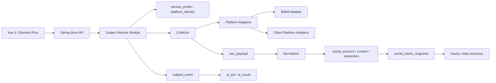

# 指定用户多维度多平台监控方案

最后更新：2026-06-11  
关联工程：`social-data-monitor`  
样式稿：[`mockups/specified-user-monitor-styles.html`](mockups/specified-user-monitor-styles.html)

## 1. 方案定位

本方案把当前项目从“B站粉丝/直播监控”升级为“指定用户多平台监控”。核心对象不再是单个平台账号，而是一个被监控对象：

```text
监控对象 Subject
  -> B站账号
  -> 抖音账号
  -> 微博账号
  -> 小红书账号
  -> 其他平台账号
```

系统围绕这个对象持续采集账号、内容、互动、直播、增长、事件和采集健康数据，形成一张跨平台用户画像和趋势看板。

边界保持当前项目原则：

- 第一阶段仍以 Bilibili 已落地能力为真实闭环。
- 其他平台只通过 Adapter 扩展，接入前必须单独确认数据来源、授权方式、频率和风险边界。
- 不做验证码绕过、Cookie 抓取、登录态规避、批量高频扫描。
- 可公开匿名获取的数据走低风险采集；需要授权的数据只接受用户明确提供并可撤销的授权凭证。
- AI 分析不进入采集主链路，只做异步摘要、异常解释和日报。

## 2. 监控维度

| 维度 | 指标 | 当前/近期来源 |
| --- | --- | --- |
| 账号资料 | 昵称、头像、简介、认证、主页、粉丝、关注 | B站 `card` 已实现；其他平台走 Adapter |
| 增长趋势 | 粉丝净增、增长率、平台贡献占比 | `social_metric_snapshot` + 汇总表 |
| 内容表现 | 发布数、播放/阅读、点赞、收藏、评论、转发 | B站后续内容 Adapter；其他平台逐步接入 |
| 互动质量 | 互动率、评论增长、弹幕活跃、直播热度 | 已有 B站直播快照；内容互动后续补齐 |
| 直播状态 | 是否开播、在线/热度、开播/下播事件、标题变化 | 已有 `bilibili_live_*` 模块 |
| 事件流 | 发布、开播、粉丝突增、异常采集、标题变更 | 从快照差异和任务日志派生 |
| 采集健康 | 最近成功、错误类型、退避、接口耗时、数据新鲜度 | `api_call_log`、任务实例、专用 monitor 表 |
| AI 观察 | 异常解释、内容摘要、风险提示、日报 | `ai_job` / `ai_result` 异步处理 |

## 3. 页面信息架构

### 3.1 监控对象列表 `/subjects`

目标：快速扫描所有指定用户的状态。

页面结构：

```text
顶部工具栏
  搜索对象 / 平台过滤 / 风险过滤 / 添加对象

摘要指标
  监控对象数 / 正常采集 / 今日异常 / 今日关键事件

对象列表
  头像 + 名称
  已绑定平台徽标
  总粉丝、24h 净增、互动率
  采集健康
  最近事件
```

### 3.2 监控对象详情 `/subjects/:subjectId`

目标：围绕一个指定用户做跨平台分析。

页面结构：

```text
对象头部
  昵称、备注、标签、健康状态、总粉丝、最后采集时间

平台账号轨道
  B站 / 抖音 / 微博 / 小红书 / 其他
  每个平台展示账号状态、最近成功、错误、启停、打开主页

多维指标矩阵
  粉丝增长 / 内容发布 / 互动率 / 直播热度 / 事件数 / 采集健康

趋势区
  平台贡献堆叠
  粉丝趋势
  内容互动趋势
  直播热度趋势

内容与事件区
  最近内容列表
  最近状态事件
  采集异常和退避

AI 摘要区
  今日变化解释
  异常原因候选
  后续观察建议
```

### 3.3 添加与绑定流程

采用抽屉或页面级 Wizard：

1. 创建监控对象：名称、备注、标签、默认采集间隔。
2. 添加平台账号：选择平台，输入平台 ID 或主页 URL。
3. 校验账号：调用对应 Adapter `fetchAccount` 获取昵称、头像、粉丝等公开信息。
4. 选择能力：账号资料、粉丝快照、内容列表、互动指标、直播状态。
5. 保存并创建采集任务。

### 3.4 任务与数据复用

现有页面不废弃：

- `/bilibili`：保留为 B站粉丝专项页。
- `/bilibili/live`：保留为 B站直播专项页。
- `/tasks`：扩展为 Subject 相关任务追踪。
- `/data`：扩展为 Subject 维度的数据检索。
- `/identity`：从占位页升级为“跨平台身份候选与人工确认”。

## 4. UI 组件设计

### 4.1 关键组件

| 组件 | 说明 |
| --- | --- |
| `SubjectHeader` | 头像、名称、标签、总览指标、采集健康 |
| `PlatformAccountRail` | 多平台账号横向轨道，显示能力、状态、错误 |
| `MetricMatrix` | 按平台 x 指标展示粉丝、互动、内容、直播 |
| `CrossPlatformTrendBoard` | 多指标趋势图，最多同时比较 4 个平台或账号 |
| `SubjectEventTimeline` | 发布、开播、下播、粉丝突增、异常恢复 |
| `CollectionHealthPanel` | 数据新鲜度、错误类型、退避、接口耗时 |
| `SubjectAccountDrawer` | 添加/编辑平台账号和能力开关 |

### 4.2 状态规则

| 状态 | UI 表达 | 行为 |
| --- | --- | --- |
| 正常 | 绿色状态点、健康分 80+ | 正常采集 |
| 数据变旧 | 黄色状态点、显示最后成功时间 | 提示刷新或检查任务 |
| 异常退避 | 红色状态点、显示错误类型 | 不立即高频重试 |
| 已暂停 | 灰色弱化、禁用趋势自动刷新 | 可手动恢复 |
| 未绑定 | 空状态按钮 | 引导添加平台账号 |

### 4.3 响应式

- 桌面端：左侧导航 + 主内容，详情页使用上方指标、下方两列分析。
- 1024px 以下：平台账号轨道横向滚动，趋势图变 1 列。
- 手机端：对象头部压缩，摘要指标 2 列或 1 列，事件流置于趋势后。

## 5. 最终技术实现方案

### 5.1 总体架构



### 5.2 后端新增模块

```text
backend/src/main/java/com/socialmonitor/subject/
  controller/SubjectMonitorController.java
  domain/MonitoredSubject.java
  domain/SubjectAccountMonitor.java
  domain/SubjectEvent.java
  dto/*
  repository/SubjectMonitorRepository.java
  service/SubjectMonitorService.java
  service/SubjectAggregationService.java
  service/SubjectEventService.java
```

职责：

- `SubjectMonitorService`：对象、账号绑定、能力开关、启停。
- `SubjectAggregationService`：从标准表和 B站专项表聚合详情页数据。
- `SubjectEventService`：把快照差异、内容发布、直播状态变化、采集异常归并为时间线事件。

### 5.3 数据库迁移建议

复用已存在的 `person_profile`、`platform_identity`、`platform_account`、`social_*`、`metric_*` 表，新增最小业务表：

```sql
CREATE TABLE monitored_subject (
    id BIGSERIAL PRIMARY KEY,
    person_id BIGINT REFERENCES person_profile(id) ON DELETE SET NULL,
    display_name VARCHAR(160) NOT NULL,
    avatar_url TEXT,
    remark TEXT,
    tags_json JSONB NOT NULL DEFAULT '[]'::jsonb,
    monitor_status VARCHAR(32) NOT NULL DEFAULT 'ACTIVE',
    default_interval_seconds INTEGER NOT NULL DEFAULT 3600,
    health_score NUMERIC(6, 2),
    last_success_at TIMESTAMPTZ,
    last_event_at TIMESTAMPTZ,
    created_at TIMESTAMPTZ NOT NULL DEFAULT now(),
    updated_at TIMESTAMPTZ NOT NULL DEFAULT now()
);

CREATE TABLE subject_account_monitor (
    id BIGSERIAL PRIMARY KEY,
    subject_id BIGINT NOT NULL REFERENCES monitored_subject(id) ON DELETE CASCADE,
    platform_identity_id BIGINT REFERENCES platform_identity(id) ON DELETE SET NULL,
    platform_id BIGINT NOT NULL REFERENCES platform(id) ON DELETE CASCADE,
    external_id VARCHAR(200) NOT NULL,
    display_name VARCHAR(160),
    profile_url TEXT,
    avatar_url TEXT,
    enabled_capabilities_json JSONB NOT NULL DEFAULT '[]'::jsonb,
    monitor_status VARCHAR(32) NOT NULL DEFAULT 'ACTIVE',
    interval_seconds INTEGER NOT NULL DEFAULT 3600,
    next_collect_at TIMESTAMPTZ,
    last_success_at TIMESTAMPTZ,
    last_error_at TIMESTAMPTZ,
    last_error_type VARCHAR(80),
    last_error_message TEXT,
    backoff_until TIMESTAMPTZ,
    extension_json JSONB NOT NULL DEFAULT '{}'::jsonb,
    created_at TIMESTAMPTZ NOT NULL DEFAULT now(),
    updated_at TIMESTAMPTZ NOT NULL DEFAULT now(),
    UNIQUE (subject_id, platform_id, external_id)
);

CREATE INDEX idx_subject_account_due
    ON subject_account_monitor (monitor_status, next_collect_at);

CREATE TABLE subject_event (
    id BIGSERIAL PRIMARY KEY,
    subject_id BIGINT NOT NULL REFERENCES monitored_subject(id) ON DELETE CASCADE,
    account_monitor_id BIGINT REFERENCES subject_account_monitor(id) ON DELETE SET NULL,
    platform_id BIGINT REFERENCES platform(id) ON DELETE SET NULL,
    event_type VARCHAR(80) NOT NULL,
    severity VARCHAR(32) NOT NULL DEFAULT 'INFO',
    title VARCHAR(240) NOT NULL,
    description TEXT,
    occurred_at TIMESTAMPTZ NOT NULL,
    source_entity_type VARCHAR(80),
    source_entity_id BIGINT,
    metrics_json JSONB NOT NULL DEFAULT '{}'::jsonb,
    created_at TIMESTAMPTZ NOT NULL DEFAULT now()
);

CREATE INDEX idx_subject_event_subject_time
    ON subject_event (subject_id, occurred_at DESC);
```

指标继续优先写入：

- `social_metric_snapshot`：账号、内容、直播间等原子指标。
- `metric_hourly_summary` / `metric_daily_summary`：看板查询。
- B站粉丝和直播专项表：短期保留，聚合服务把它们映射到 Subject 视角。

### 5.4 REST API

```text
GET    /api/subjects
POST   /api/subjects
GET    /api/subjects/{subjectId}
PATCH  /api/subjects/{subjectId}
DELETE /api/subjects/{subjectId}

POST   /api/subjects/{subjectId}/accounts
PATCH  /api/subjects/{subjectId}/accounts/{accountMonitorId}
DELETE /api/subjects/{subjectId}/accounts/{accountMonitorId}
POST   /api/subjects/{subjectId}/accounts/{accountMonitorId}/refresh

GET    /api/subjects/{subjectId}/metrics?range=7d
GET    /api/subjects/{subjectId}/trends?metric=follower_count&range=30d
GET    /api/subjects/{subjectId}/contents?platform=bilibili
GET    /api/subjects/{subjectId}/events?limit=50
GET    /api/subjects/{subjectId}/health
POST   /api/subjects/{subjectId}/ai-summary
```

详情接口建议一次返回页面首屏所需数据：

```json
{
  "subject": {},
  "accounts": [],
  "summary": {},
  "metricMatrix": [],
  "recentEvents": [],
  "health": {}
}
```

### 5.5 采集链路

```text
subject_account_monitor 到期
  -> CollectTaskExecutor 创建任务实例
  -> PlatformAdapter 按 capability 拉取数据
  -> api_call_log 记录请求
  -> raw_payload 保存原始响应
  -> Normalizer 写入 social_* 标准表
  -> 指标写入 social_metric_snapshot
  -> SubjectAggregationService 更新 subject 摘要
  -> SubjectEventService 派生事件
```

接入 B站时：

- 已有 `/api/bilibili/follower-monitor/*` 和 `/api/bilibili/live-monitor/*` 保持可用。
- 新 Subject 页优先复用现有 B站数据，不要求立即重写。
- 后续再把 B站粉丝和直播采集收敛到通用 `subject_account_monitor` 任务体系。

接入其他平台时：

- 新增 Adapter 实现 `SocialPlatformAdapter`。
- 明确 `PlatformCapability`，不支持的能力必须返回 `unsupported`。
- 每个平台单独配置 `request-min-interval`、失败退避、凭证风险等级。
- 只要无法确认稳定、授权或合规边界，就只显示“待接入”，不写采集代码。

### 5.6 前端实现

新增：

```text
frontend/src/api/subjects.ts
frontend/src/views/subjects/SubjectListView.vue
frontend/src/views/subjects/SubjectDetailView.vue
frontend/src/views/subjects/components/SubjectHeader.vue
frontend/src/views/subjects/components/PlatformAccountRail.vue
frontend/src/views/subjects/components/MetricMatrix.vue
frontend/src/views/subjects/components/SubjectEventTimeline.vue
```

路由：

```ts
{ path: 'subjects', name: 'subjects', component: SubjectListView, meta: { title: '用户监控' } }
{ path: 'subjects/:subjectId', name: 'subject-detail', component: SubjectDetailView, meta: { title: '用户详情' } }
```

样式上复用当前全局结构：

- `page`、`page-header`、8px 卡片圆角。
- Element Plus 表单、按钮、抽屉、标签、分段控件。
- ECharts 复用 `TrendChart.vue`，复杂趋势再扩展 series。
- 工具型后台优先，不做营销页。

## 6. 三版样式稿

三版已绘制在：

[`docs\mockups\specified-user-monitor-styles.html`](mockups/specified-user-monitor-styles.html)

| 版本 | 名称 | 适合场景 | 建议 |
| --- | --- | --- | --- |
| A | 清爽运营台 | 日常监控、当前项目延续 | 首版推荐 |
| B | 研究分析桌面 | 深度分析、运营复盘、对比研究 | 第二阶段可吸收局部 |
| C | 深色指挥台 | 大屏值守、异常告警、夜间监控 | 可作为主题模式 |

推荐首版采用 A 的整体布局，吸收 B 的“指标矩阵”，把 C 作为后续深色主题。

