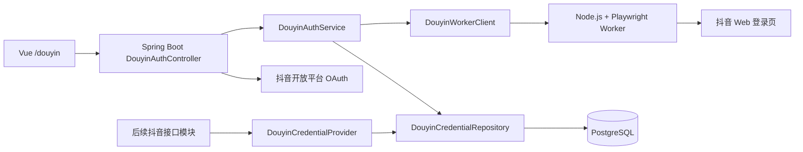
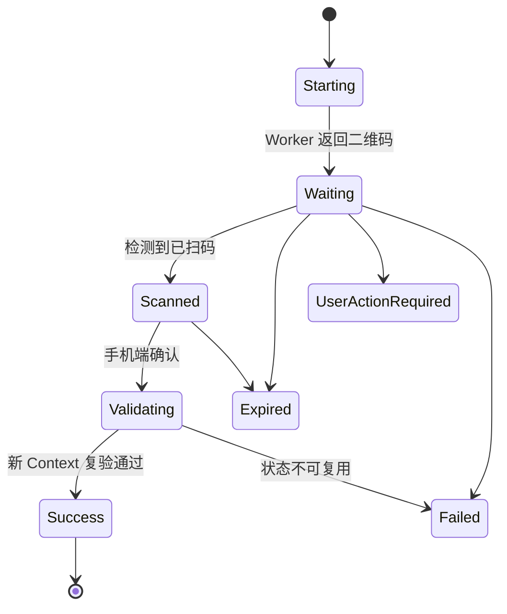

# 抖音双登录态获取与持久化设计

状态：已确认设计，等待实现计划

日期：2026-07-18

适用工程：`D:\codex_work\BiliMonitor\social-data-monitor`

## 1. 目标

在现有 `social-data-monitor` 中新增两套互相独立的抖音登录能力：

1. 抖音开放平台官方 OAuth 网页扫码授权。
2. 抖音 Web 页面扫码登录，由独立 Node.js + Playwright Worker 获取浏览器登录态。

首期只负责登录态的获取、完整保存、校验、刷新、查看、导出、撤销和复用，不实现任何抖音主页、作品、评论、直播或其他业务数据接口。

后续抖音接口统一通过 `DouyinCredentialProvider` 获取所需登录态，不直接读取数据库，也不重复实现扫码或 Cookie 拼装。

## 2. 已确认范围

### 2.1 首期包含

- 单管理员、单个当前有效 OAuth 登录态。
- 单管理员、单个当前有效 Web 浏览器登录态。
- OAuth 的 `disabled`、`mock`、`live` 三种运行模式。
- Web 二维码生成、前端轮询、手机确认、登录态捕获和新 Browser Context 复验。
- 完整保存 OAuth token 响应和浏览器会话数据。
- 完整凭据查看、复制和 JSON 导出。
- OAuth token 刷新框架。
- Web 登录态重新加载校验。
- Windows 本机运行入口。
- 独立的 Docker/Linux 部署入口。
- 为后续接口提供稳定的 Java credential provider。

### 2.2 首期不包含

- 抖音公开主页或作品采集。
- 任何具体抖音业务 OpenAPI 或 Web API。
- 评论、粉丝关系、直播、搜索或内容下载。
- 动态签名算法逆向。
- 验证码自动识别或风控绕过。
- Subject 工作台抖音绑定。
- 多抖音账号管理。
- 多系统用户或租户隔离。
- 对现有通用采集骨架的补全或重构。

### 2.3 数据完整性要求

- 登录态按原始值完整保存，不使用摘要、掩码、截断或字段白名单替代原文。
- OAuth 原始 token 响应、回调参数、授权码和账号响应完整保存。
- Web 登录态保存全部相关域 Cookie、localStorage、sessionStorage、可序列化 IndexedDB、Playwright storage state、浏览器上下文和 Worker 原始结果。
- 哈希只能用于唯一性或流程校验，不能替代原始 payload。
- 静态存储加密是可逆的存储格式；解密后必须与 Worker 或 OAuth provider 返回值一致。

## 3. 零回归隔离约束

### 3.1 不修改的内容

- `backend/src/main/java/com/socialmonitor/bilibili/**`
- `frontend/src/views/bilibili/**`
- `frontend/src/api/bilibiliAuth.ts`
- `/api/bilibili/auth/**` 的路径、请求、响应和行为
- `SOCIAL_MONITOR_BILIBILI_*` 配置
- Flyway `V1` 至 `V8`
- B站扫码的会话存储、凭据仓库和 Cipher
- 原 `scripts/dev-start.cmd` 与 `scripts/dev-stop.cmd` 的默认行为

### 3.2 允许的纯新增接入

- 在前端 Router 中增加 `/douyin`。
- 在功能开关开启时向 `MainLayout.vue` 增加抖音菜单项。
- 在 `.env.example` 增加空的抖音配置。
- 在 `.gitignore` 增加 Worker 构建产物和运行目录。
- 在 README 增加抖音独立启动说明。
- 新增 Flyway `V9__douyin_auth_credential.sql`。

### 3.3 默认关闭

没有启用抖音 profile 或功能开关时：

- 不注册抖音 controller、service 或 Worker client。
- 不启动 Playwright Worker。
- 不占用 Worker 端口。
- 不要求安装 Playwright Chromium。
- 原项目启动、B站页面和 B站扫码行为保持不变。

## 4. 当前项目适配判断

项目已有 `SocialPlatformAdapter`、`platform_credential`、统一响应对象、Flyway、Vue Router 和 B站扫码交互模式，可以复用结构约定。

通用 `CollectTaskScheduler`、`RawPayloadService` 和部分 ingestion 服务仍是骨架，因此本功能不依赖或扩展这些占位实现。抖音首期也不注册数据采集能力，只注册登录态相关组件。

现有 `BilibiliCredentialCipher` 保持不变。抖音新增独立 `DouyinCredentialCipher`，避免对 B站扫码产生回归风险。

## 5. 总体架构



### 5.1 Spring Boot

新增包：

```text
com.socialmonitor.douyin
  auth
    config
    controller
    domain
    dto
    repository
    service
  worker
    client
    dto
```

职责：

- 编排 OAuth 与 Web 二维码流程。
- 管理登录会话状态。
- 接收 Worker 返回的完整浏览器状态。
- 完整序列化并保存登录态。
- 提供校验、刷新、查看、导出和撤销接口。
- 向后续接口模块提供 credential provider。

### 5.2 Playwright Worker

目录：

```text
social-data-monitor/douyin-worker/
```

职责：

- 创建隔离 Browser Context。
- 打开抖音 Web 登录入口并显示扫码界面。
- 截取二维码元素。
- 检测等待扫码、已扫码、验证中、成功、过期和需要人工处理状态。
- 导出完整登录态。
- 使用导出的登录态创建第二个全新 Context 复验。
- 提供后续浏览器态接口调用所需的 Context 恢复能力边界。

Worker 不连接数据库。前端不直接连接 Worker。

### 5.3 Vue 前端

新增：

```text
frontend/src/views/douyin/DouyinView.vue
frontend/src/views/douyin/components/DouyinOAuthPanel.vue
frontend/src/views/douyin/components/DouyinWebAuthPanel.vue
frontend/src/views/douyin/components/DouyinQrLoginDialog.vue
frontend/src/views/douyin/components/DouyinCredentialDrawer.vue
frontend/src/api/douyinAuth.ts
```

前端沿用现有 B站扫码的交互模式，但不导入或修改任何 B站组件。

## 6. 官方 OAuth 流程

### 6.1 模式

- `disabled`：默认模式。页面显示尚未配置，不发起真实授权。
- `mock`：仅供开发和自动化测试完成闭环。
- `live`：取得网站应用资质并配置 Client Key、Client Secret 和 HTTPS callback 后启用。

### 6.2 数据流

1. 管理员调用 `POST /api/douyin/auth/oauth/start`。
2. 后端生成随机 `loginId` 和 `state`，写入 `douyin_auth_session`。
3. 前端打开官方授权 URL；官方页面负责展示二维码。
4. 抖音回调 `GET /api/douyin/auth/oauth/callback`，携带原始 callback 参数。
5. 后端检查 session、state、过期时间和是否已消费。
6. `live` 模式使用授权码换取 token，并读取用户信息。
7. 将授权码、callback 参数、token 原始响应、用户原始响应和解析字段组成完整 payload。
8. 完成校验、序列化和加密后，在同一个数据库事务内原子切换同类型凭据；事务失败时旧 ACTIVE 凭据保持不变。
9. session 标记为 SUCCESS，回调页面跳转到 `/douyin?oauth=success`。

### 6.3 刷新

- access token 刷新使用官方 `/oauth/refresh_token/`，并完整保存原始刷新响应。
- refresh token 续期仅在应用具备 `renew_refresh_token` 权限时使用官方 `/oauth/renew_refresh_token/`；没有该权限时不自动调用。
- 是否刷新由 provider 返回的有效期字段决定，不在代码中写死天数。
- 同一 OAuth 凭据只允许一个刷新操作进行。
- 刷新成功后在单个数据库事务内新增一条 ACTIVE `platform_credential`，并将旧凭据标记为 REVOKED；旧行及其原始 payload 保留。
- 刷新失败时保留当前 ACTIVE 凭据，并将完整失败响应保存到本次 `douyin_auth_session.raw_result_json`。

## 7. Web 二维码流程



### 7.1 数据流

1. Spring 创建 `loginId` 并调用 Worker 创建临时登录 Context。
2. Worker 打开抖音登录页，定位并截取二维码元素。
3. Spring 代理二维码 PNG；Vue 轮询 Spring 的 session status。
4. Worker 检测登录成功后导出完整会话 bundle。
5. Worker 使用该 bundle 创建第二个全新 Context。
6. 新 Context 重新访问抖音页面并确认仍是登录状态。
7. 复验通过后，Spring 完整保存 bundle。
8. 完成校验、序列化和加密后，在同一个数据库事务内原子切换同类型凭据；事务失败时旧 ACTIVE 凭据保持不变。
9. Worker 关闭临时 Context，并将 session 标记为可清理。

`SCANNED` 是尽力检测状态。如果页面没有稳定的已扫码信号，可以从 `WAITING` 直接进入 `VALIDATING`。

## 8. 完整登录态 payload

以下 JSON 是固定结构示例；示例字符串表示 provider 或 Worker 的实际原始值，不是未决字段。

### 8.1 OAuth payload

```json
{
  "version": 1,
  "authType": "DOUYIN_OAUTH2",
  "source": "OFFICIAL_WEB_OAUTH",
  "authorizationCode": "provider-authorization-code",
  "callbackParameters": {
    "code": "provider-authorization-code",
    "state": "generated-session-state"
  },
  "accessToken": "provider-access-token",
  "refreshToken": "provider-refresh-token",
  "openId": "provider-open-id",
  "unionId": "provider-union-id",
  "scope": ["user_info"],
  "expiresAt": "provider-derived-timestamp",
  "refreshExpiresAt": "provider-derived-timestamp",
  "account": {
    "nickname": "provider-nickname",
    "avatarUrl": "provider-avatar-url",
    "rawUserInfo": {}
  },
  "rawTokenResponse": {},
  "authorizedAt": "server-timestamp",
  "lastRefreshedAt": "server-timestamp"
}
```

### 8.2 Web session payload

```json
{
  "version": 1,
  "authType": "DOUYIN_WEB_SESSION",
  "source": "WEB_QRCODE",
  "account": {},
  "cookies": [],
  "cookieHeadersByOrigin": {},
  "origins": [
    {
      "origin": "https://www.douyin.com",
      "localStorage": [],
      "sessionStorage": [],
      "indexedDb": []
    }
  ],
  "storageState": {},
  "browserContext": {
    "userAgent": "captured-user-agent",
    "secChUa": "captured-client-hint",
    "locale": "zh-CN",
    "timezoneId": "Asia/Shanghai",
    "viewport": {
      "width": 1440,
      "height": 900
    },
    "platform": "captured-platform"
  },
  "rawWorkerResult": {},
  "capturedAt": "server-timestamp",
  "lastValidatedAt": "server-timestamp"
}
```

Cookie 不使用固定名称白名单。Worker 保存抖音登录流程实际产生的全部相关域 Cookie 及其所有属性。

## 9. 数据库设计

新增迁移：

```text
backend/src/main/resources/db/migration/V9__douyin_auth_credential.sql
```

核心 SQL：

```sql
INSERT INTO platform (code, name, status)
VALUES ('douyin', '抖音', 'ACTIVE')
ON CONFLICT (code) DO NOTHING;

CREATE TABLE IF NOT EXISTS douyin_auth_session (
    login_id UUID PRIMARY KEY,
    flow_type VARCHAR(32) NOT NULL,
    provider_mode VARCHAR(32) NOT NULL,
    worker_session_id VARCHAR(160),
    state TEXT,
    status VARCHAR(32) NOT NULL,
    expires_at TIMESTAMPTZ NOT NULL,
    completed_at TIMESTAMPTZ,
    error_code VARCHAR(80),
    error_message TEXT,
    raw_result_json JSONB NOT NULL DEFAULT '{}'::jsonb,
    created_at TIMESTAMPTZ NOT NULL DEFAULT now(),
    updated_at TIMESTAMPTZ NOT NULL DEFAULT now(),
    CHECK (flow_type IN ('OAUTH_LOGIN', 'OAUTH_REFRESH', 'WEB_QR')),
    CHECK (provider_mode IN ('disabled', 'mock', 'live')),
    CHECK (status IN (
        'STARTING', 'WAITING', 'SCANNED', 'VALIDATING', 'SUCCESS',
        'EXPIRED', 'USER_ACTION_REQUIRED', 'FAILED'
    ))
);

CREATE INDEX IF NOT EXISTS idx_douyin_auth_session_status_expires
    ON douyin_auth_session (status, expires_at);

CREATE UNIQUE INDEX IF NOT EXISTS ux_platform_credential_douyin_active
    ON platform_credential (platform_id, auth_type)
    WHERE auth_type IN ('DOUYIN_OAUTH2', 'DOUYIN_WEB_SESSION')
      AND status = 'ACTIVE';
```

登录态继续存入现有 `platform_credential`：

- `platform_id`：`douyin` 平台 ID。
- `auth_type`：`DOUYIN_OAUTH2` 或 `DOUYIN_WEB_SESSION`。
- `encrypted_payload`：可逆加密后的完整 payload。
- `expires_at`：provider 返回的 token 有效期，或 Web session 中可推导的有效期。
- `status`：`ACTIVE`、`EXPIRED`、`REVOKED` 或 `INVALID`。

凭据切换算法：

1. 在事务外完成远端响应校验、完整 payload 序列化和可逆加密，失败时不触碰当前凭据。
2. 开启数据库事务，并按 `platform_id + auth_type` 获取事务级 advisory lock，串行化同类型登录或刷新。
3. 将同类型旧 ACTIVE 行更新为 REVOKED，再插入新 ACTIVE 行。
4. 依靠部分唯一索引保证同类型最多一条 ACTIVE 行。
5. 任一步失败都回滚整个事务；其他事务在提交前仍只会看到旧 ACTIVE 行，不会观察到无凭据窗口。

不写入或更新 B站的 `platform_account`、credential 索引和迁移对象。

## 10. 外部 API

### 10.1 OAuth

```text
POST   /api/douyin/auth/oauth/start
GET    /api/douyin/auth/oauth/callback
POST   /api/douyin/auth/oauth/refresh
```

### 10.2 Web 二维码

```text
POST   /api/douyin/auth/web/qr/start
GET    /api/douyin/auth/web/qr/{loginId}/image
GET    /api/douyin/auth/web/qr/{loginId}/status
POST   /api/douyin/auth/web/validate
```

### 10.3 凭据管理

```text
GET    /api/douyin/auth/status
GET    /api/douyin/auth/credentials/oauth
GET    /api/douyin/auth/credentials/web
GET    /api/douyin/auth/credentials/oauth/export
GET    /api/douyin/auth/credentials/web/export
DELETE /api/douyin/auth/credentials/oauth
DELETE /api/douyin/auth/credentials/web
```

`credentials` 和 `export` 返回完整解密结果。删除操作只将当前凭据标记为 REVOKED，不物理删除历史 payload。

OAuth callback 允许匿名访问并依靠对应 login session 的 state 完成关联；其他抖音管理接口使用独立的 Douyin security filter chain。该 filter chain 不匹配 B站或其他 `/api/**` 请求。

## 11. Worker 内部 API

```text
GET    /internal/v1/health
POST   /internal/v1/login-sessions
GET    /internal/v1/login-sessions/{workerSessionId}/qr
GET    /internal/v1/login-sessions/{workerSessionId}/status
POST   /internal/v1/login-sessions/{workerSessionId}/consume
DELETE /internal/v1/login-sessions/{workerSessionId}
POST   /internal/v1/web-sessions/validate
```

`consume` 仅供 Spring 在成功状态后取得完整 Worker 结果。Vue 不接触内部 API。

## 12. Credential Provider

```java
public interface DouyinCredentialProvider {
    DouyinOAuthCredential requireActiveOAuth();
    DouyinWebSessionCredential requireActiveWebSession();
}
```

约束：

- provider 返回强类型对象，不返回未解析的数据库行。
- provider 负责读取、解密和校验认证类型。
- provider 不负责调用具体抖音业务接口。
- 官方 OpenAPI 客户端依赖 OAuth credential。
- Web 接口客户端依赖 Web session，并交给 Worker 恢复 Browser Context。

## 13. 前端交互

`/douyin` 页面包含：

### 13.1 OAuth 卡片

- 当前模式和配置状态。
- 开始授权。
- 刷新 token。
- 账号摘要和有效期。
- 查看完整凭据。
- 导出 JSON。
- 撤销。

### 13.2 Web 登录态卡片

- Worker 健康状态。
- 开始扫码。
- 登录态校验。
- 账号摘要和最后校验时间。
- 查看完整 Cookie、storage 和 Worker 原始结果。
- 导出 JSON。
- 删除和重新登录。

### 13.3 完整凭据抽屉

抽屉提供以下标签页：

```text
账号信息
Cookie Header
Cookies JSON
localStorage
sessionStorage
IndexedDB
storageState
浏览器上下文
Worker 原始结果
完整合并 JSON
```

支持逐项复制、复制全部和下载 JSON。

## 14. 配置与启动

新增配置项：

```text
SOCIAL_MONITOR_DOUYIN_AUTH_ENABLED=false
SOCIAL_MONITOR_DOUYIN_OAUTH_MODE=disabled
SOCIAL_MONITOR_DOUYIN_OAUTH_CLIENT_KEY=
SOCIAL_MONITOR_DOUYIN_OAUTH_CLIENT_SECRET=
SOCIAL_MONITOR_DOUYIN_OAUTH_REDIRECT_URI=
SOCIAL_MONITOR_DOUYIN_CREDENTIAL_ENCRYPTION_KEY=
SOCIAL_MONITOR_DOUYIN_WORKER_BASE_URL=http://127.0.0.1:8787
SOCIAL_MONITOR_DOUYIN_WORKER_TOKEN=
SOCIAL_MONITOR_DOUYIN_QR_EXPIRE_SECONDS=180
SOCIAL_MONITOR_DOUYIN_POLL_INTERVAL_MS=1500
VITE_DOUYIN_ENABLED=false
```

抖音配置放入新增 `application-douyin.yml`。新增启动脚本激活 `dev,douyin` profile，原 `application.yml` 和原启动脚本默认行为不变。

### 14.1 Windows

```text
scripts/dev-start-douyin.cmd
scripts/dev-stop-douyin.cmd
scripts/dev-douyin-worker.ps1
```

运行数据：

```text
.dev-data/douyin-worker/
.dev-data/douyin-worker.log
.dev-data/douyin-worker.err.log
```

### 14.2 Docker/Linux

```text
deploy/douyin/compose.yml
deploy/douyin/backend.Dockerfile
deploy/douyin/frontend.Dockerfile
deploy/douyin/worker.Dockerfile
```

Worker 固定 Playwright 与 Chromium 版本。Compose 中的路径和 volume 均使用项目内相对路径，不要求机器外部配置目录。

## 15. 异常处理

稳定错误类型：

```text
OAUTH_NOT_CONFIGURED
OAUTH_STATE_INVALID
OAUTH_TOKEN_EXCHANGE_FAILED
OAUTH_REFRESH_EXPIRED
WORKER_UNAVAILABLE
QR_EXPIRED
USER_ACTION_REQUIRED
WEB_SESSION_CAPTURE_FAILED
WEB_SESSION_INVALID
CREDENTIAL_NOT_FOUND
CREDENTIAL_DECRYPT_FAILED
```

规则：

- 新登录开始时不撤销旧登录态。
- 新登录成功后才进入凭据切换事务；旧凭据撤销和新凭据激活必须原子提交。
- Worker 不可用时后端和原项目继续运行。
- 二维码过期、验证码或附加验证不进入无限自动重试。
- 失败响应原文保存到对应 session 或 credential payload。
- 登录失败不得改变 B站凭据或 B站会话。

## 16. 测试方案

### 16.1 后端

- OAuth state、callback、mock token 和刷新流程。
- OAuth payload 完整序列化、加密、解密和导出。
- Web Cookie 全属性、storage 和 Worker 原始结果无损往返。
- 同认证类型单活约束。
- 新登录失败时旧 ACTIVE 凭据保持不变。
- 刷新成功时旧 token 历史记录保留。
- `DouyinCredentialProvider` 返回正确强类型对象。
- Douyin security filter chain 不匹配 `/api/bilibili/**`。

### 16.2 Worker

- 二维码元素发现和 PNG 输出。
- 状态转换。
- Cookie、localStorage、sessionStorage 和 IndexedDB 导出。
- 新 Context 恢复和登录态验证。
- Context、Page 和 Chromium 进程回收。
- 使用本地模拟登录页进行自动化测试，CI 不依赖真实抖音账号。

### 16.3 前端

- OAuth 与 Web 状态展示。
- 二维码轮询无并发请求。
- 弹窗关闭、成功、过期和失败时停止轮询。
- 完整凭据抽屉字段不丢失。
- 复制和 JSON 导出。
- `VITE_DOUYIN_ENABLED=false` 时不显示菜单。

### 16.4 原项目回归

- 运行全部现有 Maven 测试。
- 单独运行 B站 auth、cookie state 和 cipher 测试。
- 前端 `npm run typecheck` 和 `npm run build`。
- `/bilibili` 与 `/bilibili/live` 页面冒烟验证。
- B站二维码生成、轮询、保存、查看和删除行为验证。
- 原 `dev-start.cmd` 与 `dev-stop.cmd` 启停验证。
- `git diff` 不得包含 B站扫码源码或 V1 至 V8 的修改。

## 17. 验收标准

1. 默认关闭抖音时，原项目行为与当前版本一致。
2. `mock` OAuth 可以完成 start、callback、保存、查看、导出、刷新和撤销闭环。
3. 取得开放平台资质后，仅修改项目内私有配置即可切换 `live`。
4. Web 扫码可显示真实抖音二维码。
5. 手机确认后保存完整 Web 登录态。
6. 后端与 Worker 重启后，可从数据库恢复登录态并通过新 Context 校验。
7. 完整 OAuth 和 Web payload 可查看、复制和导出。
8. 后续模块可通过 `DouyinCredentialProvider` 获取两种凭据。
9. 首期没有任何具体抖音数据接口或采集任务。
10. B站扫码和原项目功能零回归。

## 18. 后续扩展边界

### 18.1 多抖音账号

后续通过新迁移增加 owner/account binding，并将单活约束改为账号维度。首期不提前增加未使用的多账号表。

### 18.2 多系统用户

后续凭据绑定 `sys_user` 或租户主体，并按用户查询 active credential。首期固定使用单管理员语义。

### 18.3 具体接口

官方接口客户端使用 OAuth credential；Web 接口通过 Worker 恢复保存的 Browser Context。每个具体接口作为独立后续设计和实现任务，不扩张本次登录态基础设施的职责。

## 19. 参考资料

- 抖音登录和授权：<https://developer.open-douyin.com/docs/resource/zh-CN/dop/ability/opensdk/user-authorization/solution>
- 抖音获取授权码：<https://developer.open-douyin.com/docs/resource/zh-CN/dop/develop/openapi/account-permission/douyin-get-permission-code/>
- 获取 access_token：<https://developer.open-douyin.com/docs/resource/zh-CN/dop/develop/openapi/account-permission/get-access-token/>
- 刷新 access_token：<https://developer.open-douyin.com/docs/resource/zh-CN/dop/develop/openapi/account-permission/refresh-access-token>
- 刷新 refresh_token：<https://developer.open-douyin.com/docs/resource/zh-CN/dop/develop/openapi/account-permission/refresh-token>
