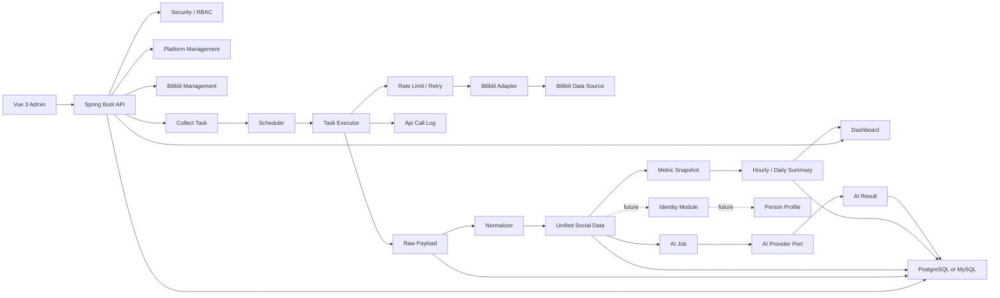

# 多社交平台数据监控系统技术框架总方案

## 1. 方案定位

本方案面向一个“多社交平台数据监控系统”。当前阶段只做单体项目，不创建后端或前端工程代码，但架构必须为后续微服务拆分、AI 接入、多平台接入和跨平台身份聚合留下清晰边界。

合并后的最终方向：

- 第一阶段以 Bilibili 数据采集闭环为 MVP。
- 其他平台通过 Adapter 机制预留，不在 MVP 实现。
- 同一人跨平台聚合作为未来模块预留，避免早期自动合并带来误判。
- 不参考社交平台开放平台资料。
- 可参考本地 `bilibili-api-collect-new-research` 作为 Bilibili 数据对象、接口形态、凭证风险和采集边界的工程参考。

## 2. 核心问题

这个系统不是简单的 API 调用和图表展示，而是一个轻量数据采集与治理平台。它要处理：

- 平台接口不稳定、字段可能变化。
- Token、Cookie、代理、访问频率带来的风险。
- 采集任务的限流、重试、checkpoint 和失败恢复。
- 原始数据留存和标准化数据分离。
- Bilibili 特有数据对象和通用社交数据模型的边界。
- 多平台后同一人的不同平台账号需要未来聚合。
- AI 分析必须异步接入，不能阻塞采集主链路。

## 3. 推荐技术栈

### 后端

推荐：

- Java 21，保守环境可使用 Java 17。
- Spring Boot 3.x。
- Spring Web。
- Spring Security。
- Spring Validation。
- Spring Scheduling。
- Spring Actuator。
- MyBatis-Plus。
- Flyway。
- PostgreSQL 优先，MySQL 8 可替代。
- Maven。

可选：

- Spring Modulith：用于约束模块边界。
- Resilience4j：用于限流、重试、熔断。
- springdoc-openapi：用于接口文档。

暂不默认引入：

- Redis：多实例任务锁、分布式限流、热点缓存出现后再引入。
- Kafka：采集和清洗吞吐需要异步解耦后再引入。
- Elasticsearch：复杂全文检索需求明确后再引入。
- ClickHouse：指标分析规模超出关系型数据库和汇总表后再引入。
- Kubernetes：服务数量和部署复杂度上来后再引入。

### 前端

推荐：

- Vue 3。
- Vite。
- TypeScript。
- Pinia。
- Vue Router。
- Element Plus。
- ECharts。
- Axios。

Element Plus 适合后台系统的表格、表单、弹窗、任务管理和权限配置。Naive UI 可作为视觉风格替代。

## 4. 单体阶段架构



## 5. 后端模块划分

```text
com.socialmonitor
  common
  config
  security
  platform
  bilibili
  collector
  ingestion
  socialdata
  analytics
  ai
  identity
  notification
  admin
```

模块职责：

- `platform`：平台定义、能力矩阵、账号、凭证、Adapter SPI。
- `bilibili`：Bilibili Adapter、Bilibili normalizer、Bilibili 特有风险处理。
- `collector`：采集任务、任务实例、调度、执行、限流、重试、状态机、checkpoint。
- `ingestion`：原始数据、去重、重放、标准化协调。
- `socialdata`：统一账号、内容、评论、弹幕、互动、趋势、指标。
- `analytics`：指标快照、小时汇总、日汇总、看板查询。
- `ai`：AI Job、AI Result、Prompt、Provider Port。
- `identity`：未来跨平台身份聚合预留。
- `security`：登录、JWT、RBAC、审计。
- `notification`：未来告警和通知。

## 6. 前端模块划分

```text
src
  api
  router
  stores
  layouts
  views
    dashboard
    bilibili
    platform
    tasks
    data
    analytics
    ai
    identity
    settings
  components
    charts
    tables
    forms
    status
    platform
```

页面建议：

- Dashboard：任务状态、平台健康、Bilibili 核心指标。
- Bilibili：UP 主、视频、动态、评论、弹幕、指标。
- 平台管理：平台能力、账号、凭证、风险状态。
- 采集任务：任务定义、任务实例、失败原因、重试。
- 数据中心：账号、内容、评论、弹幕、趋势。
- 分析看板：粉丝趋势、互动趋势、内容 TopN、失败分布。
- AI 分析：摘要、情绪、异常、报表结果。
- Identity：未来入口，MVP 可隐藏或仅占位。
- 系统设置：用户、角色、权限、审计。

## 7. 核心数据库表草案

### 权限与审计

| 表 | 说明 |
| --- | --- |
| `sys_user` | 用户 |
| `sys_role` | 角色 |
| `sys_permission` | 权限 |
| `sys_user_role` | 用户角色 |
| `audit_log` | 操作审计 |

### 平台与凭证

| 表 | 说明 |
| --- | --- |
| `platform` | 平台定义 |
| `platform_capability` | 平台能力矩阵 |
| `platform_account` | 被监控的平台账号 |
| `platform_credential` | 加密凭证 |
| `platform_rate_limit_state` | 限流状态 |

### 采集任务

| 表 | 说明 |
| --- | --- |
| `collect_task` | 采集任务定义 |
| `collect_task_instance` | 单次执行实例 |
| `task_checkpoint` | 游标和恢复点 |
| `api_call_log` | 外部调用日志 |

### 原始与标准化数据

| 表 | 说明 |
| --- | --- |
| `raw_payload` | 原始响应 |
| `social_account` | 标准账号 |
| `social_content` | 标准内容 |
| `social_comment` | 标准评论 |
| `social_danmaku` | 弹幕 |
| `social_interaction` | 互动 |
| `social_metric_snapshot` | 指标快照 |
| `metric_hourly_summary` | 小时汇总 |
| `metric_daily_summary` | 日汇总 |
| `trend_topic` | 趋势主题 |

### AI 与身份聚合预留

| 表 | 说明 |
| --- | --- |
| `ai_job` | AI 分析任务 |
| `ai_result` | AI 结果 |
| `prompt_template` | Prompt 模板 |
| `person_profile` | 未来人物档案 |
| `platform_identity` | 某人在某个平台的身份 |
| `identity_link_candidate` | 疑似同一人的候选关系 |
| `identity_merge_audit` | 身份合并和拆分审计 |

关键索引：

- `social_account(platform_id, external_id)`。
- `social_content(platform_id, external_id)`。
- `social_comment(platform_id, external_id)`。
- `raw_payload(platform_id, data_type, external_id, payload_hash)`。
- `collect_task(status, next_run_at)`。
- `social_metric_snapshot(entity_type, entity_id, metric_key, captured_at)`。

## 8. Bilibili 重点数据域

MVP 优先覆盖：

- UP 主资料：昵称、头像、认证、简介、粉丝数、关注数、投稿数。
- 视频：标题、简介、分区、发布时间、时长、封面、播放、点赞、投币、收藏、转发、评论、弹幕。
- 动态：动态内容、发布时间、互动指标、关联内容。
- 评论：正文、评论用户、层级关系、点赞数、发布时间、回复。
- 弹幕：文本、出现时间、颜色、模式、发送时间、视频关联。
- 粉丝与关注：第一阶段以快照为主，不强制做全量关系图。
- 趋势与榜单：按时间快照保存，避免覆盖历史。

## 9. 平台 Adapter 设计

核心接口：

```text
SocialPlatformAdapter
  platformCode()
  capabilities()
  validateCredential()
  refreshCredential()
  fetchAccount()
  fetchContents()
  fetchContentDetail()
  fetchComments()
  fetchDanmaku()
  fetchInteractions()
  fetchFollowers()
  fetchTrends()
```

统一返回：

```text
FetchResult
  success
  data
  rawPayload
  nextCursor
  rateLimitInfo
  errorType
  retryable
  riskLevel
```

原则：

- Adapter 只处理平台差异。
- collector 不感知平台字段。
- normalizer 负责平台字段到标准模型的映射。
- 不支持的能力必须显式返回 `unsupported`。

## 10. 采集任务、限流、重试、恢复

采集链路：

```text
Scheduler
  -> scan due collect_task
  -> create collect_task_instance
  -> acquire rate limit
  -> call adapter
  -> write api_call_log
  -> write raw_payload
  -> update checkpoint
  -> normalize
  -> update metric snapshot
```

限流策略：

- MVP 单实例：内存令牌桶 + DB `next_allowed_at`。
- 多实例：Redis 分布式限流。
- 维度：平台、账号、凭证、接口、全局。

重试策略：

- 429、5xx、网络超时可重试。
- 401、403、凭证失效、明确风控不可盲目重试。
- 最大 3 次。
- 指数退避 + jitter。

失败恢复：

- checkpoint 保存分页游标、最后成功时间和状态 JSON。
- raw payload 已保存但 normalizer 失败时，可修复后重放。
- watchdog 扫描超时 `RUNNING` 任务。
- 不可恢复失败进入 `MANUAL_REVIEW`。

## 11. 数据标准化模型

统一身份键：

```text
platform_code + external_id
```

统一实体：

- Account。
- Content。
- Comment。
- Danmaku。
- Interaction。
- FollowerSnapshot。
- Trend。
- MetricSnapshot。

原则：

- 原始响应永远进入 `raw_payload`。
- 常用查询字段进入标准列。
- 平台特有字段进入 JSON 或扩展表。
- 指标变化使用快照，不覆盖历史。
- 跨平台身份聚合不自动合并，先做候选关系和人工审计。

## 12. 可视化方案

Dashboard：

- 采集任务成功率。
- 失败原因分布。
- API 调用耗时。
- 限流状态。
- Bilibili UP 主粉丝趋势。
- 视频播放、点赞、收藏、投币、评论、弹幕趋势。
- 内容 TopN。
- 评论增长趋势。
- 弹幕活跃区间。

图表：

- 折线图：指标趋势。
- 柱状图：内容排行。
- 堆叠图：互动构成。
- 热力图：失败时间分布、弹幕密度。
- 表格：任务实例、API 调用日志、内容列表。

## 13. AI 能力预留

AI 不进入采集主链路。

能力：

- 内容摘要。
- 评论情绪分析。
- 舆情风险识别。
- 异常互动检测。
- 智能日报、周报。
- UP 主运营建议。

接口：

```text
AiAnalysisPort
  summarizeContent()
  analyzeSentiment()
  detectAnomaly()
  generateReport()
  suggestOperation()
```

要求：

- 输入脱敏。
- 记录 provider、model、prompt version。
- 记录 input hash、output、耗时和成本。
- MVP 使用 Mock Provider。

## 14. 未来微服务拆分路线

1. 模块化单体：当前阶段。
2. AI Worker：AI 异步任务先拆。
3. Report Worker：报表和汇总任务独立。
4. Platform Access Service：平台凭证、Adapter、API 调用独立。
5. Collector Service：任务调度、限流、重试独立。
6. Analytics Service：看板查询、汇总表、报表独立。
7. Identity Service：跨平台身份聚合独立。
8. Notification Service：告警和通知独立。
9. Kafka：服务间异步事件需要时引入。
10. Elasticsearch：复杂全文检索需要时引入。
11. ClickHouse：大规模指标分析需要时引入。
12. Kubernetes：服务数量和部署治理需要时引入。

## 15. MVP 第一阶段计划

1. 基础工程、登录、RBAC、Flyway、统一异常。
2. 平台、Bilibili 账号、凭证加密、审计。
3. 采集任务、任务实例、调度、API 调用日志。
4. Bilibili Adapter 第一版，采集账号、视频、评论。
5. raw payload、normalizer、标准账号、内容、评论。
6. 弹幕、指标快照、基础趋势图。
7. 限流、重试、checkpoint、失败恢复。
8. AI 表、Mock Provider、最终压测和风险复核。

## 16. 风险和技术债控制

| 风险 | 等级 | 控制 |
| --- | --- | --- |
| Bilibili 接口变化 | 高 | raw payload 保留，normalizer 可重放 |
| 凭证失效 | 高 | 凭证状态机、重新配置提示 |
| Cookie 或 Token 泄露 | 高 | 加密存储、日志脱敏、审计 |
| 访问频率触发风控 | 高 | 限流、退避、暂停任务 |
| 标准化失败 | 中 | 保存原始数据，记录解析错误 |
| 查询变慢 | 中 | 索引、小时汇总、日汇总、后续缓存 |
| 架构过重 | 中 | 重型组件按触发条件引入 |
| 身份误合并 | 高 | MVP 不自动合并，未来人工确认和审计 |
| AI 成本失控 | 中 | 异步任务、额度、Mock Provider、按需触发 |

技术债控制：

- Adapter 不允许直接写业务表。
- 所有外部响应先写 raw payload。
- 所有采集必须有 task instance。
- 所有外部调用必须有 api call log。
- 所有凭证必须加密和脱敏。
- 所有数据库变更必须走 Flyway。
- 模块之间通过 service/port 调用。
- 不为“未来可能”提前引入 Kafka、ES、ClickHouse、K8s。

