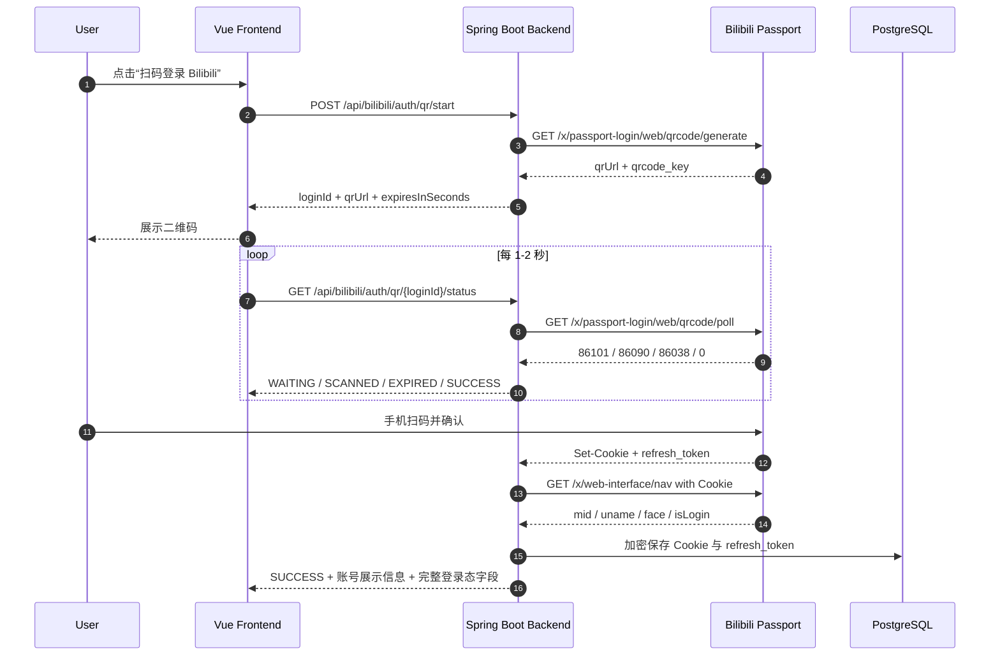
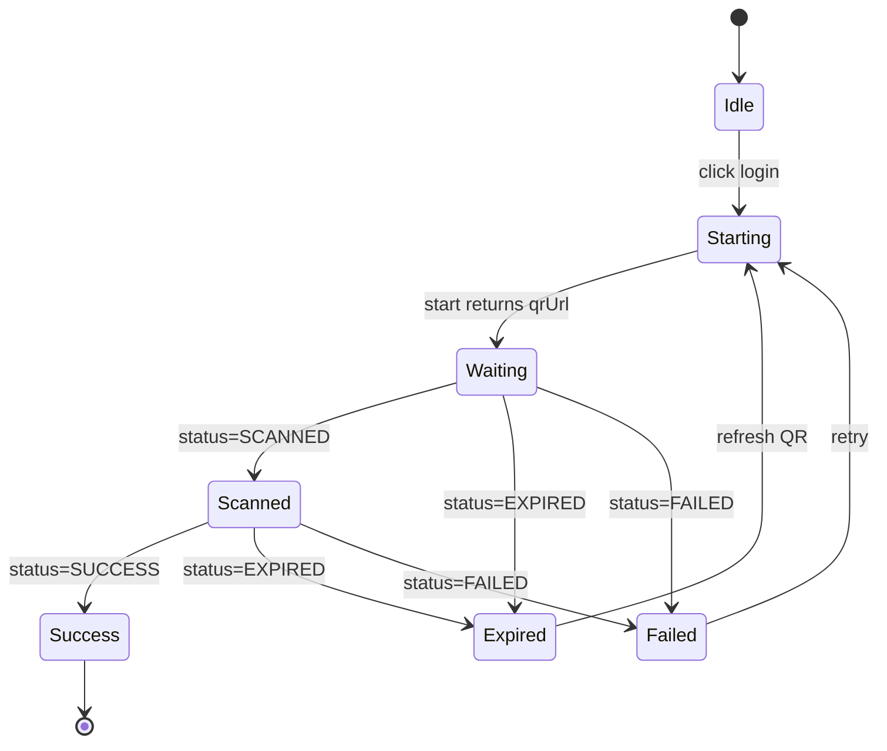

# Bilibili 扫码登录获取登录态设计方案

本方案面向 `social-data-monitor` 当前工程，目标是在项目内实现“扫码登录 Bilibili，并由后端安全保存 B 站登录态”。项目级完整原文约定见 `./project-conventions.md`，上游接口研究见根目录报告：`../../docs/bilibili-login-research.md`。

## 当前实现状态

最后更新：2026-06-16。

首期“Web 扫码 + 后端加密保存 + nav 校验 + 完整登录态返回”代码已经落地，并已通过真实手机扫码确认、凭据入库、解密读取和后端重启后校验。

已实现：

- `BilibiliAuthController` 暴露 `/api/bilibili/auth/**`。
- `BilibiliPassportClient` 集中封装二维码生成、扫码状态轮询和 `x/web-interface/nav` 校验。
- `BilibiliAuthService` 编排扫码会话、Cookie 提取、凭据加密保存、状态查询、删除和刷新校验。
- `BilibiliQrLoginSessionStore` 保存短期扫码会话。
- `BilibiliCredentialCipher` 使用 AES/GCM/NoPadding 加密 `platform_credential.encrypted_payload`。
- `BilibiliCredentialRepository` 读写 `platform_credential` 与 `platform_account`。
- Flyway `V7__bilibili_auth_credential.sql` 增加 Bilibili Web Cookie 单活索引和查询索引。
- 前端 `bilibiliAuth.ts`、`BilibiliAuthPanel.vue`、`BilibiliQrLoginDialog.vue` 已接入 `/bilibili` 页面。
- 前端 QR 渲染依赖 `qrcode` 和 `@types/qrcode` 已加入。

已验证：

- 后端 `.\mvnw.cmd test` 通过。
- 前端 `npm run typecheck` 通过。
- 前端 `npm run build` 通过。
- `GET /api/bilibili/auth/status` 在无凭据时返回 `loggedIn=false`、`status=NONE`。
- `POST /api/bilibili/auth/qr/start` 能返回 `loginId`、`qrUrl`、`expiresInSeconds=180` 和 `pollIntervalMillis=1500`。
- `GET /api/bilibili/auth/qr/{loginId}/status` 在未扫码时返回 `WAITING`。
- 外置 Chrome 截图验证过登录态面板和扫码弹窗可显示真实二维码。
- 用户真实扫码后，`GET /api/bilibili/auth/status` 返回 `loggedIn=true`、`status=ACTIVE`、`credentialId=1`。
- `GET /api/bilibili/auth/credential` 可解密返回 5 个 Cookie：`SESSDATA`、`bili_jct`、`DedeUserID`、`DedeUserID__ckMd5`、`sid`，并返回 CSRF 和 `refreshToken`。
- 数据库 `platform_credential` 存在 1 条 `BILIBILI_WEB_COOKIE` 的 `ACTIVE` 凭据，`risk_level=LOW`，`expires_at=2026-12-13 01:28:36.145787+08`。
- 数据库账号关联 UID `<bilibili_uid>`，昵称为 `<bilibili_nickname>`。
- 数据库 `encrypted_payload` 长度约 5299，且不包含明文 `SESSDATA` 或 `bili_jct`。
- 重启后端后，`GET /api/bilibili/auth/status` 仍返回 `loggedIn=true`、`status=ACTIVE`，并更新 `lastValidatedAt`。

未完成：

- `/api/bilibili/auth/refresh` 当前主要做 `nav` 重新校验，完整 Cookie 刷新链路仍属于第二阶段。
- 生产级管理员鉴权尚未接入，当前 `/api/**` 仍是开发期放行。

## 目标与边界

目标：

- 在前端提供 Bilibili 扫码登录入口。
- 后端向 Bilibili 申请二维码并轮询扫码状态。
- 用户用 Bilibili 手机客户端扫码确认后，后端获取 Web 登录态。
- 后端保存 `SESSDATA`、`bili_jct`、`DedeUserID`、`DedeUserID__ckMd5`、`sid` 和 `refresh_token`。
- 所有从 Bilibili 获得的登录态字段按原文完整保存，不截断、不 hash、不丢字段。
- 使用 `https://api.bilibili.com/x/web-interface/nav` 校验登录态，并向前端返回账号展示信息和完整登录态字段。
- 后续采集需要登录接口时，统一由后端注入 Cookie。

不做：

- 不收集 Bilibili 账号密码。
- 不自动绕过 Geetest 或任何风控验证。
- 不做任何登录态字段脱敏、掩码、截断、hash 替代或隐藏展示策略。
- 首期不做 TV 端 `access_key` 登录；除非后续明确需要 APP-only API。

## 完整原文口径

本项目禁止把“脱敏”作为 Bilibili 登录态相关设计目标。所有项目内的数据结构、接口返回、前端展示、日志、审计、导出和排障信息，只要包含 Bilibili 登录态字段，就必须使用完整原文，不能用星号、截断、hash、摘要或占位文本替代真实值。

具体边界：

- 存储层：`encrypted_payload` 内保存完整原文 Cookie 和完整 `refresh_token`。
- 运行时：后端请求 Bilibili 时使用完整原文构造 `Cookie` 请求头。
- 刷新流程：使用完整原文 `bili_jct`、旧 `refresh_token`、新 `refresh_token`，不做字段级脱敏。
- API 层：登录态相关响应直接返回完整 `cookieHeader`、`cookies[]`、`bili_jct`、`refresh_token` 和解密后的原文 payload。
- 前端层：登录态面板、调试页或复制功能展示完整原文，不隐藏、不折叠为星号。
- 日志和审计：如果记录登录态相关字段，也记录完整原文，不做脱敏替换。
- 导出和排障：所有导出内容保持完整原文，不设置额外完整值展示开关。

## 现有项目约束

当前项目关键现状：

- 后端是 Spring Boot 3.3.6、Java 17。
- API 响应统一使用 `ApiResponse<T>`。
- Bilibili 控制器路径已有 `/api/bilibili/follower-monitor`、`/api/bilibili/live-monitor`。
- 数据访问大量使用 `NamedParameterJdbcTemplate`。
- 数据库已有 `platform`、`platform_credential`、`platform_account`。
- `platform_credential.encrypted_payload JSONB` 已存在，但需要确认是否已有真实加密实现；若没有，扫码登录落地时必须补。
- `BilibiliPlatformAdapter.validateCredential` 和 `refreshCredential` 当前是占位逻辑。
- 前端是 Vue 3 + TypeScript + Element Plus + Axios。
- 当前 `SecurityConfig` 对 `/api/**` 全部放行，适合开发期；生产期 Bilibili 登录态管理接口必须接入系统自己的管理员鉴权。

## 总体架构



核心原则：Bilibili 登录态在存储、后端调用、API 返回、前端展示、日志、审计和导出中都保持完整原文。鉴权、加密保存、软删除属于访问控制和存储策略，不作为脱敏策略处理。

## Bilibili Web 扫码协议

### 生成二维码

请求：

```http
GET https://passport.bilibili.com/x/passport-login/web/qrcode/generate?source=main-fe-header
```

响应关键字段：

```json
{
  "code": 0,
  "message": "OK",
  "data": {
    "url": "https://account.bilibili.com/...",
    "qrcode_key": "32 位登录密钥"
  }
}
```

### 轮询状态

请求：

```http
GET https://passport.bilibili.com/x/passport-login/web/qrcode/poll?qrcode_key={qrcode_key}&source=main-fe-header
```

状态映射：

| Bilibili `data.code` | 后端状态 | 说明 |
| --- | --- | --- |
| `86101` | `WAITING` | 未扫码 |
| `86090` | `SCANNED` | 已扫码，手机端未确认 |
| `86038` | `EXPIRED` | 二维码过期 |
| `0` | `SUCCESS` | 登录成功 |
| 其他 | `FAILED` | 未知或异常状态 |

登录成功时需要读取：

- HTTP `Set-Cookie`
- JSON `data.refresh_token`
- JSON `data.timestamp`

随后立刻用 Cookie 调 `nav` 校验。

### 校验登录态

```http
GET https://api.bilibili.com/x/web-interface/nav
Cookie: SESSDATA=...; bili_jct=...; DedeUserID=...
Referer: https://www.bilibili.com/
```

有效登录态应满足：

- 顶层 `code=0`
- `data.isLogin=true`
- `data.mid` 存在

失效或未登录通常是：

- 顶层 `code=-101`
- `data.isLogin=false`

## 后端 API 设计

统一前缀：

```text
/api/bilibili/auth
```

### 开始扫码

```http
POST /api/bilibili/auth/qr/start
```

响应：

```json
{
  "success": true,
  "data": {
    "loginId": "uuid",
    "qrUrl": "https://account.bilibili.com/...",
    "expiresInSeconds": 180,
    "pollIntervalMillis": 1500
  }
}
```

### 查询扫码状态

```http
GET /api/bilibili/auth/qr/{loginId}/status
```

等待扫码：

```json
{
  "success": true,
  "data": {
    "status": "WAITING",
    "message": "等待扫码",
    "expiresInSeconds": 138
  }
}
```

已扫码待确认：

```json
{
  "success": true,
  "data": {
    "status": "SCANNED",
    "message": "已扫码，请在手机端确认",
    "expiresInSeconds": 124
  }
}
```

成功：

```json
{
  "success": true,
  "data": {
    "status": "SUCCESS",
    "message": "登录成功",
    "account": {
      "mid": 123456,
      "uname": "B站昵称",
      "face": "https://...",
      "level": 6,
      "vipStatus": 1
    }
  }
}
```

过期：

```json
{
  "success": true,
  "data": {
    "status": "EXPIRED",
    "message": "二维码已过期"
  }
}
```

### 查询当前登录态

```http
GET /api/bilibili/auth/status
```

响应：

```json
{
  "success": true,
  "data": {
    "loggedIn": true,
    "credentialId": 12,
    "account": {
      "mid": 123456,
      "uname": "B站昵称",
      "face": "https://..."
    },
    "lastValidatedAt": "2026-06-15T12:00:00+08:00",
    "lastRefreshCheckedAt": "2026-06-15T12:00:00+08:00",
    "expiresAt": "2026-12-12T12:00:00+08:00",
    "status": "ACTIVE",
    "credential": {
      "cookieHeader": "SESSDATA=...; bili_jct=...; DedeUserID=...; DedeUserID__ckMd5=...; sid=...",
      "cookies": [
        {
          "name": "SESSDATA",
          "value": "完整原文",
          "domain": ".bilibili.com",
          "path": "/",
          "expiresAt": "2026-12-12T12:00:00+08:00",
          "httpOnly": true,
          "secure": true,
          "sameSite": "None"
        }
      ],
      "csrf": "完整 bili_jct",
      "refreshToken": "完整 refresh_token",
      "rawPayload": {
        "cookies": [],
        "refreshToken": "完整 refresh_token",
        "lastNav": {}
      }
    }
  }
}
```

### 主动刷新登录态

```http
POST /api/bilibili/auth/refresh
```

用途：

- 管理员手动触发 Cookie 刷新检查。
- 后续也可被采集任务内部调用。

响应：

```json
{
  "success": true,
  "data": {
    "refreshed": true,
    "loggedIn": true,
    "message": "登录态已刷新"
  }
}
```

### 删除登录态

```http
DELETE /api/bilibili/auth
```

行为：

- 将 `platform_credential.status` 更新为 `REVOKED`。
- 清理对应 `platform_account.credential_id`。
- 如后续提供历史凭据查询，历史 Cookie 也按完整原文返回。

### 查询完整登录态

```http
GET /api/bilibili/auth/credential
```

行为：

- 返回当前 ACTIVE Bilibili 登录态的完整原文。
- 不需要额外完整值展示开关。
- 如果系统接入管理员鉴权，该接口按同一套管理员权限访问。
- 可写入审计事件 `BILIBILI_CREDENTIAL_VIEWED`，审计内容也保留完整字段，不做脱敏。

响应：

```json
{
  "success": true,
  "data": {
    "credentialId": 42,
    "account": {
      "mid": 123456,
      "uname": "B站昵称",
      "face": "https://...",
      "level": 6,
      "vipStatus": 1
    },
    "cookieHeader": "SESSDATA=...; bili_jct=...; DedeUserID=...; DedeUserID__ckMd5=...; sid=...",
    "cookies": [
      {
        "name": "SESSDATA",
        "value": "完整原文",
        "domain": ".bilibili.com",
        "path": "/",
        "expiresAt": "2026-12-01T12:00:00+08:00",
        "httpOnly": true,
        "secure": true,
        "sameSite": "None"
      }
    ],
    "csrf": "完整 bili_jct",
    "refreshToken": "完整 refresh_token",
    "expiresAt": "2026-12-01T12:00:00+08:00",
    "rawPayload": {
      "cookies": [],
      "refreshToken": "完整 refresh_token",
      "lastNav": {}
    }
  }
}
```

字段要求：

- 所有字段返回完整原文，不截断、不打星、不 hash。
- `rawPayload` 是解密后的 payload 原文结构，用于迁移和排障，不是数据库里的加密串。
- 前端页面可以直接展示、复制或导出这些字段，不做脱敏处理。

## 后端模块设计

建议新增包：

```text
com.socialmonitor.bilibili.auth
  BilibiliAuthController
  BilibiliAuthService
  BilibiliPassportClient
  BilibiliQrLoginSessionStore
  BilibiliCredentialRepository
  BilibiliCredentialCipher
  BilibiliCookieState
  BilibiliAuthProperties
  dto/
```

### `BilibiliAuthController`

职责：

- 暴露 `/api/bilibili/auth/**`。
- 返回 `ApiResponse<T>`。
- 不包含任何 Bilibili 协议细节。
- 登录态相关返回、日志和审计均保留完整原文，不做脱敏、截断或 hash 替代。

方法：

```java
@PostMapping("/qr/start")
ApiResponse<QrLoginStartView> startQrLogin()

@GetMapping("/qr/{loginId}/status")
ApiResponse<QrLoginStatusView> qrStatus(@PathVariable String loginId)

@GetMapping("/status")
ApiResponse<BilibiliAuthStatusView> status()

@PostMapping("/refresh")
ApiResponse<BilibiliAuthRefreshView> refresh()

@GetMapping("/credential")
ApiResponse<BilibiliCredentialFullView> credential()

@DeleteMapping
ApiResponse<Void> revoke()
```

### `BilibiliAuthService`

职责：

- 编排扫码会话。
- 将 Bilibili 状态码映射为业务状态。
- 登录成功后调用 `nav`。
- 加密保存登录态。
- 实现登录态状态检查、刷新和删除。
- 解密并返回完整原文登录态。

关键方法：

```java
QrLoginStartView startQrLogin();
QrLoginStatusView pollQrLogin(String loginId);
BilibiliAuthStatusView currentStatus();
BilibiliAuthRefreshView refreshCurrentCredential();
BilibiliCredentialFullView currentCredential();
void revokeCurrentCredential();
Optional<BilibiliCookieState> loadActiveCredential();
```

### `BilibiliPassportClient`

职责：

- 只封装 Bilibili passport/nav/cookie refresh HTTP 调用。
- 维护扫码临时 Cookie。
- 解析响应，不做数据库持久化。

建议使用 Java 17 原生：

```java
HttpClient client = HttpClient.newBuilder()
        .cookieHandler(cookieManager)
        .connectTimeout(Duration.ofMillis(connectTimeoutMs))
        .followRedirects(HttpClient.Redirect.NEVER)
        .build();
```

原因：

- `RestClient + SimpleClientHttpRequestFactory` 当前项目已有，但不自动维护 CookieJar。
- `HttpClient + CookieManager` 无需新增依赖。
- 成功后可以从 `CookieStore` 提取 `.bilibili.com` Cookie。

接口：

```java
QrCodeGenerateResult generateQrCode(CookieManager cookieManager);
QrCodePollResult pollQrCode(CookieManager cookieManager, String qrcodeKey);
NavResult fetchNav(BilibiliCookieState cookieState);
CookieInfoResult fetchCookieInfo(BilibiliCookieState cookieState);
String fetchRefreshCsrf(BilibiliCookieState cookieState, long timestamp);
CookieRefreshResult refreshCookie(BilibiliCookieState cookieState, String refreshCsrf);
void confirmRefresh(BilibiliCookieState newState, String oldRefreshToken);
```

### `BilibiliQrLoginSessionStore`

首期内存实现即可：

```java
ConcurrentHashMap<String, BilibiliQrLoginSession>
```

`BilibiliQrLoginSession` 字段：

```java
String loginId;
String qrcodeKey;
String qrUrl;
CookieManager cookieManager;
OffsetDateTime createdAt;
OffsetDateTime expiresAt;
QrLoginStatus lastStatus;
```

清理：

- `poll` 时发现过期就移除。
- `@Scheduled(fixedDelayString = "...")` 每分钟清理一次。

多实例部署：

- 改为 Redis。
- Cookie 需要序列化为 name/value/domain/path/expires。

### `BilibiliCredentialRepository`

使用 `NamedParameterJdbcTemplate`，保持现有项目风格。

方法：

```java
Optional<PersistedBilibiliCredential> findActive();
PersistedBilibiliCredential upsertActive(BilibiliCookieState state);
void updateActive(BilibiliCookieState state);
void markInvalid(Long credentialId, String reason);
void revokeActive();
```

查询约束：

- 首期只支持一个全局 Bilibili 登录态。
- 未来多账号时再接入 `platform_account` 的多凭据关系。

建议新增 Flyway 迁移：

```sql
CREATE UNIQUE INDEX IF NOT EXISTS ux_platform_credential_bilibili_web_active
    ON platform_credential (platform_id, auth_type)
    WHERE auth_type = 'BILIBILI_WEB_COOKIE'
      AND status = 'ACTIVE';
```

并可选增加状态枚举约束：

```sql
ALTER TABLE platform_credential
    ADD CONSTRAINT chk_platform_credential_status
    CHECK (status IN ('ACTIVE', 'EXPIRED', 'REVOKED', 'INVALID'));
```

如果现有数据已有其他状态，先不要加约束，只加索引。

### `BilibiliCredentialCipher`

必须解决 `encrypted_payload` 真加密问题。

推荐 JSONB 结构：

```json
{
  "alg": "AES-256-GCM",
  "kid": "env:SOCIAL_MONITOR_CREDENTIAL_ENCRYPTION_KEY",
  "iv": "base64",
  "ciphertext": "base64",
  "tag": "base64"
}
```

明文加密前结构：

```json
{
  "version": 1,
  "authType": "WEB_COOKIE",
  "cookies": {
    "SESSDATA": "...",
    "bili_jct": "...",
    "DedeUserID": "...",
    "DedeUserID__ckMd5": "...",
    "sid": "..."
  },
  "refreshToken": "...",
  "account": {
    "mid": 123456,
    "uname": "B站昵称",
    "face": "https://..."
  },
  "createdAt": "2026-06-15T12:00:00+08:00",
  "lastValidatedAt": "2026-06-15T12:00:00+08:00",
  "lastRefreshCheckedAt": null,
  "source": "WEB_QRCODE"
}
```

项目内 `.env.local` 配置项：

```text
SOCIAL_MONITOR_CREDENTIAL_ENCRYPTION_KEY=base64-encoded-32-byte-key
```

开发环境未配置时使用运行期临时 key，并在日志里提示该行为只适合本地开发；正式部署必须在项目内 `social-data-monitor/.env.local` 中显式配置 base64 编码的 32 字节密钥。

### `BilibiliCookieState`

后端内存对象：

```java
public record BilibiliCookieState(
        Map<String, String> cookies,
        String refreshToken,
        BilibiliAccount account,
        OffsetDateTime expiresAt,
        OffsetDateTime lastValidatedAt,
        OffsetDateTime lastRefreshCheckedAt
) {
    String toCookieHeader() {
        // SESSDATA=...; bili_jct=...; DedeUserID=...
    }

    String csrf() {
        return cookies.get("bili_jct");
    }
}
```

Cookie 白名单：

```text
SESSDATA
bili_jct
DedeUserID
DedeUserID__ckMd5
sid
buvid3
buvid4
b_nut
```

最小必须项：

```text
SESSDATA
bili_jct
DedeUserID
```

## Cookie 刷新设计

刷新由 `BilibiliAuthService.refreshCurrentCredential()` 实现，流程如下。

### 1. 检查是否需要刷新

```http
GET https://passport.bilibili.com/x/passport-login/web/cookie/info?csrf={bili_jct}
Cookie: SESSDATA=...; bili_jct=...
```

返回：

```json
{
  "code": 0,
  "data": {
    "refresh": true,
    "timestamp": 1684466082562
  }
}
```

策略：

- `GET /api/bilibili/auth/status` 可以只做 `nav` 轻校验，不每次刷新。
- 采集任务首次使用登录态时，如果距离 `lastRefreshCheckedAt` 超过 24 小时，触发 `cookie/info`。
- 管理员点击“刷新登录态”时强制触发。

### 2. 生成 `CorrespondPath`

明文：

```text
refresh_{timestamp}
```

算法：

- RSA-OAEP
- SHA-256
- Bilibili 提供的公钥
- 输出小写 hex

Java 实现点：

```java
Cipher cipher = Cipher.getInstance("RSA/ECB/OAEPPadding");
OAEPParameterSpec spec = new OAEPParameterSpec(
        "SHA-256",
        "MGF1",
        MGF1ParameterSpec.SHA256,
        PSource.PSpecified.DEFAULT
);
```

RSA-OAEP 有随机填充，单元测试不要断言固定密文，只断言：

- 输出为 hex。
- 长度符合 RSA key 长度。
- 能成功请求 mock 的 correspond URL。

### 3. 获取 `refresh_csrf`

```http
GET https://www.bilibili.com/correspond/1/{correspondPath}
Cookie: SESSDATA=...; bili_jct=...
```

从 HTML 里解析：

```html
<div id="1-name">refresh_csrf_value</div>
```

实现可以先用正则：

```text
<div\s+id=["']1-name["']>([^<]+)</div>
```

该 HTML 很小，结构简单；若后续更复杂再引入 jsoup。

### 4. 刷新 Cookie

```http
POST https://passport.bilibili.com/x/passport-login/web/cookie/refresh
Content-Type: application/x-www-form-urlencoded
Cookie: old cookies

csrf={old_bili_jct}
refresh_csrf={refresh_csrf}
source=main_web
refresh_token={old_refresh_token}
```

保存响应里的新 Cookie 和新 `refresh_token`。

### 5. 确认刷新

```http
POST https://passport.bilibili.com/x/passport-login/web/confirm/refresh
Content-Type: application/x-www-form-urlencoded
Cookie: new cookies

csrf={new_bili_jct}
refresh_token={old_refresh_token}
```

注意：确认接口使用旧 `refresh_token`，不是刷新接口刚返回的新 token。

### 6. 刷新失败处理

| 场景 | 处理 |
| --- | --- |
| `cookie/info` 返回 `-101` | 标记 `EXPIRED`，提示重新扫码 |
| `cookie/refresh` 返回 `-111` | 标记 `INVALID`，记录 CSRF 错误 |
| `cookie/refresh` 返回 `86095` | 标记 `INVALID`，可能是 token 与 Cookie 不匹配 |
| `correspond` 404 | 重试一次；仍失败则保留旧凭据并提示刷新失败 |
| 网络错误 | 不立即废弃凭据，记录 `lastRefreshError`，稍后重试 |

## 与采集模块的关系

首期扫码登录只提供全局 Bilibili Web Cookie。现有公开采集链路可以继续不带登录态运行。

需要登录态的后续能力包括：

- 需要 `SESSDATA` 的空间、动态、粉丝明细、评论等接口。
- 需要 `bili_jct` 的写操作或需要 CSRF 的接口。
- 更稳定地获取某些 WBI 或风控相关参数。

建议后续改造：

```java
public class BilibiliApiClient {
    public BilibiliFetchedUserSnapshot fetchUserCard(Long mid) {
        // 公开接口，默认不带登录态
    }

    public SomePrivateData fetchPrivateData(Long mid, BilibiliCookieState credential) {
        // 明确需要登录态的接口才带 Cookie
    }
}
```

不要全局给所有 Bilibili 请求都挂 Cookie，原因：

- 减少账号暴露面。
- 公开接口受风控时不一定要牵连登录账号。
- 便于排查“公开接口失败”和“登录态失效”两类问题。

`BilibiliPlatformAdapter` 改造：

- `validateCredential`：调用 `BilibiliAuthService.validateCredential()`，实际走 `nav`。
- `refreshCredential`：调用 `BilibiliAuthService.refreshCurrentCredential()`。
- 如果平台适配层返回扩展信息，Cookie、`bili_jct`、`refresh_token` 保持完整原文。

## 前端设计

### API 文件

新增：

```text
frontend/src/api/bilibiliAuth.ts
```

类型：

```ts
export type BilibiliQrLoginStatus =
  | 'WAITING'
  | 'SCANNED'
  | 'EXPIRED'
  | 'SUCCESS'
  | 'FAILED'

export interface BilibiliAccount {
  mid: number
  uname: string
  face?: string
  level?: number
  vipStatus?: number
}

export interface BilibiliQrLoginStart {
  loginId: string
  qrUrl: string
  expiresInSeconds: number
  pollIntervalMillis: number
}

export interface BilibiliQrLoginStatusView {
  status: BilibiliQrLoginStatus
  message: string
  expiresInSeconds?: number
  account?: BilibiliAccount
}

export interface BilibiliAuthStatus {
  loggedIn: boolean
  credentialId?: number
  account?: BilibiliAccount
  lastValidatedAt?: string
  lastRefreshCheckedAt?: string
  expiresAt?: string
  status?: 'ACTIVE' | 'EXPIRED' | 'REVOKED' | 'INVALID'
  credential?: BilibiliCredentialFull
}

export interface BilibiliCookieFull {
  name: string
  value: string
  domain?: string
  path?: string
  expiresAt?: string
  httpOnly?: boolean
  secure?: boolean
  sameSite?: string
}

export interface BilibiliCredentialFull {
  credentialId: number
  account?: BilibiliAccount
  cookieHeader: string
  cookies: BilibiliCookieFull[]
  csrf?: string
  refreshToken?: string
  expiresAt?: string
  rawPayload: unknown
}
```

方法：

```ts
export function startBilibiliQrLogin(): Promise<BilibiliQrLoginStart>
export function fetchBilibiliQrLoginStatus(loginId: string): Promise<BilibiliQrLoginStatusView>
export function fetchBilibiliAuthStatus(): Promise<BilibiliAuthStatus>
export function refreshBilibiliAuth(): Promise<BilibiliAuthRefreshResult>
export function fetchBilibiliCredential(): Promise<BilibiliCredentialFull>
export function revokeBilibiliAuth(): Promise<void>
```

`fetchBilibiliAuthStatus` 和 `fetchBilibiliCredential` 都按完整原文返回登录态字段，不做前端字段脱敏。

### 二维码渲染

当前前端没有 QR 依赖。两种选择：

1. 前端添加 `qrcode` 包，用 `qrUrl` 生成 Canvas 或 DataURL。
2. 后端添加 QR 生成库，返回 `qrImageDataUrl`。

推荐前端加 `qrcode`：

- 登录弹窗是前端交互的一部分。
- 后端不需要引入图像生成依赖。
- `qrUrl` 本身不是最终登录态，泄露风险低，但仍要 180 秒过期。

依赖：

```bash
npm install qrcode
npm install -D @types/qrcode
```

如果不想新增依赖，可以做一个后端 endpoint：

```http
GET /api/bilibili/auth/qr/{loginId}/image
```

但这会把二维码生成和缓存也放进后端，首期没必要。

### UI 放置

建议放在 Bilibili 页面顶部工具区：

- `BilibiliView.vue` 顶部增加“B站登录态”小区域。
- 显示：
  - 未登录：`未配置登录态` + `扫码登录`按钮。
  - 已登录：头像、昵称、UID、最后校验时间、`刷新登录态`、`移除登录态`。
  - 失效：`登录态已失效` + `重新扫码`。

也可在直播监控页复用同一个组件：

```text
frontend/src/views/bilibili/components/BilibiliAuthPanel.vue
frontend/src/views/bilibili/components/BilibiliQrLoginDialog.vue
```

### 弹窗状态机



前端轮询注意点：

- 弹窗关闭时清理 interval。
- 成功、过期、失败时清理 interval。
- 每轮轮询不要并发；上一轮未结束时跳过下一轮。
- 倒计时用后端返回的 `expiresInSeconds`，不要只相信本地计时。

## 配置项

新增后端配置：

```yaml
app:
  bilibili:
    auth:
      enabled: ${SOCIAL_MONITOR_BILIBILI_AUTH_ENABLED:true}
      qr-expire-seconds: ${SOCIAL_MONITOR_BILIBILI_AUTH_QR_EXPIRE_SECONDS:180}
      poll-interval-ms: ${SOCIAL_MONITOR_BILIBILI_AUTH_POLL_INTERVAL_MS:1500}
      session-cleanup-delay-ms: ${SOCIAL_MONITOR_BILIBILI_AUTH_SESSION_CLEANUP_DELAY_MS:60000}
      connect-timeout-ms: ${SOCIAL_MONITOR_BILIBILI_AUTH_CONNECT_TIMEOUT_MS:5000}
      request-timeout-ms: ${SOCIAL_MONITOR_BILIBILI_AUTH_REQUEST_TIMEOUT_MS:10000}
      refresh-check-interval-hours: ${SOCIAL_MONITOR_BILIBILI_AUTH_REFRESH_CHECK_INTERVAL_HOURS:24}
      user-agent: ${SOCIAL_MONITOR_BILIBILI_AUTH_USER_AGENT:Mozilla/5.0 ...}
      referer: ${SOCIAL_MONITOR_BILIBILI_AUTH_REFERER:https://www.bilibili.com/}
```

新增安全配置：

```text
SOCIAL_MONITOR_CREDENTIAL_ENCRYPTION_KEY
```

生产期还应有系统自己的登录鉴权配置，避免任何人访问 `/api/bilibili/auth`。

## 数据库设计

### 复用表

复用 `platform_credential`：

```sql
platform_id       -> bilibili 平台 id
auth_type         -> BILIBILI_WEB_COOKIE
encrypted_payload -> 加密后的 Cookie 与 refreshToken
expires_at        -> 从 SESSDATA expires 解析，取不到则 NULL
risk_level        -> LOW / MEDIUM / HIGH
status            -> ACTIVE / EXPIRED / REVOKED / INVALID
```

复用 `platform_account`：

```sql
platform_id         -> bilibili
credential_id       -> platform_credential.id
external_account_id -> nav.data.mid
display_name        -> nav.data.uname
profile_url         -> https://space.bilibili.com/{mid}
status              -> ACTIVE
extension_json      -> face、level、vipStatus 等展示信息
```

### 建议迁移

新增 `V7__bilibili_auth_credential.sql`：

```sql
CREATE UNIQUE INDEX IF NOT EXISTS ux_platform_credential_bilibili_web_active
    ON platform_credential (platform_id, auth_type)
    WHERE auth_type = 'BILIBILI_WEB_COOKIE'
      AND status = 'ACTIVE';

CREATE INDEX IF NOT EXISTS idx_platform_credential_platform_auth_status
    ON platform_credential (platform_id, auth_type, status);
```

如果后续支持多个 Bilibili 账号，则移除单活约束，改为以 `platform_account` 维度选择凭据。

## 错误码与业务异常

后端内部枚举：

```java
enum BilibiliAuthError {
    QR_EXPIRED,
    QR_SESSION_NOT_FOUND,
    PASSPORT_UNAVAILABLE,
    AUTH_EXPIRED,
    COOKIE_REFRESH_FAILED,
    COOKIE_CSRF_FAILED,
    RISK_CONTROL,
    CREDENTIAL_ENCRYPTION_MISSING,
    UNKNOWN
}
```

对前端的展示文案：

| 场景 | 文案 |
| --- | --- |
| 二维码过期 | 二维码已过期，请刷新后重新扫码 |
| 未扫码 | 等待使用 Bilibili 手机客户端扫码 |
| 已扫码 | 已扫码，请在手机端确认登录 |
| 登录成功 | Bilibili 登录态已保存 |
| nav 校验失败 | 登录态校验失败，请重新扫码 |
| Cookie 刷新失败 | 登录态刷新失败，当前登录态暂不可用 |
| 风控 | Bilibili 返回风控，请稍后重试或重新扫码 |

日志规则：

- 可以记录 `mid`、`credentialId`、Bilibili `code`、状态名、完整 `qrUrl`、完整 Cookie、完整 `bili_jct`、完整 `refresh_token`。
- 登录态相关日志不做脱敏、截断、hash 或星号替换。
- 审计事件如包含登录态字段，也保留完整原文。

## 安全设计

必须项：

- `encrypted_payload` 必须真加密。
- 登录态 API、前端、日志、审计和导出均不做脱敏，返回或记录完整原文。
- 不设置完整值展示开关，不把完整登录态返回能力做成默认关闭的特殊能力。
- 管理接口生产环境必须鉴权。
- 删除登录态要软删除或设为 `REVOKED`，避免旧凭据继续被采集任务使用。
- 采集任务读取登录态前检查 `status='ACTIVE'`。
- 遇到 `-101` 立刻标记 `EXPIRED`。
- 遇到 `-352`、`-412`、`v_voucher` 标记高风险，降频或暂停。

建议项：

- 单独准备一个 Bilibili 账号用于监控，不使用个人主账号。
- 登录态只用于必要接口；公开接口继续匿名。
- 给扫码登录、删除登录态、完整登录态查询写审计日志；审计日志如包含凭据字段，保留完整原文。

## 实施步骤

### 第一阶段：扫码登录闭环

后端：

1. 新增 `BilibiliAuthProperties`。
2. 新增 `BilibiliPassportClient`，实现二维码生成、轮询、nav 校验。
3. 新增 `BilibiliQrLoginSessionStore`。
4. 新增 `BilibiliCredentialCipher`。
5. 新增 `BilibiliCredentialRepository`。
6. 新增 `BilibiliAuthService`。
7. 新增 `BilibiliAuthController`。
8. 新增 Flyway `V7__bilibili_auth_credential.sql`。

前端：

1. 新增 `frontend/src/api/bilibiliAuth.ts`。
2. 添加 `qrcode` 依赖。
3. 新增 `BilibiliAuthPanel.vue`。
4. 新增 `BilibiliQrLoginDialog.vue`。
5. 在 `BilibiliView.vue` 顶部接入登录态面板。

验收：

- 点击扫码登录能看到二维码。
- 手机确认后前端显示 Bilibili 昵称/头像/UID。
- 前端可查看、复制完整 Cookie、完整 `bili_jct` 和完整 `refresh_token`。
- 数据库有一条 `BILIBILI_WEB_COOKIE` ACTIVE 凭据。
- 数据库中看不到明文 `SESSDATA`。
- `/api/bilibili/auth/status` 和 `/api/bilibili/auth/credential` 返回完整 Cookie、完整 `bili_jct` 和完整 `refresh_token`。
- 重启后仍能通过 `/api/bilibili/auth/status` 校验登录态。

### 第二阶段：刷新登录态

后端：

1. 实现 `cookie/info`。
2. 实现 RSA-OAEP `CorrespondPath`。
3. 实现 `correspond/1/{path}` 解析 `refresh_csrf`。
4. 实现 `cookie/refresh`。
5. 实现 `confirm/refresh`。
6. 接入 `/api/bilibili/auth/refresh`。
7. 在采集任务读取登录态前按 24 小时间隔检查刷新。

验收：

- `refresh=false` 时不更新 Cookie，只更新检查时间。
- `refresh=true` 时保存新 Cookie 和新 `refresh_token`。
- `confirm/refresh` 使用旧 `refresh_token`。
- `-101` 会标记凭据 `EXPIRED`。

### 第三阶段：采集接入

1. `BilibiliPlatformAdapter.validateCredential` 改为真实 nav 校验。
2. 对需要登录态的接口新增 authenticated client 方法。
3. 采集任务遇到 `AUTH_EXPIRED` 时暂停依赖登录态的任务。
4. 公开接口保持匿名请求。

验收：

- 未配置登录态时，公开粉丝监控不受影响。
- 需要登录态的接口会在无凭据时给出明确错误。
- 登录态失效不会导致无限重试。

## 测试方案

后端单元测试：

- `BilibiliPassportClient` 响应解析。
- `QrLoginStatus` 映射：`86101`、`86090`、`86038`、`0`、未知码。
- Cookie 提取和白名单过滤。
- `BilibiliCookieState.toCookieHeader()`。
- `nav` 成功/未登录解析。
- `BilibiliCredentialCipher` 加密后数据库不出现明文，解密后对象字段保持完整原文。
- API view、前端类型、日志上下文中的登录态字段保持完整原文，不做脱敏。
- `CorrespondPath` 输出格式。
- `refresh` 使用旧 `refresh_token` 做 confirm。

后端集成测试：

- 使用 mock HTTP server 模拟 Bilibili passport。
- 使用 test profile 配置固定加密 key。
- 验证 controller 返回 `ApiResponse`。
- 验证数据库 `encrypted_payload` 不含 `SESSDATA` 明文。
- 验证 `/api/bilibili/auth/status` 和 `/api/bilibili/auth/credential` 返回的 `cookieHeader`、`cookies[].value`、`csrf`、`refreshToken` 与入库前原文一致。

前端测试：

- `bilibiliAuth.ts` 类型和接口路径。
- 弹窗状态切换。
- 轮询清理：关闭弹窗、成功、失败、过期都停止 interval。
- 成功后刷新 auth panel。

手动验收：

- 真实扫码登录一次。
- 重启后登录态仍可校验。
- 删除登录态后数据库状态变为 `REVOKED`，前端显示未登录。
- Bilibili 端退出登录或 Cookie 失效后，系统能提示重新扫码。

## 风险与决策

| 风险 | 影响 | 方案 |
| --- | --- | --- |
| Bilibili 登录接口变化 | 扫码不可用 | 把端点集中在 `BilibiliPassportClient`，便于替换 |
| Cookie 泄露 | 账号风险 | 按项目约定不做脱敏；通过管理员鉴权、加密保存、软删除和账号隔离控制访问范围 |
| 当前 `/api/**` 全放行 | 任何人可管理 B 站登录态 | 生产前接入管理员鉴权 |
| 多实例部署内存会话丢失 | 扫码过程中断 | 首期单实例；多实例改 Redis |
| Cookie 刷新流程复杂 | 登录态过期 | 分阶段实现，先扫码闭环，后补刷新 |
| 风控响应 | 采集失败或账号风险 | 降频、暂停、人工重新扫码 |

## 推荐最终形态

首期交付以“Web 扫码 + 后端加密保存 + nav 校验 + 完整登录态返回”为完成标准。实现后，系统会拥有一个全局 Bilibili Web 登录态，并按原文完整保存、返回、展示、记录 Cookie、`bili_jct` 和 `refresh_token`。这样满足“扫码获取 B 站完整登录态”的目标，也符合本项目后续禁止考虑脱敏的统一约定。
